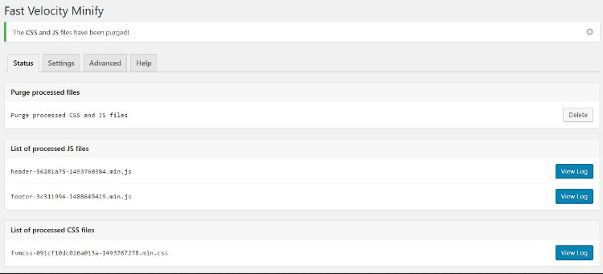
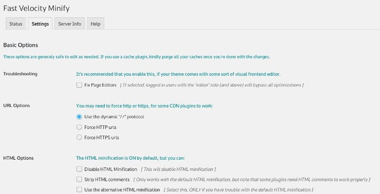

WordPress repository is the home to 100s of minification plugins. Some plugins may break the site and some will do their job. Fast Velocity Minify is a free plugin that improves the loading speed of your site. The plugin has 20000 active users and it is easy to use. It is a great alternative to Autoptimize and WP Better Minify.

FVM supports Nginx gzip\_static module and it is compatible with 100s of popular plugins. You can use it with other popular caching plugins i.e. WP Rocket, Super Cache, W3TC, WP Fastest Cache, etc.

## Review

FVM is a free plugin. You can install it from the plugins page of your WordPress dashboard. The plugin's setting page has several tabs.

The 1st tab of FVM displays the list of minified files it has generated. You can delete the cached files manually in FVM.

2nd Tab displays several options. In this tab, FVM provides an option to select the tool you want to use for minifying the files. If you've installed Java on your VPS, you can enable the YUI compressor else you have to stick with the PHP function which takes care of minifying the files.

The plugin allows you to see the list of JS or CSS files it has processed. It supports websites using SSL certificates.

Fast Velocity Minify plugin minifies HTML files. It can strip comments from the HTML documents.

FVM enables you to disable loading of Google Fonts. It can also inline the fonts and merge different requests of font files into one. This option will reduce the number of DNS lookups.

The Fast Velocity minifies WordPress plugin can combine and minify CSS or JS files. It supports content delivery networks and has the option to ignore processing of certain files.

The free FVM plugin won't process Adsense scripts. Hence, you can use it on a site serving AdSense advertisements.

The Fast Velocity can preload images to improve their loading time. To preload photos, you must enter the image URLs in the settings page of the plugin.

To see whether the plugin is compatible with your website or not or whether your server has the necessary modules to function, open the Server Info page of FVM.

Unlike other plugins that combine several files into a single file, FVM generates 4 to 5 minified files to make sure that your site's layout doesn't break in browsers.

The Fast velocity minify plugin saves the cached files in the uploads folder of the wp-content directory. It supports WordPress multisite installations and localized scripts.

### How to know whether FVM is working or not?

To see whether the plugin is working on your site or not, open the page of your website and view its source code. Now, press ctrl and f keys together. Type the word FVM. If you see URL of this type http://example.com/wp-content/uploads/fvm/cache/, sit back and relax because FVM is working on your site.

#### Does FVM works as advertised

If configured correctly, FVM can reduce the page size by 40 or 50%. I've used this plugin on my sites. It worked like a charm.

\[themify\_button bgcolor="purple" link="https://wordpress.org/plugins/fast-velocity-minify/" target="\_blank"\]Download FVM\[/themify\_button\]
