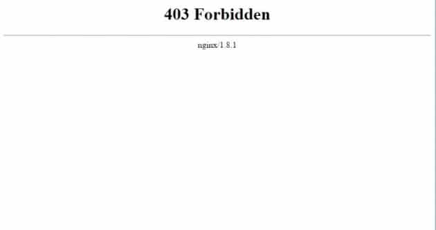

403 access forbidden error message is displayed on the browser when you try to open a file whose public access has been blocked by the webmaster or because of a permission problem. In other words, the web server is saying that you are not allowed to view the file.

If you're a webmaster (blogger) and if you're facing this issue, then it 's obvious that you don't have much experience in web server configuration and management. There's nothing to be ashamed of. Let's understand these two issues in detail.

### IP blocked from accessing a file or directory

There may be some files or directories on the server which the webmaster don't want the user to access. Nginx configuration file can be configured do so.

The webmaster may have added code to allow only his IP Address to access the file. When you try to access this file, 403 response will be generated, and the browser will show access forbidden error.

If you don't want to see the error, you can add:

- A rule to prevent search engine's access to a particular directory or a file on the server.
- Whitelist your IP Address.

If the page on your website shouldn't be crawled and indexed by the search engines, add a disallow rule in the robots.txt file to do so. If the web page is a login page, you should protect it from hackers by adding a rule in the Nginx config file to allow only your IP to access the page.

### Permission Denied

While setting up a content management system, you may have forgotten to make Nginx the owner of the www folder. In such cases, Nginx may not be able to store files on the disk, support editing of files on the server from the CMS dashboard due to which Nginx will return 403 forbidden error. Assign RWX permissions to Nginx to avoid this issue.

If you're not able to upload media files in WordPress, the above solution will fix the problem. Use the following code for making  Nginx processes the owner of the folder in which your website's files have been stored:

`chown -R nginx:nginx folder_name`

You can avoid the 403 forbidden issue by using shared hosting service (Bluehost or Hostgator) or making changes as we have pointed above.

**Conclusion**: Fixing the 403 error in Nginx is not a big task. You just have to edit the site's configuration file or make changes to the folder permissions. Make sure that you backup the files before editing it.
