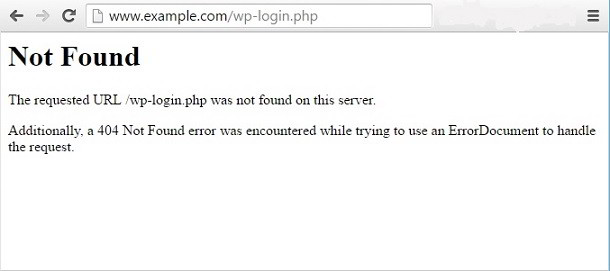

On a bad day, you may face difficulties in logging into the WP dashboard or opening the login page. These two problems can be easily fixed if you know the HTTP status code or error message shown by the browser when you access the twp pages.

Today, we will help you out in fixing the 404 not found error message displayed by the web browser when you try to open wp-login or wp-admin PHP files. Earlier, we had shared a tutorial on fixing error establishing a database connection.

The wp-admin and wp-login PHP files are important. You may have accidentally deleted one of these files. Hence, you are seeing the 404 not found error each time you try to access the WordPress dashboard or the login page.

WordPress CMS does not change any of the PHP files on the server. It renders the web pages as per the settings saved in the database. Hence, uploading the missing file to the server will fix the 404 error. Use FTP software such as FileZilla, CyberDuck for the same.

**Reason 2 and solution**: A WP plugin may have moved the file to some other directory or renamed it as a security measure. If you don't remember the path, try to locate the file using CPanel.

If you cannot find the file, login to the server using putty, paste the below command in the terminal, and hit enter.

`find /your_website_wp_directory/ -name wp-login` (for locating the login.php file)

`find /directory_of_wp_installation/ -name wp-admin` (for location wp-admin.php file).

Once the file is found, use mv or cp Unix commands to restore the file to its original location or open the folder where the files are stored in the CPanel.

Copy the files to the root directory of your WordPress installation.

**Solution 3**: The server configuration file may have a code which redirects non-trusted users (IP Addresses) on 404 page. This problem may occur on VPS servers. Here is an example which explains the same:

The webmaster has added a line of code to redirect all IPs other than his to a 404 error page.

If your IP has been changed, you will not be able to access the login or admin pages of your site.

The three solutions which we have specified above will fix the problems for you.
