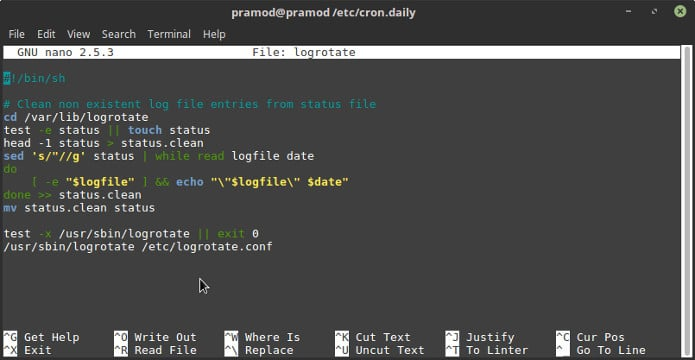

If your app is appending the errors and website visitor's IP address, browser data, etc to a log file, you should manually archive old log files or use Logrotate.

If you don't do so, the server will run out of storage memory and your application may crash.

Logrotate is a powerful program that archives and removes old log files. It saves heaps of storage memory by automatically compressing log files generated by Apache, NGINX, MySQL, etc.

The tool has two main modules, a script that executes the task of rotating logs and a configuration file.

When you install and start the web or a database server, Logrotate creates a configuration file for the same in the Logrotate directory.

For example, If you have installed and started Apache web server, Logrotate will create apache config file.

Unless you make changes to the config file, the tool will rotate log files saved in the /var/log directory.

By default, the script that runs the task of rotating logs is saved in the cron.daily folder which means that the script is executed once in a day.

## Logrotate not working error

Yesterday, I made some changes to the Anacron configuration file and changed the value of variable START\_HOURS\_RANGE of the Anacrontab.

On some systems, the Anacron program executes the Cron, hour, daily, and weekly scripts instead of the crontab.

Anacron's executable file is stored in the bin directory and configuration file is saved to the etc directory.

I  had to make changes to the Anacrontab file because I had changed the timezone on my VPS to IST. But, the log files were generated on UTC time. Furthermore, the crontab file was empty.

I saved the changes and waited for Logrotate to rotate logs. Unfortunately, the program failed to work.

Anacron was executing hourly Cron jobs. But for some reasons, it wasn't running the daily task.

To fix the problem, I moved the script to some other folder on the system. Then, I configured crontab to execute it.

Example: Crontab file's content

`13 13 * * * /dir1/logrotate.sh`

The above line in the crontab file ensures that the Logrotate script saved in the dir1 directory is executed daily at 13:13 local time.

You can modify the above line as per your requirements.

Follow the below steps to create a cronjob for Logrotate

1) Open the terminal, type the crontab -e command and press enter.

2) Add the cronjob, save the file and close the editor.

3) Restart crond service

Now, the script will work as per your expectations.

If the above solution doesn't work for you, make sure that the shell script and config files are error free.
