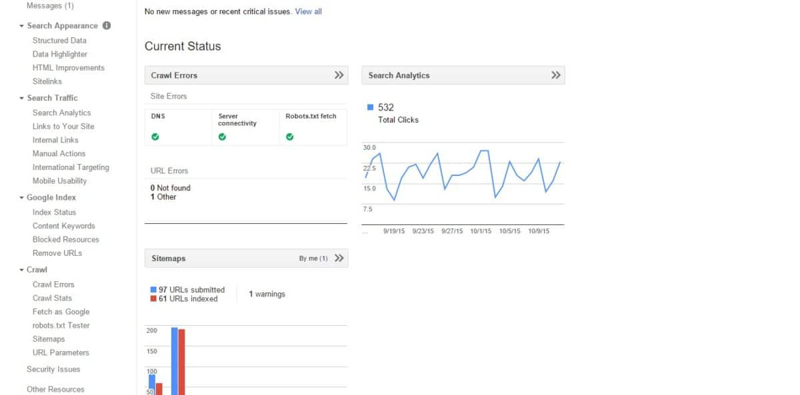
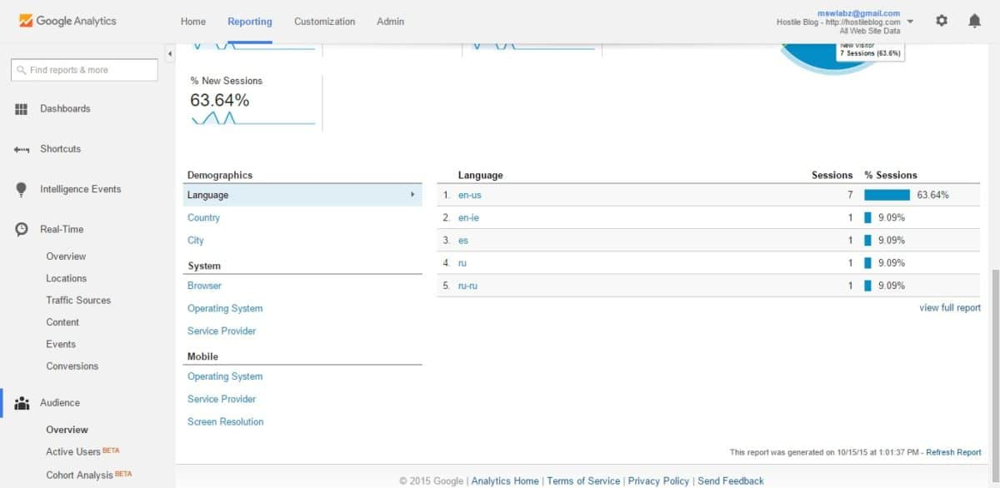
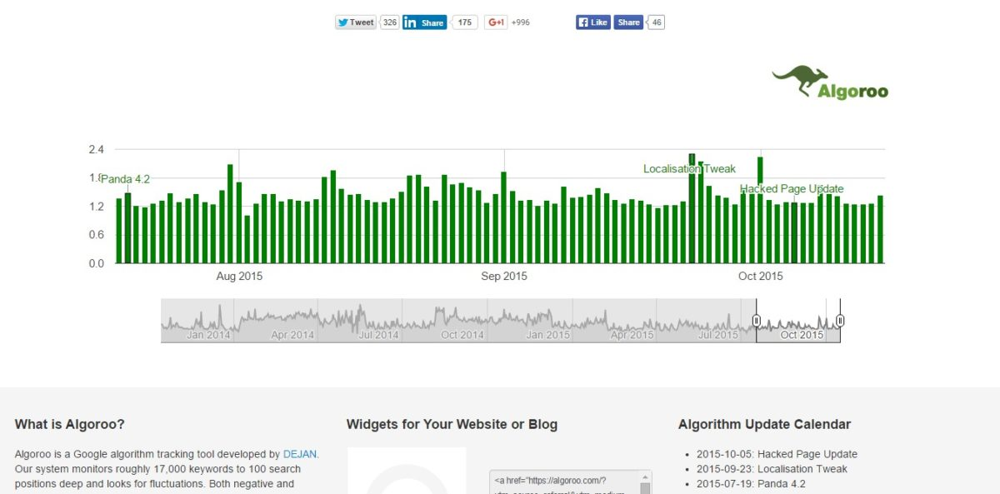
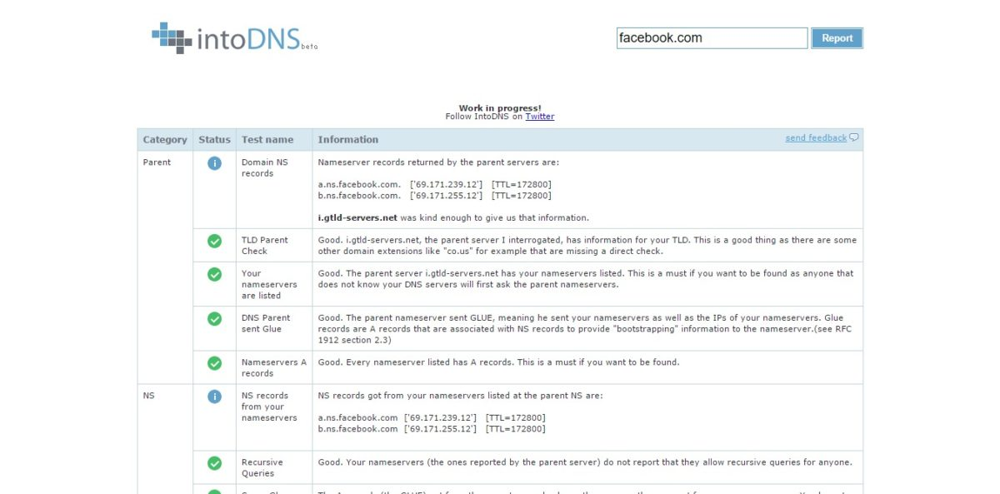
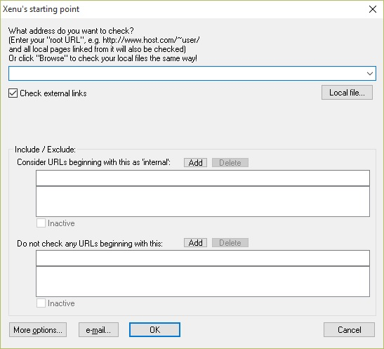

Search engine optimization aka SEO is one of the most important topics of discussion in the online world. Without following the right guidelines and SEO tips, it will be tough to survive as a blogger or a webmaster.

People use search engines and Facebook more than any other website. Promoting a product on Facebook is not free. If you want to do this without any costs, you will have to build a large community and huge fan following. Search engines like Google are powerful and every major or minor website is indexed by them. It indexes your site without any costs.

If your content is good and well written, Google will rank it high in its pages. Popular blogs get millions of unique visitors every month because of this search engine. Google crawls billions of URL's every day, and it ranks the website by several on page and off page factors.

Newbie blogs and business websites fail because they are not implemented correctly. They contain a lot of errors and search engines will not rank them high. The errors may be technical or caused due to ignorance of the webmasters. The user can quickly find and fix them with the below best SEO tools for 2015.

### Google search console aka webmaster tools:

This is best SEO tool for bloggers who rely on Google search engine traffic. When you launch a new blog, the 1st thing that you should do is signup with GWT and verify the ownership of the site.

GWT supports several verification methods, and you can choose anyone of them. The easiest way to verify will be placing an HTML code (that GWT provides you) in the header section of your site.

Verification will take hardly a few seconds. Once your site is accepted, open the sitemaps section and configure it.

Google will crawl your site very soon, and your blog posts will be indexed. If you site is new, your site will not rank very high in Google pages. If your content is of high quality, Google will improve the rankings.

Google webmaster tools include several relevant reports. It has been designed to support all types of websites i.e., blogs, news, eCommerce platform, forums, etc.

GWT includes the below tools:

**HTML improvements**: This report will display duplicate content issues on your site. If Google finds that two pages on your blog or website have the same content or Title, HTML improvements report of your GWT account will be updated. The errors displayed in this report should be taken seriously by the webmaster, and it should be fixed immediately.

**Manual actions**: If your site was manually reviewed by one of the Google engineers and if it contains useless content i.e., spam or you're building backlinks artificially, the site will be banned. You can get the reason for the ban in manual action section of Google webmaster tools.

**Crawl and soft 404 errors:** This is yet another important SEO tool because it makes you aware of the errors on your site. If you've deleted a page from your site, Google will not be able to crawl it. If the link is indexed in Google or if one of your articles refers to this link, Google will not be able to crawl the post and it will report a 404 error in crawl errors report. Google claims that it will not hurt rankings of your site when the web server or the CMS throws a 404 error.

Soft 404 errors are dangerous, and they should be fixed. If one of blog page has been deleted and if your CMS is not throwing 404 error. Google will make you aware of this in the soft errors report.

**Traffic report**: This is the best report in search engine console as it gives you vital details on the website traffic. It makes you aware of the average CTR, position, impressions, etc your blog posts get when users use Google to find information.

**Structured data:**

If you're using schema.org markups on your site, this tool will make you aware of the errors related to it.

Some of the most common errors are:

missing updated, invalid markup, etc. These errors are easy to fix.

**Crawl stats and index status:** These 2 Google SEO tools will make users aware of the indexing activity of Google. Crawl stats will give you information on Google's crawl activity, time taken to download your page, etc.

Security issues: If you see "this site may be harmful" message along with your blog posts' meta description in search engine pages, you should check security report for more information on this message.

Google will report this error whenever it finds malware, virus or phishing page on your website. If you're using WordPress, install malware plugins to get rid of unnecessary code embedded in your site.

**Links**: Google rankings depend on the backlinks and content quality. The webmaster tools allow website owners to find backlinks to their site in this section. Whenever Google finds a link pointing to your site, it will update this report.

**Blocked resources and robots.txt tester**: Useless robots.txt rules will avoid Google bot to crawl some important scripts, pages of your website. If the search engine is not able to crawl some pages, it will report them in Blocked resources section in your GWT account. You can test the said page with the robots.txt tester to find out the code that is blocking the resources.

**Remove URLS:** Google will not like your site if you're allowing it to crawl useless pages that may cause duplicate content issues. You can use this SEO tool to remove indexed pages. This is very significant utility because it will make sure that your blog or website is not affected by Google Panda algorithm update.

**URL Parameters:** This tool is useful if you want google bot to ignore URLs that contain specific parameters.

### Google analytics

This is one of the most used Google SEO tools in the world. It is a perfect utility because GA generates various traffic reports of your site.

When you create GA account, you will have add analytics code before the </head> htms tag. Don't worry! The code is not lengthy nor will it affect the website load time. It has just 4 to 5 lines.

With Google analytics, the user will get details on real time reports, bounce rate, daily, monthly, yearly visitors.

GA allows you to create and set goals. It lets users track conversion; extenal link clicks activity, etc. As it is a Google product, the user can connect their GA account with adsense and webmaster tools.When you link these two accounts, your GA dashboard becomes all in one SEO tool because you'll have several important details at your disposal.

### Bing webmasters:

Bing and Yahoo are the top search engines after Google. Yahoo doesn't offer a webmaster tool because it has partnered with Microsoft bing for sharing search data. The Bing WT gives you access to useful tools like SEO analyser, 404 checkers, keyword analyser, etc.

It allows you to verfiy website to be included in Bing search index. If Google has penalized your blog or website, you can work on traffic from bing. To do this, use Bing webmaster tools.

### Majestic SEO

This is one of the best seo tools because it makes you aware of backlink fluctuation. For someone is trying to spam your site with 1000s of links, you can easily find it via majestic. You can also get a detailed report on your link profile free of cost.

### Algoroo

If you blog's search engine ranking has been tanked, you should open Algooro.com to check if Google is undergoing algorithm changes or not.

This tool will display a graph that will make you aware of the ongoing activity. Algoroo checks around 17000 keywords to generate the graph.

### IntoDNS:

This is one of the most valuable tools because it helps you identify faulty nameservers. If your site is down for more than a week, Google will start losing trust in it and your rankings will go down.

If Google webmaster tools are reporting server or DNS related errors, open INTODNS to find out the reason.

### Pagespeed and GTmetrix:

Site loading time is critical because if your blog post takes more than 2 seconds to open in the browser, it is very likely that the visitor will go back to the search engine and open another website. This may result in a high bounce rate.

\[gallery link="file" columns="2" size="medium" ids="1256,1257"\]

Google considers the page loading time as a search engine ranking signal. To help you identify scripts that are affecting the load time of your website, you can use Google pagespeed service and GTmetrix. You can also use Pingdom for the same.

### Keyword planner:

This is the best keyword research tool. Google itself maintains the data displayed in the planner. Use it and identify high traffic and low competition keywords. This SEO tool has various filters, and it allows you to find country specific keywords. If you want to outperform your competitor, use SEMrush.

### Keyword Density checker:

According to google webmaster guidelines, a website page should not contain spam, spun content, nor it should be stuffed with keywords. To make sure that your KD doesn't exceed above normal limit of 3 to 4, open this tool, enter your blog post/page URL and click on the submit button. The keyword density report will be generated in 1 or 2 seconds.

### Linkio

When getting ready to run your next link campaign, consider Linkio for analyzing your backlink data in order to craft the best possible anchor text. Linkio will provide you with insightful and better-informed decisions in a flexible, automated, and easy to use interface. Sign up for a free trial and browse the different plans to suit your needs.

### Xenu Link sleuth

Internal broken links are difficult to detect manually on a site with 100s of pages. Xenu link sleuth is a software that runs on Windows. It checks all checks every internal and external link on your site and makes you aware of their HTTP status code.

Broken links will report 404 not found error whereas clean ones will have HTTP 200 status code. On WordPress, you can install broken link checker for the same. If you've deployed your blog on a shared hosting platform, configure BLC in such a way that it will not consume very high CPU or RAM. Failing to do this might cause strick action from your hosting provider.

**Conclusion**: There is not shortcut to success in the online world. The user will have to work extremely hard to make online online or manage a succesful internet business. Don't use automated tools that promises good rankings in Google. Google is run by talented engineers who can easily trace your spam activity because the search engine stores a lot of data for analysis.

The panda and pengiun algorithms have succesfully demoted rankings of blogs that tried to get higher search engine rankings by tricking Google.
