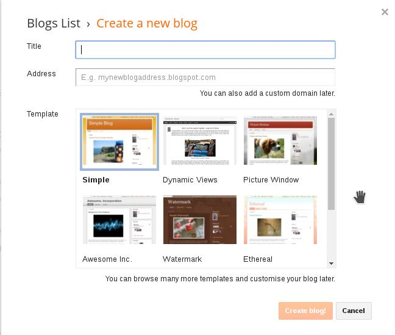
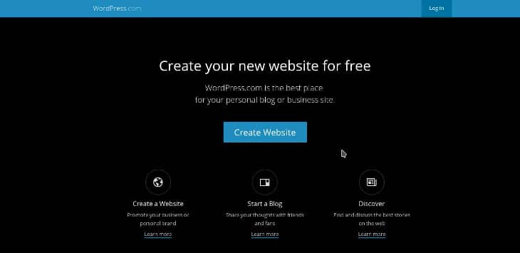
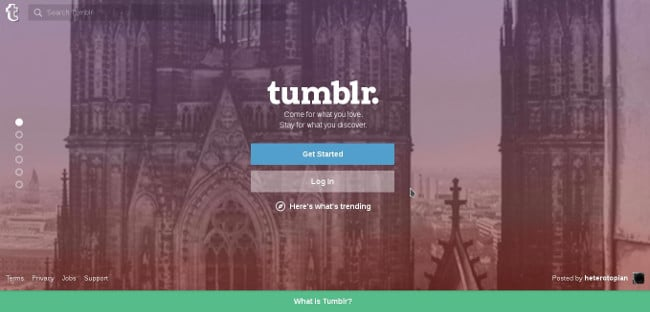

Hosting a website is an easy task, but choosing a company which offers this service is difficult. There are two types of hosting platforms, free and premium. Newbie or wannabe pro bloggers would prefer signing up with a free blog hosting site. An experienced webmaster will avoid it. If you're wondering what's the reason for the same, then go through the below cons and pros of FBHS.

#### Pros:

**Pocket-friendly**: Free blog hosting websites don't come with any subscription plans. Your site will be hosted on their platform as long as you wish to use it and as long as the service is in existence.

Modern hosting companies i.e. GoDaddy, Hostgator, Bluehost will charge you between 5 to 50 dollars per month. You'll save end up saving a minimum of 50 USD each year when your blog is hosted on free hosting platform.

**User\-friendly**: Not everyone intends to use Free blog hosting sites have sound knowledge of web servers, Linux, MySQL, etc. Thus, a hosting provider which doesn't have easy to use CMS or server management interface will be of no use to such users.

FBHS offer a CPanel like UI to its users. Some free online content management systems have a neat dashboard that allows users to manage their content i.e. posts and images.

#### Cons:

**Security**: This should be the biggest concern for the users of FBHS. There's no guarantee that your site will be protected from hackers, intruders, etc. 000webhost, a big name in the world of hosting was hacked last year, exposing login credentials of over 10000 users.

If your site is earning money for you, sign up for Bluehost, Siteground or Bluehost. These two companies have adamant security infrastructure. Thus, your site won't get hacked.

If you're using a CMS, harden its security. If you're using WordPress, install and configure the best security plugin or add a two-factor authentication system to your WP site. Blogger is the most secure free blog hosting platform. Thus, your first preference should be the blogger.

**Support**: If you need technical assistance, no one would be ready to help you out in FBHS. You should seek help from somewhere else or hire someone to fix the problem. Support is the major drawback of free blog hosting companies. If you're not an IT guy, avoid free blog hosting.

**Poor Performance**: Google owns blogger. It's performance when tested with page speed insights, and Pingdom alternatives will be awesome. The page load time will be below 3 ms no matter how long a blog post. Tumblr is a Twitter alternative microblogging platform. WordPress.com is one of the best free platforms of blogging, but it is not ad free. LiveJournal is quick, but it is not as popular as Blogger.

A free blog hosting service (excluding the ones which I've mentioned above) doesn't have an unyielding infrastructure to afford the latest computing hardware, your website's performance will be below average. The page load time is one of the 200 ranking factors in Google search engine.

Even if your content is great, Google might not rank it in first five pages of the page is taking a lot of time to open in the client's web browser.

**Limited Bandwidth**: Bandwidth is nothing but outgoing traffic from a web server that handles your website. Free hosting providers offer very little bandwidth to their users. Thus, they're not suitable for high traffic websites. Online CMS don't impose bandwidth restrictions. Even if your site has transferred 1 TB of data, you'll not hear from them.

## Best Free blog sites

### Blogger.com

A platform owned by Google, setting up a free blogger account is easy. Once you start a blog with this site, you'll be able to write and publish your content free of charge. You can also use Google Adsense for monetizing your website traffic. Getting Adsense account approved for a Blogspot account is easy. If you wish to use your domain name, you'll have to reapply for AdSense.

Blogger is user\-friendly and has a great uptime. Its major limitation is that there are a very few SEO optimize blogger themes. Customization is not very easy because code that powers your blog 's hard to understand.

Google engineers will not help you in customization. If you're not able to access your account or if something unusual is happening in your blogger dashboard, you should create a thread in the Google products forum to notify engineers about the problem. Visit blogger

### WordPress.com

WordPress is the best free CMS in the world. It powers millions of websites. Unlike Blogger, you can install free plugins like Yoast, All in One SEO or the SEO framework plugins to make your wordpress.com website Google and Microsoft Bing friendly.

WordPress.com offers 1000s of free themes to choose from. If you're using self-hosted WordPress CMS, you can buy premium themes which provide a lot of features and great support from its developers.

Self-hosted WP is the best blogging software. As WordPress has been written in PHP, customization of code is easy. As the CMS has an intuitive UI, it is very easy to manage a blog powered by WP. Visit WordPress.com

### Tumblr.com

Tumblr was an independent company until Yahoo bought it. Like WordPress.com and Blogger, you can easily start a blog for free with Tumblr. This site offers better customization support than Blogger.

Most people use it for sharing their thoughts in one or two paragraphs or sharing pictures. It is not used for professional blogging purposes. Like WordPress, there are a lot of free Tumblr themes which are mobile friendly and support customization. Visit Tumblr

**Conclusion**: Many people are often confused in choosing a free blogging platform. After experimenting with various platforms, most of them eventually end up using self-hosted WordPress software.

If you're serious about blogging, sign up with Bluehost, Hostgator or Siteground. They offer one-click WP installer tool which will guide you in starting a blog. Avoid free hosting platforms to host WP or any other CMS. Ex: Drupal, etc.
