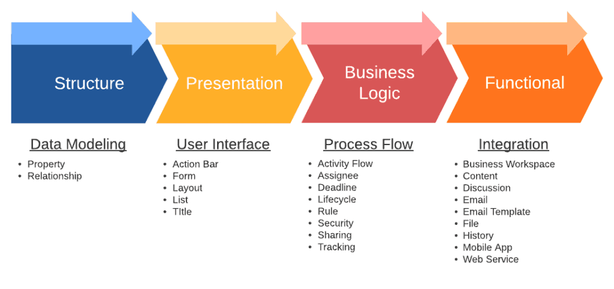
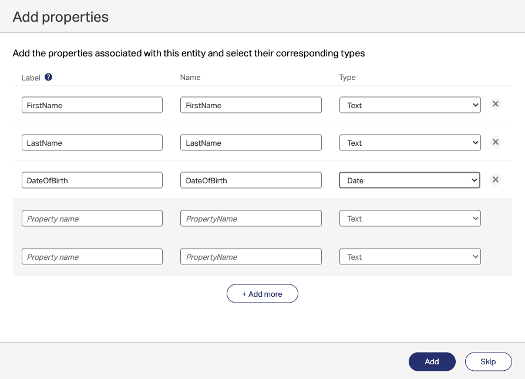
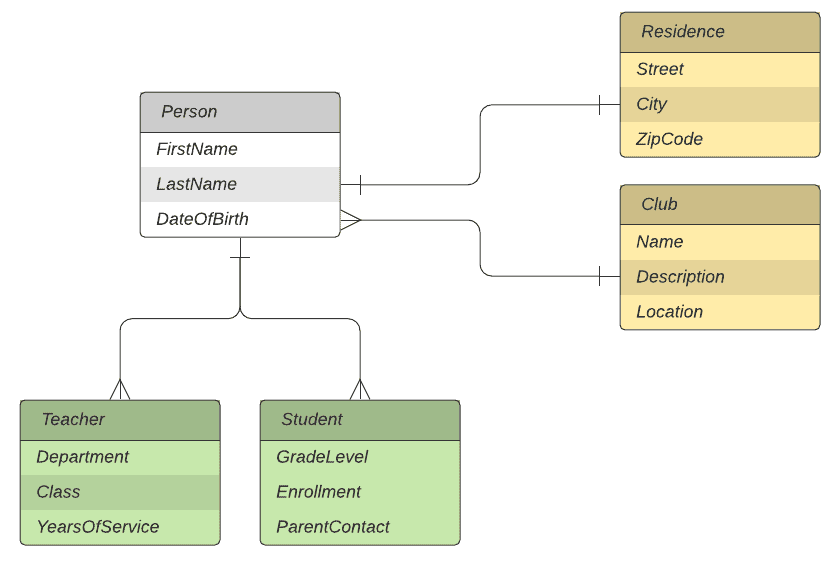
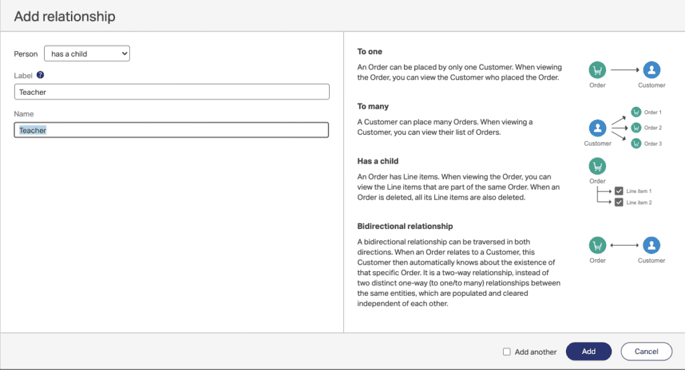
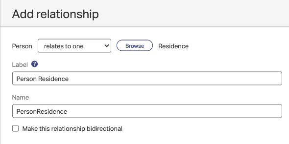

AppWorks provides a handy feature for modeling business objects through the use of entities. Objects could take the form of any aspect of a business application you are building. For example, if you needed to write an application that would be used as part of a school's administration system you may include entities that represented objects such as teachers, students, courses, lessons, and so on. AppWorks provides a nice interface for managing these different types of entities and even lets you build relationships. The term entity modeling is not new to this platform, the concept behind this has been around for a long time, but it has traditionally been the responsibility of database engineers or software developers to define. The low-code platform AppWorks provides now enables business analysts to define these entities and relationships, without the need to have a software engineering background.

All entities within AppWorks are typically made up of building blocks. There are four main types of building blocks, structure, presentation, business logic, and functional. Within each of these groups are a number of building blocks you can use to define, design, develop, and publish your application.

This article focuses on the **structure building blocks**, which enables us to define properties (or fields) as well as to define relationships between entities. I demonstrate some of the basic functionality in AppWorks using example entities in this article, but this is by no means a full application development tutorial, rather a reference for the various features of the platform.

## Property Building Block

Within structure is the properties building block, which provides a way for us to easily add fields to our entities. For example a course within a school may have fields such as name, description, start date, end date, required, etc. Each of these fields can be defined as different data type, for example name and description could be defined as text, start and end date could be defined using the date type, and required could be defined as boolean. Currently AppWorks provides 13 different data types to choose from when defining a field. These are listed below.

| Boolean | Duration | Image |
| --- | --- | --- |
| Currency | Enumerated Integer | Integer |
| Date | Enumerated Text | Long Text |
| Date and Time | Float | Text |
| Decimal |

* * *

Most of these should be fairly self explanatory. AppWorks provides advanced configuration for each data type which enables to do things like add a pattern (e.g. 999-999-9999 could be used for a phone number). Advanced configuration also lets you set things like default values, tooltips, and define when or if users can change values on the property. Enumerated text can be defined as both static and dynamic. Static enables you to enter a predefined (drop-list) of values, while dynamic can be built from a pre-defined business process. AppWorks performs what is described as intrinsic validation on user entered data based on the field types defined. If for example a user tries to add alphanumeric text into an integer field, intrinsic validation will fire, preventing this action and data to be stored. Later we will look at Rules, which provides more advanced validation in the platform.

### Creating Entities with Properties in AppWorks

To create a new Entity in AppWorks, navigate to Workspace Documents in the AppWorks Explorer. See Getting Started with Low-Code Development in OpenText AppWorks for reference. Create a new project by right-clicking Projects and selecting 'New Project'. Right-Click your project and select New - Other and choose Entity from the icons selection. You should see a screen where you can begin defining your properties. I have entered some example properties of a person entity I'll come back to later when I discuss relationships. You can add any fields here and explore the various data types available under the 'type' column.

Once you click 'Add' you will be placed Inside the Entity editor. Note the Building Blocks side-menu on the left hand side. You can also create properties from here as well as explore the other building blocks available. Here I am only referencing Structure (Property and Relationship). Feel free to explore the other building blocks available under the Presentation, Business Logic and Functional groups, which I'll cover in a later article.

## Relationship Building Block

If you are familiar with relational databases, then you will find the way AppWorks handles relationships to be very familiar. AppWorks defines relationships as parent-child and peer.

### Parent-Child Relationships

Earlier I used the school example for describing entities. Parent-child relationships can be used when additional details can be defined about a particular type of business object or (in this example) person. The reason these relationships exist is to provide a means to store common data across a set of related objects while defining children objects that contain their own distinct properties. In the diagram below, the objects in green (Teacher and Student) are child objects of person. All person objects will contain FirstName, LastName, and DateOfBirth properties, however only students will contain GradeLevel, Enrollment, and ParentContact. Subsequently teachers will may have information stored on Department, Class, and YearsOfService. You can think of parent-child relationships as mandatory one to many relationships (for child objects to exist (teachers, or students), a parent object must be defined).

<figure>

<figcaption>

Parent-Child and Peer Relationships

</figcaption>

</figure>

### Peer Relationships

In contrast to parent-child relationships, peer relationships are two separate entities that may form a relationship due to a certain need or requirement in our application. In the above diagram, residence and club exist to demonstrate this point. For the purpose of this example, residence and club information in this application may or may not be required for each person. Many people can belong to one club and one person will only be able to define one residence (where they currently live). In AppWorks, peer relationships can be defined as both one to one and one to many.

### Defining Relationships in AppWorks

AppWorks lets us define our relationships in the entity editor screen by selecting Relationship under the Structure building block group. In the below example I am defining a child relationship (Teacher) belonging the the Person Entity (from the above ERD). Note the summary guidance AppWork provides for the various relationships. By defining a child relationship, I am telling AppWorks to create a mandatory one to many relationship between Person and Teacher.

<figure>

<figcaption>

Adding a Child Relationship in AppWorks

</figcaption>

</figure>

To create a peer relationship, from the entity editor screen you will select **Relationship** as before. Here you may choose **relates to one** or **relates to many**. The entity you are currently editing will be the source of the relationship and if you click **Browse** you can select its target. In the example below I am editing the Person entity and selecting **Browse** for Residence (one person relates to one residence).

<figure>

<figcaption>

Adding a Peer Relationship in AppWorks

</figcaption>

</figure>

Similarly from the Club entity, you can define Club **relates to many** Persons. AppWorks allows you to choose bidirectional for two-way relationships. This provides a way to also define many to many relationships if needed.

In my next article, I'll cover some of the presentation building blocks available in the entity editing screen. These building blocks provide tools for creating the User Interface (UI) for your application, which include action bar, form, layout, list, and title. The action bar can be used for providing buttons for various functions such as uploading files, and other related actions. Forms provide design tool to drag and drop the various properties or fields defined under structure. Here you can visually apply your fields, labels and arrange them to your liking. Layouts provide the container of how the pages in our application will look. Eventually you will publish your application to the AppWorks Client, which provides a nice web interface for your users.
