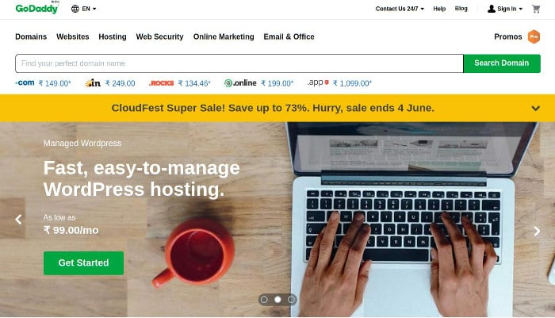

Godaddy is one of the top domain registrars and hosting companies of the world. It has over 500K customers. I'm one of the customers of Godaddy. I've been using its email hosting and domain registration service for 5 years. Here's my review of the company.

### List of GoDaddy services that I use

- Domain names
- Premium email address

### Domain names

Godaddy website is user-friendly. It doesn't matter whether you're an experienced or a novice user, registering a new DN is easy with GD. The home page of GoDaddy's official website features a text box through which you can find domain names.

Once you enter a name and click on the search option, Godaddy will display a list of extension filters and domain names matching/containing the words you had entered in the text field.

Godaddy will automatically apply the biggest available discount to the price of the domain name and it will display an option to add the same to the cart. In India, the company uses CCAVENUE to handle payments. You can checkout with wallet apps, credit/debit card or net banking with CCAVENUE. Apart from the payment gateway, GD accepts payments with PayPal.

### Premium EMAIL address

If you own a business website, you should buy a premium email address.

#### What is a premium email ID?

An email address containing the domain name. Example:

- pramodc@hostileblog.com
- admin@hostileblog.com, etc.

GoDaddy email hosting plans are cheap. Once you buy a plan, setting up your email account is easy. GoDaddy provides a documentation for the same.

GD enables you to link your email account with popular Android and desktop email client apps such as Outlook, Thunderbird, etc. Once you link your account with a third-party app, you can read or compose new emails with it.

### Godaddy Hosting

I started my online journey in 2013 with the Blogspot platform. After learning the advantages of WordPress over other CMS, I decided to switch my site from Blogger to WordPress. WordPress is self-hosted CMS. As I was a newbie blogger, Bluehost, Hostgator plans were not in my budget. GD was offering shared hosting for 3 months for just $5. I signed up for GoDaddy shared hosting. In 2013/2014, GD didn't have restrictions on resource usage. I remember using plugins that made my site horribly slow (because of high RAM/CPU consumption). GoDaddy didn't send "high server resource usage" warning emails to my inbox.

One day, I found 100s of preview DNS URLs in Google's search index. Despite turning off preview DNS feature in my GoDaddy hosting dashboard, Google was still able to access the preview DNS URLs. The URLs caused a duplicate content issue on my site. To get rid of it, I switched from GD to another hosting company. My site was never down when it was hosted on a Godaddy server.

Considering that the company has good infrastructure, Godaddy hosting is reliable. The only thing I didn't like about Godaddy hosting is the preview DNS thing which can cause duplicate content issues for a website. I used Godaddy hosting service in 2013. Things may have changed now.

#### Features of GD hosting:

- One click CMS installer tool.
- Option to create or backup MySQL database.
- PHP 7+ support.
- FTP access.
- Unlimited bandwidth.
- Uptime of 99.9%.

### Support

GD offers phone and email based support to the customers. Godaddy support is great. I have contacted its technical support team a few times. I got a satisfactory answer from the team.

### GoDaddy coupons

The company sends discounts/coupon codes for hosting/domain name renewal or new products to the registered email address of the customers on regular basis.

Some websites are sharing coupon codes through which you can get a domain name for below 1 USD. The 0.99 cent coupon is available only to new customers. If you have registered a domain name with GoDaddy, you won't be able to use the 99 cent coupon.

### Alternatives to Godaddy

Namecheap is a good alternative to Godaddy. Its web-hosting, domain name, premium email address plans/pricing are same as GD.
