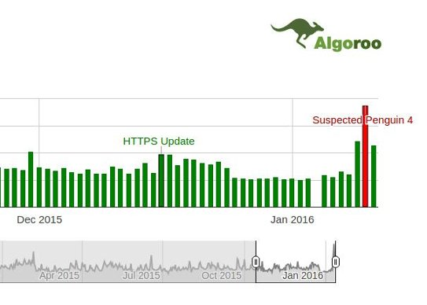
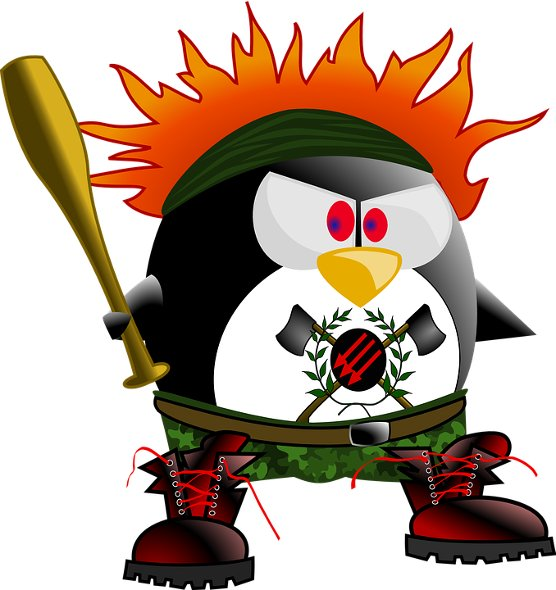

Google Penguin and Panda are two of the most talked about and important algorithm updates in the world of SEO. They are refreshed once or twice a year. Every webmaster keeps an eye on these two updates. Panda algorithm focuses on promoting high-quality content high in the Google search engine. Google Penguin can hit blogs and websites that are not following the webmaster guidelines. Both these algorithms affect's rankings of large as well as new sites.

The last Panda refresh was in July 2015. Penguin was expected to be rolled out in December, but it didn't happen. Google seems to have released its Google Penguin 4.0 algorithm update on 10th of January 2016. Yesterday, mozcast reported the highest temperature in its SEO weather report. Algoroo, the mozcast alternative is already claiming that the Penguin 4.0 update has been rolled out. The web spam team head at Google has not confirmed the news yet.

The Penguin algorithm penalizes websites that try to achieve a high Google ranking with black hat methods of link building. It will now work in a real-time manner.

Some of the methods are as follows:

**Buying do follow links**: Some websites try to sell backlinks for 5 to 10 dollars. They claim that your rankings will increase when the job of building backlink is over. After Google Penguin 4.0 update, I don't think that the paid links will have any positive impact on the SERP. The algorithm will knock your site's ranking within a few hours time.

**Allowing guest blogging**: If you're allowing authors to add backlinks to their websites in your blog posts, then Google Penguin 4.0 will not spare you because the site is violating the link scheme guideline.

**Spamming Forum**: There are a lot of do follow forums running on the web. If you've identified and spammed plenty of them to get backlinks, the Penguin algorithm will not like your website.

 

### Recovering from Google Penguin algorithm

If you have built 1000s of backlinks, your site might be penalized manually by Google engineers. You can find details on the penalty in Google webmaster tools manual action page.

If a manual action has been imposed on your website, you'll have to work hard to get the penalty revoked.

The webmaster has to identify all bad links pointing to the site. They can use the backlink checker tools for the same.

With the disavow tool, you can make Google ignore the backlinks to rank your website. Instead of adding the domain of permalink to the disavow file, contact the webmaster of the other site to remove the backlink. If he takes no action, delete the page from your website. If the page is an important part of your blog or website, add the backlink URL to the UTF 8 format disavow file.

Google will process the file within a few days, and your rankings will be restored.

If you've paid money to build many backlinks or if you've used an automated software for the same, Paid tools like link research or liquidator will help you in finding susceptible links.

**Conclusion**: Follow the webmaster guidelines if you want your website to survive in each and every algorithm update from Google. Don't buy links. Don't spam other websites. Work hard on your site's quality and Google will reward it with higher rankings. BTW, Has your website gained or lost traffic in the recent Google algorithm update?

Penguin Image Source: Pixabay
