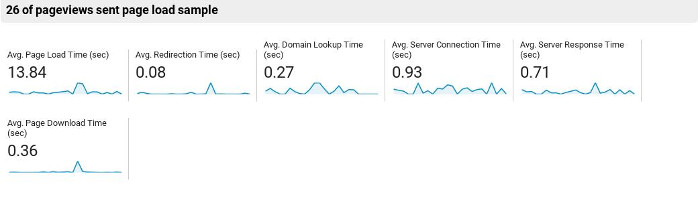
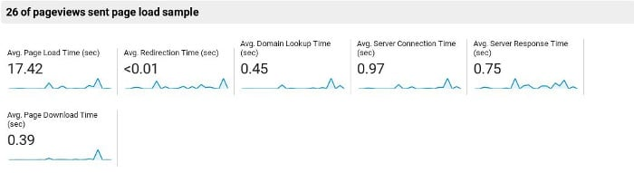
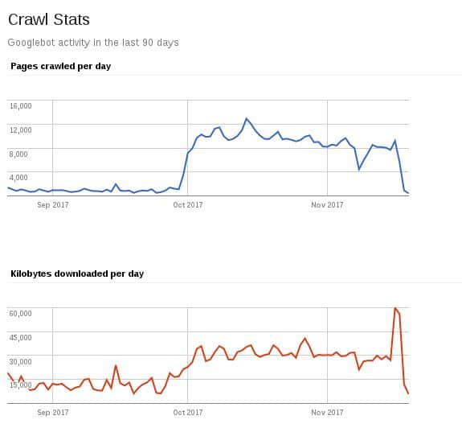

After Googleweblight, AMP aka Accelerated Mobile Pages is the new initiative from the search engine giant Google to make the web fast. As of today, over 900K sites are powered by AMP.

I've used AMP on my site for a month. Below, I've shared the Pros and Cons of Google AMP.

## Pros of Google AMP (Advantages)

### Easy to implement

Google has published a detailed documentation which covers the HTML markup/CSS code you should use while implementing AMP. It also covers tutorials, news, case studies and demos of AMP. If you're a developer, go through the documentation before writing the code of your website.

If you're using WordPress, implementing AMP on your site is a piece of cake. Simply and download and install the best AMP plugin and configure it as per your requirements.

Google has launched a tool to check AMP pages for errors. If the pages on your website has a valid AMP code, Google will crawl and index it, else it will report errors in Google Search Console's AMP section. After updating the WP plugin or modifying the code, make sure that you check AMP page for errors.

### Free CDN

AMP powered pages are served from Google.com. Depending on the visitor's location, they may open faster than non-AMP pages in the browser of a mobile phone. If you're looking for a free CDN, you can use AMP.

## Disadvantages of Google AMP (Cons)

### Google AMP Speed

Although AMP pages on my ste were delivered by Google, I'm not sure whether they opened in the visitors browser faster than the non-amp pages.

Here's the screenshot of GA speed test report of my site before implementing AMP:

Screenshot of the same report after implementing AMP:

Also, people in almost all countries have ditched the slow 2G network and have begun using 4G. The average download speed of a 4G connection in the most populous countries (e.g. India, China) is within 5 to 10 Mbps. In countries with a lower population than India and China, the 4G speed will be higher. Unless a website offers video streaming or image hosting service, its size will be below 1 MB. Web pages having a size below 1 MB won't take more than 3 seconds to open in a mobile phone browser. So what's the point of implementing AMP on pages which will be accessed by the audience using high-speed mobile data connection?

### Only large sites many benefits from it

Small publishers use Google AMP thinking that Google will push the ranking of their sites higher in the SERPs for using AMP. Google's John Mueller had clarified that AMP is not a ranking signal.

Top stories/carousel is similar to Google News and getting a site into Google News is not a joke. The carousel module is displayed on the 1st page of search result page of Google. Only sites with high-quality content are included in the top stories aka carousel. So, if your site has horrible content, don't expect your post to be featured in the Top Stories section.

### Invitation to death (sites with quality issues)

Once you implement AMP on your site, Googlebot will crawl 100s of pages on your site. It will do so several times a day. The more Google visits your site, the more it understands your website. If your AMP powered site has quality issues, its ranking may tank in next Google Algorithm update.

### Disabling or removing AMP

The best way to remove AMP pages from Google is to remove the AMP plugin/code from your website and set up permanent 301 redirects.

Make sure that the URLs of the following type http://example.com/test-site/amp/upsq=23189sdad redirect to the original page i.e. http://example.com/test-site/

No-indexing AMP pages is a risky business and you should avoid doing so at all costs.

Did your website benefit fom Google AMP? Share your experiences, Pros or cons of AMP with us.
