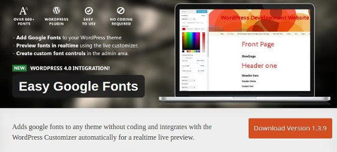
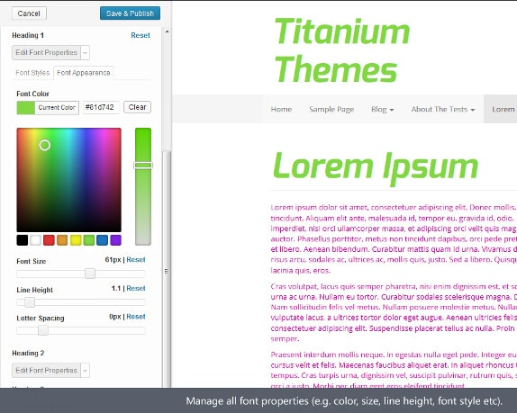

The font is one of the most critical elements on a website. Developers make sure that the typography of their website is best in class. If your visitor finds that your site is ugly, he'll leave it immediately without reading the content or making a purchase.

There are 100s of fonts that you can use for free, but you will have to spend a lot of time in searching for them unless you use Google web fonts.

### Below are the advantages of using GWF

**Version control:** Google Engineers takes care of updating the font files. When an update is available, you can easily choose the version of your choice.

**CDN**: Google owns one of the most robust CDN systems in the world. The fonts will be served through the CDN, and it will load much quicker than your expectations. As your server is not hosting the files, this will save bandwidths.

### How to use the fonts on your website?

Google web fonts should be added to the header or footer section of the site. As there's an official website, it is easy to add them. In WordPress, you can insert GWF by using the Easy Google Fonts plugin.

The plugin lets you choose from one of the 600 supported fonts. It automatically handles typography of a theme without making the user edit any of its CSS or PHP files. This plugin not only saves time but also makes sure that GWF is loaded from an authoritative Google server.

The plugin doesn't place the font directly on your website. It uses the safe method of enqueueing the required files.

Easy Google Fonts plugin features a live customizer tool in which you can quickly manage typography of your website. This tool has options to choose font family, weight, color, size. You can also configure text effects.

With this plugin, you can efficiently manage the font properties for all the headings on a web page. If you're not comfortable with the default English language of EGF, you can change it as the plugin supports translation. To make conversion easy, EGF ships with PO and MO files.

The Ajax technology powers easy Google Fonts customizer. It uses nonce WordPress security. Thus, the plugin is highly secure.

**Conclusion**: Although adding Google web fonts is not a rocket science if you want to use a simpler method of using them, download and use the free EGF WordPress plugin from the WordPress.org website.
