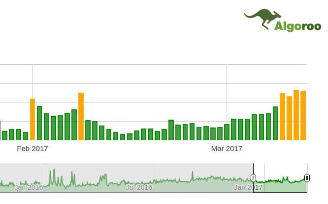

Google has rolled out a new algorithm update on 7th of March. The head of web spam team, Garry Illyes has named the new algorithm as Fred.

The Google Fred update has killed the rankings of many websites overnight. It has brought people who were earning good amount of money online to their knees. Since 8th of March, many webmasters have reported that their sites have lost 80 to 90% traffic and some folks have reported a significant increase in organic traffic after March 8.

According to popular search engine activity tracker tool Algoroo, the Google Fred update is still rolling out.

Until the algorithm rolls out completely, you must cross your fingers and hope that Google Fred doesn't knock your site down in the SERPs.

## Is Google Fred the most powerful algorithm update?

Google Fred algorithm seems to be a hybrid of Google Phantom and Google Penguin algorithms.

The phantom algorithm targets websites that provide a poor experience to Google search users.

The Penguin algorithm kills websites that engage in black hat link building techniques i.e. creating private blog networks, comment spamming, etc.

Sites that have lost traffic after 7th March 2017 may have content quality issues or plenty of unnatural backlinks.

If your site has been badly affected by the Google Fred update, you'll have to kill the bad do-follow backlinks. Use the free backlink checker tools to find them.

Once you find bad inbound links, contact the website owners and ask them to remove the links or create a disavow file and submit it to Google.

You should also improve the quality of your website and the user experience.

To improve UX, make sure that your website is fast and mobile friendly. If your site has a large number of thin pages, noindex or remove them.

If Google Fred is a real-time algorithm, your site's traffic may recover soon else you'll have to wait for several weeks or months to see a recovery.

**Conclusion**: Google Fred is one of the biggest Google algorithm updates of this year. It is also one of the most complex and accurate algorithm updates till date. Is your site affected by the recent Google update?
