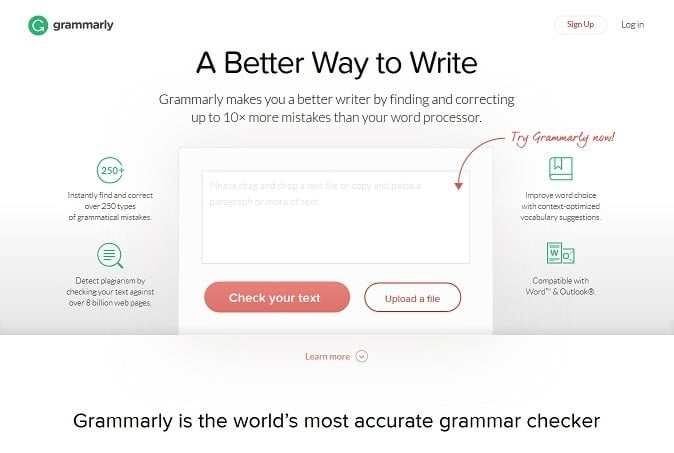
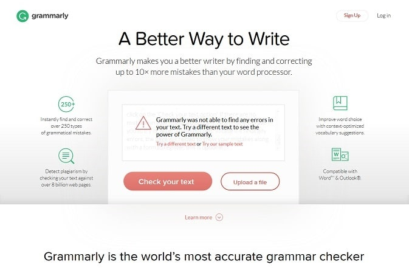
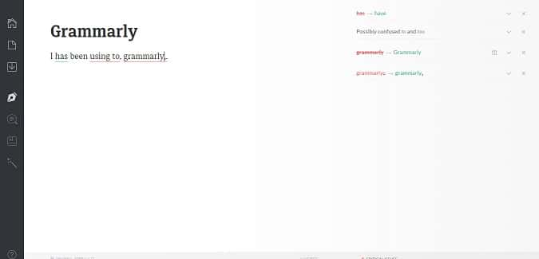
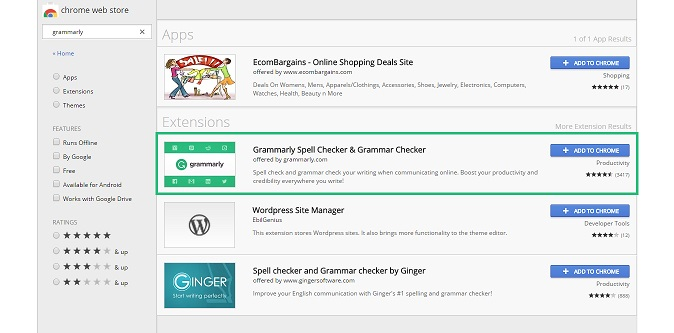

English is one of the most widely accepted and spoken language around the globe. Whether its a TV or any other electronic device, English is used everywhere.

English has more than 2 billion speakers. Due to its importance, it has become an official language in many countries. Although it is used everywhere, let us face a truth that many people do not speak and write good English. There might be many reasons behind this problem, but one of the most common is the grammar. Grammar is vast and many people fail to understand it.

It is an essential part of the many languages. Without proper use, it becomes hard to speak and write fluently. Moreover, you will sound funny if you try to speak in broken English. As a blogger, it is very important for you to have a good command over the language. Search engines will rank well-written content high in their pages. Well, if you don't have time to visit a tutor, you can follow the below tool to improve your English:

## Grammarly review: The best English Checker

We all know how to use the internet. You can easily find a lot of tools that help us in improve our English. You don't have to do any research as the best tool among them is Grammarly.

Founded in the year 2009 by Alex Shevchenko and Max Lytvyn, this online tool has today become one of the best and most popular grammar checkers in the world. With more than 3 million users worldwide, Grammarly has also gained very positive reviews from well-known language experts.

**Key Features of Grammarly are as follows:**

- Thoroughly checks your content with 250 grammar rules.
- Proofreading and checking plagiarism by going through more than 8 billion web pages within seconds.
- Checks for contextual spelling issues and improves your vocabulary skills by providing right choice of words.
- Users can use this tool in Microsoft Office Word and Outlook as a plug-in is available.
- It can analyze academic, casual, creative, business, general, and technical writings.
- no downloads. The tool runs on any MAC, Windows or Linux (Ubuntu) browser.
- Its plugin is compatible with all websites.

### How do I use Grammarly? Is it worth using?

Of course, you one can. Everyone can use Grammarly. It indeed is one of the best and simplest websites on the World Wide Web for improving writing skills. Grammarly is very easy to use and is available in many other ways. Let us discuss on 'How to use this tool?' in more detail.

Copy and paste your content on Grammarly.com.

We all know what a Notepad or WordPad is and how to use it. Pick a topic and write anything in it. If you finish writing or typing, copy the entire text or save it as a file. Open your web browser, type www.grammarly.com in the web address bar and press enter.

A web page will open with an empty box, asking you to 'drop a text file' or 'copy and paste a text'. Once the page loads completely, paste the copied text or upload the saved file in that box and click on the 'Check your text option'. If there are no mistakes in your uploaded content, Grammarly will ask you to try or enter a different text. In case if it finds any errors, the page will reload to show your mistakes along with a form to register, this is optional.

\[gallery link="file" size="medium" ids="1055,1056,1057"\]

Sign up on Grammarly to check documents online.

Creating and editing documents on the internet has become very common these days. However, it is not always possible to check such files with grammar and writing mistakes instantly. When we face such problem, it is the right time to shift and sign up on Grammarly.com

For signing up on Grammarly, you only need to enter your name, email id, and a strong password. After completing the signing up process, you can create, change, store, and edit documents on the website itself. There is no need to press any shortcut key for checking errors as Grammarly keeps on analyzing your text while you are typing.

When it detects any errors in your text, a green line below grammar and a red one will appear below spelling mistakes. Furthermore, it will also display suggestions according to the errors. If you want more advanced features on Grammarly, here is what you need to do.

Only 'Premium Subscribers' can use advanced features on Grammarly. If you too wish to become one, follow the mentioned below steps.

**First method:**

1. Fill up the sign-up form.
2. After filling, the required details click ‘Proceed to next step’.
3. Out of three which are ‘Monthly Plan’ ’Quarterly Plan’ and ’Annual Plan’, select a one that suits you the best.
4. Complete the next step i.e. ‘Payment Completion’.

**Second method:**

1. Sign-in to your existing Grammarly account.
2. From the home screen select ‘Premium’ option and enter.
3. Out of three, choose one plan that you need and go ahead to the next step.
4. Complete the payment online and enjoy ‘Premium’ features of Grammarly.

Use Grammarly by installing its extension on Google's Chrome web-browser.

Many web browsers do not support Grammarly's extension, but if yours is Google's Chrome, there is no need to worry. If not, you can download the Chrome web browser by visiting www.chrome.com or www.google.com/chrome/

There are two steps for installing Grammarly's extension. They are as follows.

**First step:** After installing Chrome go to settings, select more tools and then extensions. Scroll down to the bottom of the page and open 'Get more extensions' link. Once the page gets loaded, type Grammarly in 'Search the store' bar and install it. Once you see a green color 'G' icon in your extensions bar, log in to the Grammarly extension, and leave it.

**Second step:** Open Grammarly.com and log in. Select apps on the home page and enter. There you will see 'Grammarly for Chrome' option and its status. Click on the install option and wait. Later you will see a green color 'G' icon in your extensions bar. Click it and check whether it is active. If not, log in and leave it.

Whether you write a post, article, email, comment, etc. anywhere on the web, Grammarly will keep on running in the right-hand lower corner of that particular website and keep analyzing your text. If it detects any mistake, Grammarly will let you know and suggest ways for correcting it.

Grammarly add-in for Microsoft Office. From many years, we are using Microsoft's Office Suite to create and edit documents. There are a lot of people who would be happy to use it further, and not creating documents online i.e. on the internet.

If you are a 'Premium Subscriber' of Grammarly, but still want to use Microsoft's services, there is nothing to worry as Grammarly's 'add-in' is available for Office Word and Outlook. Once you install the add-in, the only thing you need to do is to sign in with your registered email id and password. Once done, configure the settings as per your requirements and use it.

Follow the link to download the Grammarly add-in.
