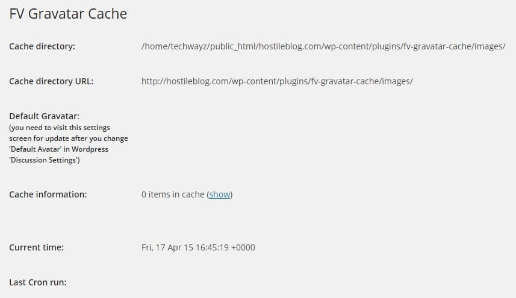
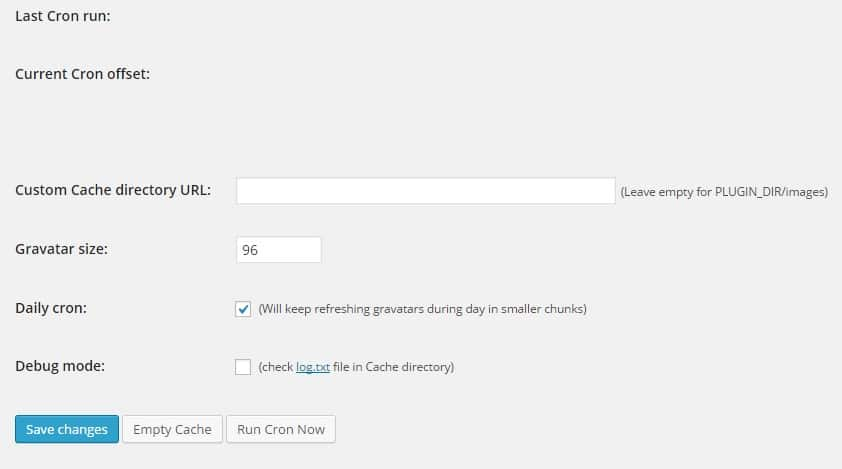

Gravatar is one of the top software products of Automatic. It is used on 1000s of WordPress content management powered blogs. With this service, commentators are allowed to add their profile image that will appear alongside their comment on WordPress blogs. Gravatar is useful in many ways. It can increase user engagement on sites, and it saves a little bit of bandwidth because the commentator's image will be served from Gravatar servers. It will also attract more comments on your blog.

Gravatar is a free service. Thus, anyone can create an account on this site. Although it is a very useful online tool, Gravatar comes with a few disadvantages. It can affect page load time of your blog if the Gravatar server is down/facing some issues. If one of your WordPress posts has over 100 comments, the page load time will be adversely affected because 100 image requests will be made to Gravatar servers. Google considers loading time of a site as a ranking factor. It will be soon rolling out an update to improve rankings of a mobile friendly site and a page with very high loading time is not mobile friendly. One more problem associated with this online tool is that when you test your website speed with tools like Google page speed insights, GTMetrix, you'll be recommended to remove Gravatar redirect chain. The problems stated above can be easily fixed with a WordPress plugin called FV Gravatar cache.

**How to use this plugin from Foliovision?**

This plugin is not as popular as WP-SEO, Autoptimize or WP-super cache but it is very effective. FV Gravatar has registered just 10000 downloads, and it has two ratings of 5.0 on its official page on WordPress.org. To start using FV Gravatar Cache on your blog, open plugins page from your WordPress blog dashboard and search for the fv-gravatar cache plugin. When this extension appears in the search result, click the install button. Now open this plugin's page from the WP settings. You'll see the above interface.

FV Gravatar Cache will start caching images automatically. You are allowed to change the folder where these pictures will be saved. Users can force this plugin to cache gravatar images by clicking on RUN Cron Now button. This plugin will cache just a few images at a time tTo prevent high server resource usage. It will execute a cronjob (that handles the task of caching the pictures) one or two times in a day. Once all gravatar images have been cached, delete all the files cached by W3TC, super cache or any other WP plugin.

The highlighting feature of this plugin is that all calls to gravatar.com will be replaced, and only one default image file will be served if the user has not set his/her avatar. Thus, the redirection chain problem has been solved. As profile pictures have been cached, no link juice will be passed to gravatar.com website. You can now test the loading time of your WordPress post with Google page speed insights or Gtmetrix. You'll see a noticeable improvement.
