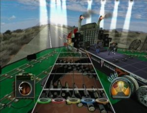
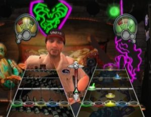

Finally, the best part of Guitar Hero has been developed by Harmonix. Because it ends the suspense, Guitar Hero 3 supplants its elders, admittedly few, but still. It must be said that the formula has not changed, not to say that it remains unchanged with the exception of a few discrete improvements and additions not necessarily essential. The first change in size provided by this third edition is obviously the partial abandonment of lumpish from the previous flap. Activision puts his hand to the portfolio as well to recall how the popularity of Guitar Hero actually an advertising and therefore unavoidable, we are left with almost half of the tracklist that consists of original songs, singer without risking a dangerous original interpreter imitation of the solo and without deviating a bit from our memories. The disadvantage is that by contrast, these times always seem to do most unfortunate that, inevitably. Composed, therefore, with security whose integrity has been little affected, the new playlist of the game is a pure marvel, perfectly balanced between musical styles and technical approaches. Rock, Alternative, Metal, Blues-Rock, the sounds of electric fan is not only spoiled by the variety of styles but also by the worthy representatives selected by and paid by Neversoft Activision.

I refer of course to the list cited in the news but how not to mention a few names at random when we see the classic rock 60/70 years represented by Cream and Sunshine Of Your Love, Seeker of the Who or the cult of Paint It Black Stones? Everything supported by Santana (Black Magic Woman), Aerosmith (Same Old Song And Dance) or Alice Cooper (School's Out). Other beacon period, the alternative rock of the 90s where the Smashing show themselves "totally responsible" with Pumpkins Cherub Rock, Pearl Jam (Even Flow), Sonic Youth (Kool Thing), a rich fusion of Rage Against The Machine (Bulls On Parade). Closer to home, we rely on the excellent Queens Of The Stone Age who surrender their recent 3's & 7's or with Living Color’s Cult Of Personality. And of course, metal fans are not forgotten and will have the opportunity to ask their shreds on the handle. It will not take a risk by suggesting that the soundtrack of this third title of Guitar Hero is a success.

Some small changes in the aesthetic approach which one gets used soon. On gaining information on the stage with the characters, including secondary, more lively and better cared for. The addition of small cut-scenes is quite nice. The heart of the game remains unchanged, but gains in natural rhythm in its approach or its management techniques hammer on and pull off. The tracklist is a much diversified little marvel; we do not see what we could complain.

Those who wish to reach the peaks will have what to do in Extreme mode which becomes more and more evil, the less competitive players will also have seen you for the quality of the tracklist. And in the end, everyone will end up on the multiplayer, offline or online. Not only is the song selection a total success, but the game has the good taste to contain much of the original title. So, no regrets that a few times fairly poor (Pat Benatar or the Dead Kennedys, for example).

After the disappointment of the 80s spin-off special, Guitar Hero 3 is a reassurance on the future of the series despite the departure of its creator. Clearly the best part to all points of view, it only one thing to know: what about the confrontation with Rock Band?
