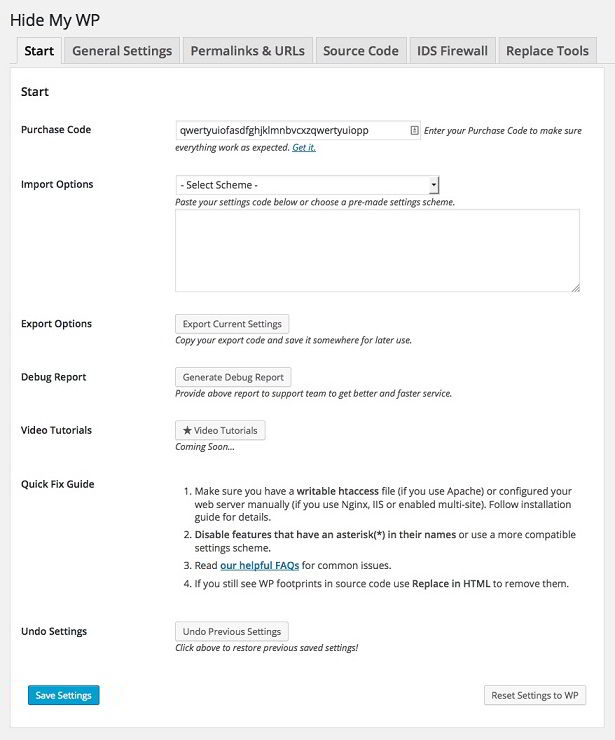
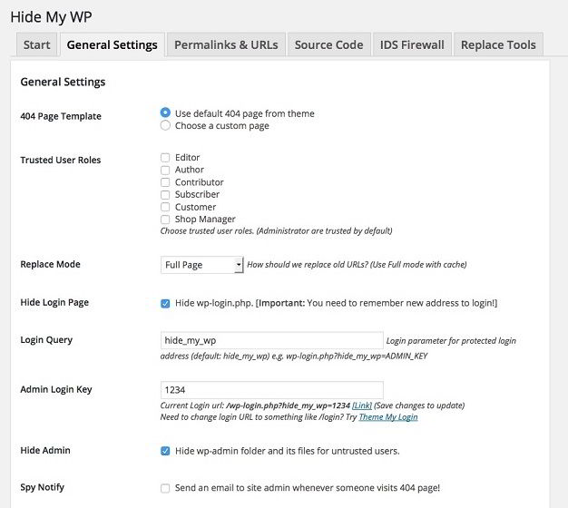
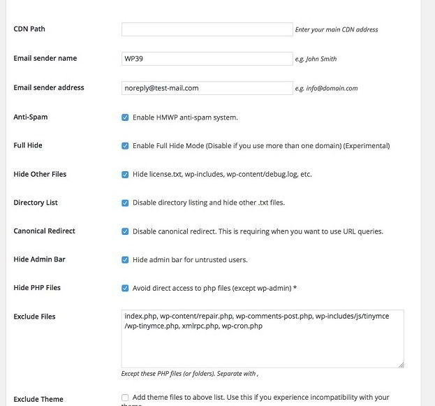
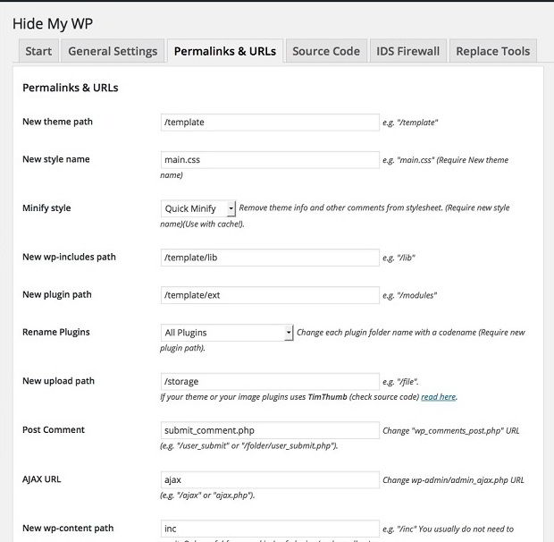
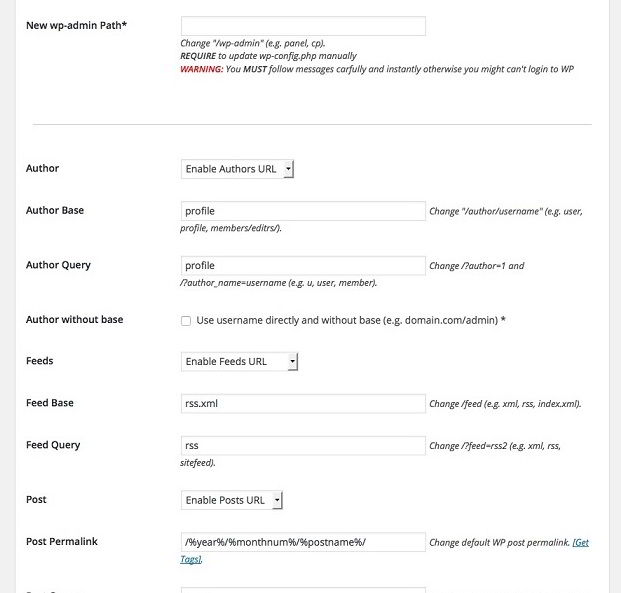
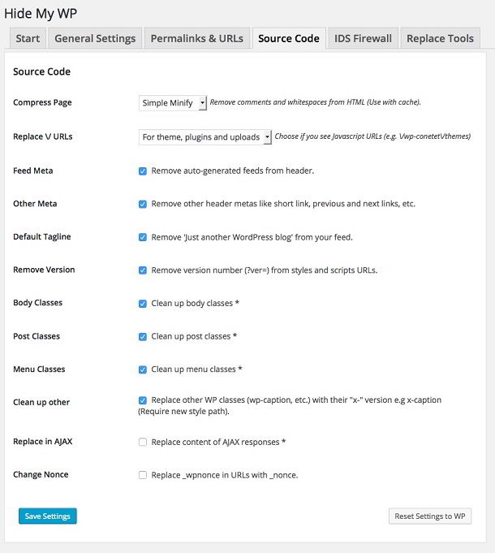
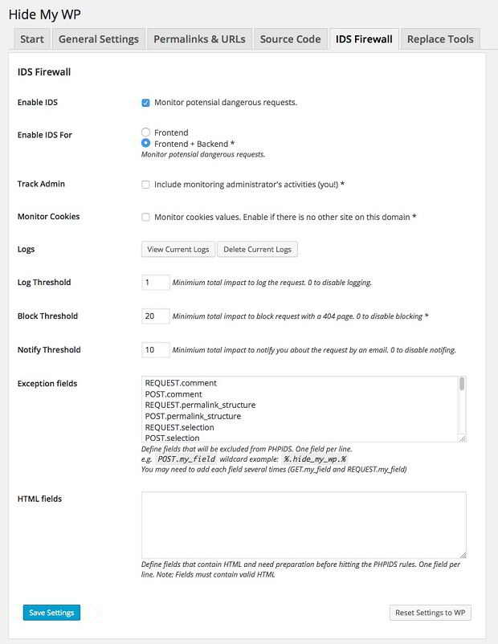

1000s of WordPress websites are hacked every day because the hackers are aware of the security loopholes in plugins and themes that the website is using. Usually, the websites that use outdated or nulled WordPress plugins and themes fall prey to hackers.

There are incidents where websites that use powerful WordPress security plugins are hacked. To keep your WordPress website or blog safe, you must back up the database and images on regular basis. You should also use a WordPress security plugin and tweak web server settings to minimize threats.

Unfortunately, not every one using WP CMS has knowledge on web server configuration. Even if you have good knowledge on a web server, you'll have to spend some time in writing rules and testing them to check if they are working or not. If you're looking for a simpler solution, then download and configure the hide my wp plugin for WordPress.

HMWP is one of the most powerful security plugin for WordPress. If you're using this plugin, no one excluding you will know that your blog/website is powered by WordPress. HMWP is a premium security plugin which can be downloaded from **codecanyon on a payment of 23 USD**.

## Hide my WP review : A Great WordPress security and Firewall plugin

This WordPress security plugin has a settings panel where you can configure the below options:

### Start

Users who have bought this plugin will have to enter the purchase code to ensure that its features are fully functional.

This section has option to import or export settings of this plugin. If you're moving your WordPress website or blog to other server, make sure that you back up the settings.

If the plugin's features are not working as expected, enable debug mode so that you can find out what's causing the issue. As hide my wp is a premium WordPress security plugin, you can contact the developer to get help on the issue.

### General settings

This is the next important section of hide my wp plugin. Here, you'll have to specify the fault 404 page template and define the trusted users. General settings includes an option to hide the WordPress login page URL. To use this feature, user will be asked to enter a custom login query and a key/parameter for accessing WordPress admin dashboard. Hide my WP can hide the WordPress dashboard from untrusted users.

By default, WordPress CMS sends emails for comment reply with the admin's user name and email address. If you own a WordPress website and you don't want to reveal your login id, the hide my wp plugin will help you in changing the sender's email address and name.

Hide my wp security plugin can hide the theme's license file, wp-includes and log files created in the wp-content folder. The plugin can protect your WordPress blog or website from spam. It can disable directory listing and prevent direct access to PHP files. Hide my wp can disable canonical redirects. You can disable the above mentioned features for specific files (JS/CSS/PHP).

**Download the plugin**.

### Permalinks and URLS

This section covers the best features of hide my wp plugin. It has settings that will make it possible for users to learn that your site is using the WordPress content management system.

Permalinks and Urls settings lets you change the theme, wp-includes, plugin, uploads, wp-content folder path and rename the theme's stylesheet name. It includes an option to minify the theme stylesheet file. Hide my wp plugin allows users to change the name of admin-ajax.php file, disable author and WordPress feed URL. It can change author base, tag base, category base and search base as well.

With the hide my wp plugin, users can disable date archives and WordPress pagination.

You'll not find the above mentioned features in a single plugin for WordPress.

### Source code

Hide my WP plugin lets you compress pages by removing whitespaces and comments from HTML content. It can remove auto-generated feeds and useless meta data from the header section of your site. It can clean up body, post, menu classes and strip version from CSS and JS files in WordPress.

### IDS firewall

To protect your WordPress from hacking attempts, hide my WP plugin includes a specially designed IDS firewall which can be enabled for fronted and backend (or both). It can monitor cookies values, admin activities on demand. Hide my WP can be configured to generate a log file with the data tracked for security purposes. This module will protect your WordPress blog/site from SQL injection, CSRF, XSS, Brute force attacks.

The Hide my WP plugin might have a lot of options, but it is easy to use. You just have to select the options which you want to activate. That's it!

**Conclusion**: If you don't have knowledge on server configuration and security, you'll have to invest some money in securing your website. The money which you'll invest will be very low than the cost of recovering or cleaning a hacked website. Remember one thing, unsecure websites are easy target for hackers. Once your WP portal has been hacked or infected by malware, you'll have to hire third party developers for recovering the website.

Hide my WP is a very cheap WordPress plugin, but it has many useful features for protecting a website. Grab your copy of HMWP plugin from **Codecanyon here for just 23 USD**.
