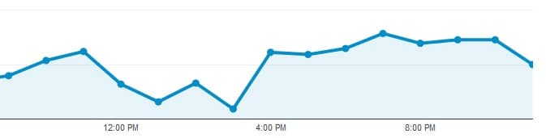
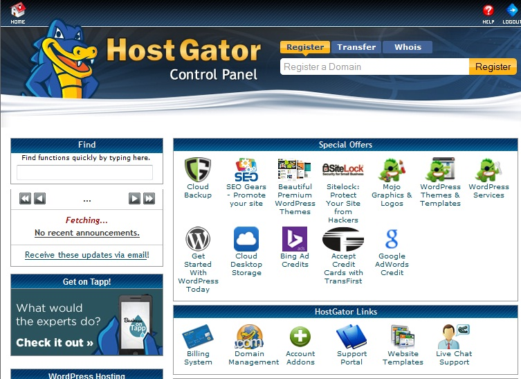
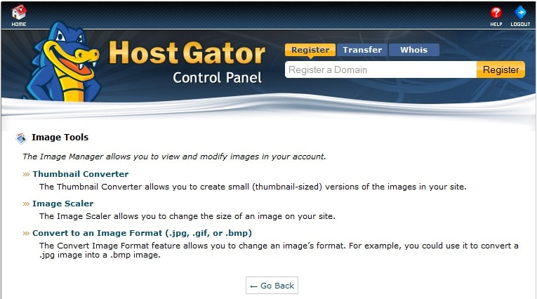

Yesterday, the 1st of April might have been the best day for you but it was an awful day for me. My top site, which generates a decent income was down for nearly 4 hours in the daytime. The site was not accessible to 100s of search engine users from 12:30 PM to 4:20 PM. The downtime was due to a network issue and misconfiguration by ASO staff.

The network issue started around 12:30 PM and it was resolved after 45 minutes. The staff moved the affected domains to a new IP address but the mapping was not correct. So from 1:00 PM onwards, the homepage of my blog was being redirected to some shi\*t site. This resulted in 100s of 404 errors.

Many visitors might have thought that my blog has been hacked but this was not the case. After interacting with the ASO support for 4 to 5 times, the issue was resolved. For the proof, you can have a look at the Google analytic screenshot.

When the issue occurred, my blog was being hosted on a small orange shared hosting plan.

Well, I won't say that ASO is a bad hosting provider. But if you have a site that receives 4000 to 5000 visitors daily visitors, you should consider a better and more reputed hosting company. I'm not quitting ASO as its support is excellent and servers are good. But I've moved my top site to HostGator. The Hostile blog is still on a small orange server.

Hostgator has a good live support team that can help you out in any hosting or configuration issue. Many people believe that HostGator support is bad but I don't feel the same. Yes! The ticket resolution might take time. But why should you raise support ticket when you can get a solution to your problem within few minutes.

I interacted with 2 HostGator support staff in a real-time chat session. The wait time for the 1st session was 3 minutes and for the second it was within 30 seconds.

**Sign up for Hostgator here and use the promo code hostileblog to get 25% off.**

**Memory and CPU usage**: Hostgator servers have an excellent configuration. They restrict the max server resource usage to 25%. i.e if your website has bad coding, the RAM, CPU usage will shoot above 25 and Hostgator support will suspend your plan.

**Plan**: I've signed up for a baby plan. As a part of this plan, I'm eligible to host unlimited domains on the same account. There's no limit on the bandwidth. You can create as many MYSQL databases, FTP accounts and email accounts you want. The inode limit is 250000. The Hostgator baby plan is being handled by Linux Centos operating system.

Features: Hostgator is offering me various tools to optimize and improve my blog. **Here are the important ones:**

**Anti-hotlink:** If you don't want users to link your images or media content on other sites, you can activate the hotlink plugin from Hostgator Cpanel.

**One click WP installer**: If want to use WordPress CMS as a front end, you can install it on the server with just a single click. This installer will also create a DB for you.

**Backup Wizard**: Hostgator has clearly mentioned in this article that DB backup plugin consumes high CPU and RAM. Thus, you should avoid using it. To create or restore a backup of DB as well as files, you can use Hostgator's backup tool.

**Weebly**: If you want to launch a small static site with 7 to 10 pages, click on the Weebly icon in the Cpanel. Weebly is a free platform with some good features. You should give it a try before making someone develop a website for you.

**Image manager**: This is a useful tool to convert images from one format to the other. You can also scale or create thumbnails of images with it.

**Traffic and error logs**: Hostgator creates log files for website errors, visitor information. Cpanel also includes tools to check Website stats, bandwidth used on a given day. Just like ASO, his Cpanel includes Webalizer, AWStats, raw log files.

**Network tools**: If you're experiencing any connectivity issues with your website or blog, you fire a trace-route command right through the Cpanel. Just click on the network tools icon in your Cpanel.

**DNS editing**: You can easily modify DNS settings through Hostgator Cpanel. Be careful when you using the DNS editor as incorrect configuration will kill your site. Search engine crawlers won't be able to index your posts too.

If you'll explore Google webmaster forums, you'll find that many webmasters have lost their income, website traffic because of bad DNS configuration.

**Cancellation policy:** If you're not happy with Hostgator website hosting, you can request a refund within 45 days of signup.

**If you've made up your mind to signup for HostGator, use the coupon code hostileblog and get 25 percent discount on any plan.**
