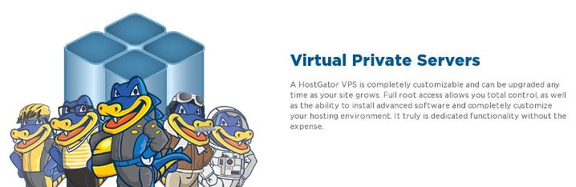
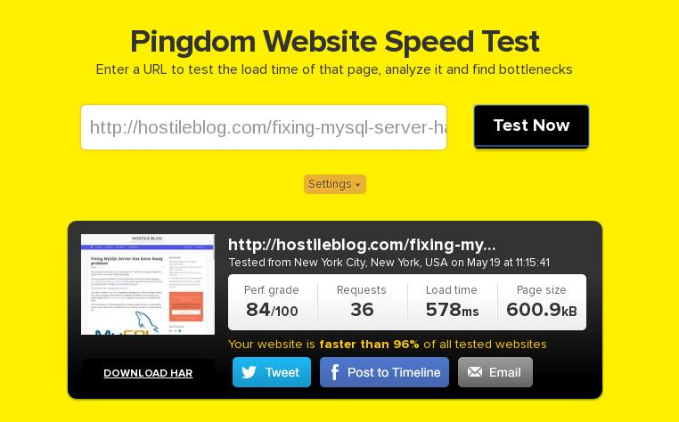

Shared hosting plans are suitable for beginners and people with no knowledge of PHP, MySQL and Web servers. In a shared hosting, the company offers PhpMyAdmin, CPanel, Awstats (Google Analytics Alternative) and many more tools to make website configuration or deployment easier for a webmaster.

Shared hosting comes with several limitations. Your site will be hosted with several other web portals, and it will have limited resource to use. Bandwidth usage will be a matter of concern. You are not allowed to experiment with PHP MySQL modules. Nor you can switch from Apache/Nginx to some other web server.

As resources are limited, you cannot host a lot of websites on a shared server. If you own several websites or if you're planning to start some more blogs, I would request you to buy a Linux VPS hosting plan from **Hostgator.com website**.

Hostgator offers two types of VPS hosting service, managed and unmanaged. Let's first understand the difference between these two terms.

### Managed vs. Unmanaged VPS Hosting

In **Managed VPS**, the company installs all necessary software on the server. For example, the provider may install one click CMS installers, CPanel, a database application, etc. As needed software is already up and running on the VPS, it becomes easier for the webmaster to deploy his website. Full customer support is offered to the users of this hosting plan.

In **unmanaged VPS hosting**, the service provider will install only the OS and set up the network connectivity options. The webmaster has to install the software manually. You'll be given a Virtuozzo panel which allows you to handle simple operations like file downloads, uploads, editing PHP files, restarting the server, etc. Although Virtuozzo is a CPanel alternative, it doesn't offer as many features as the CPanel.

The user must use SSH client on his PC to install software packages, and he must have sound knowledge of Unix commands. Unmanaged VPS is for geeks and techies. No technical support is provided for its users. You can get help only of the server's hardware has been damaged, or the company had shut down the server for maintenance.

### Hostgator offers the below 5 VPS plans:

**Snappy 500:** This is a semi-managed VPS, which has a half core processor and 512 MB RAM. In this plan, you get 500 GB bandwidth, 2 IP addresses, and 25 GB storage space. Its subscription cost is $11.97 for the first month. In recurring months, you'll be charged $20. **More Details**.

**Snappy 1000**: You can buy this plan for a price starting at $50. The configuration offered in this Linux VPS plan is one core processor, 1 TB bandwidth, 2 IPs, 1GB RAM and 60 GB storage. **More Details**.

**Snappy 2000**: In this Hostgator VPS plan, the user will have access to a server with 2GB RAM, dual-core CPU, and 120GB storage memory. The bandwidth limit is 1.5 TB. Subscription cost is $90 per month. **More Details**.

**Snappy 4000**: This hosting plan includes a dual-core processor, 4GB RAM, 126GB storage equipped VPS. 2TB is the data transfer limit. Its pricing starts at $130. **More Details**.

**Snappy 8000**: This is the best VPS configuration offered by Hostgator. In this plan, a server with monstrous 8GB RAM, quad-core processor, and 240 GB storage memory will be offered to you. The pricing for the same starts at $160. **More Details**.

Choosing one of the above configurations is not a difficult thing to do. Check your website requirements to know what plan is ideal for your website.

#### Which plan I use?

I've been hosting all my WordPress websites on a Hostgator Snappy 500 VPS since six months. I've not experienced any server related issues till date. My server came preinstalled only with a Linux distro, and it was enabled with networking feature. I had to install and configure PHP-fpm (ver 5.6), MySql, Zend OpCace and Nginx to make my websites work. To make sure that there are no DNS related issues, I modified BIND Named configuration files.

A few days back, I replaced PHP 5.6 with php7-fpm. The performance of my WordPress blogs has become much better.

Hostgator VPS are equipped with modern hardware which takes the website's performance to the next level. Check my site's page speed for the proof.

As you can see in the below screenshot, this site's articles takes less than 1 second to open in the client browser. I don't use a CDN.

You can use any website software on the Hostgator VPS server. Apart from Nginx, PHP, WordPress, you can power your VPS with Apache, Memcached module, performance monitoring applications, Magento, Drupal, etc.

The uptime of websites hosted on Hostgator VPS is great. My sites have been down only one time in 6 months. The downtime was due to a maintenance activity conducted by the Hostgator engineers.

The network infrastructure of this hosting provider is one of the best in the world. I have never faced network related issues with Hostgator.

I used semi-managed VPS plan which comes with limited support. If you're not a technical person, you should buy a managed hosting plan. Hostgator offers customer support via phone, ticket, forum and a live chat plugin.

**Conclusion**: I've been Hostgator customer for 1.5 years. Before moving to the VPS plan, I was using a Shared hosting plan. The customer support is excellent. I interacted with them a couple of times. I was satisfied with their answers/help.

If you're searching for a good Linux VPS hosting service provider, **sign up with Hostgator**. The company is offering 60 off (discount) on all of its VPS plans for a limited time.
