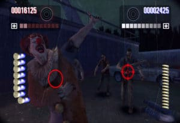
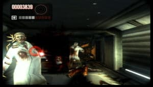

The Dead House has risen the degumming of zombies to the rank of an art. After a through enough portage in episodes 2 and 3, the Wii will finally host an original and jubilant forthcoming opus.

At the outset, the fans can rest assured, the unique atmosphere of The House of the Dead has been preserved. Bad taste, humor at twenty cents, torrents of hemoglobin, the Sega team has worked hard to restore the atmosphere of horror cinema of the 60s. The image is deliberately patina, the soundtrack evokes the films "Pulp" dear to the heart of Tarantino and just take a look under the letter written in levels of blood (“Papa's Palace of Pain," "Scream Train... ") to understand that the script never takes itself too seriously. Chronologically situated before the original episode, it is far from devoid the interest since we propose to follow the beginning of the famous Agent G and his sidekick, Issac Washington. The opportunity to try to learn more about one of the most enigmatic characters in the series.

After a delightfully fashioned introduction, the adventure begins by exploring a mansion full of ... zombies of course. Do not panic just press the B button to empty a loaded Magnum in the flop (or head for a headshot). Explosions tripper and bloodshed guaranteed! It then reloads a blow with the Wiimote, and as we went in the 40s. Unnecessary anxiety to the idea of getting lost in the corridors of the building or disturbing the environment of the following levels, all trips are scripted in The House of the Dead. However, it is now possible to direct a little camera angle in the direction of our choice to discover hidden bonuses or eliminate enemies lurking in the shadows. We cannot really talk about real mastery of the vision sigh, but this new feature encourages us to replay the levels and search them from top to bottom.

On the new, note that you can shake the Wiimote to fight in a melee or get rid of particularly sticky enemies. The damage is not huge but it helps to defend as a last resort if you do not have time to reload your firearm. About the latter, compulsive shooters excited by the trigger will probably be delighted to learn that we can now build a small arsenal and carry around two weapons of choice for a pleasant change. Shotguns, machine guns, there was much choice when we have enough money to buy them and improve them. There is obviously no question of using both arms simultaneously in action but you can switch at any time. Another new friendly that can regularly be found is the sets of strange lights items to slow down the action. They are particularly useful because they offer us the opportunity to specifically target the weak points of our enemies in all serenity. More anecdotal: mini-games available from the menu can simultaneously accommodate four players but from what we have seen, they do not fly very high.

Finally, it was nice to try to take the dialogues in the second degree, vulgarity wins too often over humor. From the first lines, the characters use and abuse of "motherfucker", "bitch", "asshole", etc... At that point it quickly becomes disgusting. Like many fat sexual allusions, primary violence is omnipresent. Despite this, The House of The Dead: Overkill, still looks a particularly effective to kick up your heels and it is as such that we now look hard in the coming weeks on our consoles. Zombies and mutants will hardly stand on their feet!
