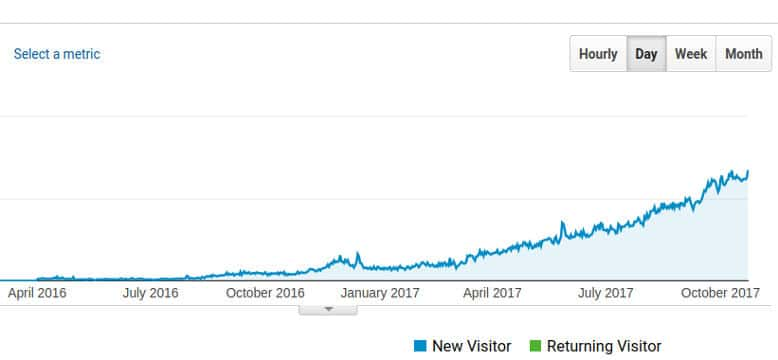

Starting a new blog is easy but making it popular is difficult. People find blogging as one of the easiest ways to make money online. Well, making money through a blog is not a piece of cake. Only websites getting decent traffic generate revenue for their owners.

A successful blogger is one who earns enough money only to feed his family and pay internet and web hosting bills. Frankly speaking, the website's fate depends on the traffic. If a site is getting traffic, it will make money for the owner. If it hardly gets visitors, it is of no use to the owner.

Today, I'll share 5 great tips for increasing blog traffic. The tips are easy to understand and implement. You don't have to hire an SEO expert, firm or consultant once you go through the tips.

## How to increase traffic to your website?

### Follow Google webmaster guidelines

The Google Webmaster Guidelines is a great resource for those seeking SEO knowledge. Once you've read and understood the Google webmaster guidelines, nothing can stop you from becoming a successful blogger.

#### Why should you follow the guidelines?

The self-proclaimed SEO experts will ask users to build backlinks by spamming forums, submitting guest posts, submitting website to directories, etc. These strategies used to work in the early 2000s, but now it doesn't. Google analyzes backlinks carefully and demotes the ranking of a website with unnatural backlinks. The dreaded Google Penguin algorithm is now a part of the core search engine ranking algorithm. Hence, if you build unnatural backlinks to your site, Google may kill your site's ranking within few days or week.

Building backlinks manually isn't a good SEO strategy. Unless you built something extraordinary, your site won't get traffic from search engines for a few months. You must post new content regularly on your site instead of spamming other websites.

Once your site is flagged as spam, its ranking will be lowered during an algorithm update.

### Focus on the bounce rate

Your site must have unique content to get traffic from Google and Bing. Search engines help visitors in finding information. If they won't find the right information on your site, they'll switch to another website.  While writing a post, you must think like a user. Here's a great example that explains why bloggers must think like a user.

A user who wants to know the features of the iPhone while typing the following query in the Google search box

"iPhone features"

When the user presses the search button, Google will display search results matching the entered query. Most users will click the first result. If the user is not satisfied with the result, he'll click on the 2nd result. This will go on until the user finds the complete answer to this question. The transition of the user from site 1 to site 2 is called a bounce. Google uses the "Bounce Rate" metric to measure the quality of a website. A site with high bounce rate may not perform well in search engines. To reduce the bounce rate, you can interlink posts or write a detailed blog post that answers the user's questions.

### Keep your social network profiles active

Believe it or not! the traffic from social networks can be great for sites. Facebook and Twitter are two of the most popular social networking portals. To get traffic from these 2 behemoths, you must add social sharing buttons to blog posts.

Let's not forget about Whatsapp, an instant messaging app with a billion users. WhatsApp now allows users to access their profiles and send messages through the desktop browser. It also allows website owners to add WhatsApp button to their sites. You can take advantage of this and increase mobile traffic to your website by adding a "share on WhatsApp" button.

Creating a Facebook page or Twitter profile takes few minutes, but getting 1000+ followers can take months. People will follow your social networking accounts if they like your website's content.

### Use a good theme

A theme should not only be responsive and fast but should have code which search engines can understand. Why should you use a premium theme? WordPress repository features a forum where users of free plugin or templates can seek help from the developer. The developer of the free theme may or may not reply to your query.

The developers of premium themes give users access to a forum where users can post their questions. They reply to user's query within 2 or 3 hours. There are 100s of premium WP templates. I recommend people to use a premium theme from StudioPress, ElegantThemes, or Themify. Themeforest is an also a great website to find premium themes.

### Use a reliable hosting service

Hosting is the backbone of a website. If the server crashes for some reason, the visitors will not be able to access your website. Also, if the DNS server is slow, your site will take ages to open in the visitor's browsers and search engines will report DNS errors. The most reliable shared hosting firms are Bluehost, Hostgator. If you're searching a VPS hosting, join Linode or Digital Ocean.

### Get rid of spammy comments

If the comment has a website link, then it has been published on your site for only one reason i.e. to get a backlink. You should moderate comments carefully. If the comment has too many keywords or it is unrelated to the topic, you should delete it.

Conclusion:  A site that doesn't get enough traffic from search engines or social networks will make just a few cents every month. Follow the tips I've shared above to increase traffic to your website.
