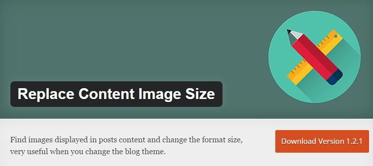
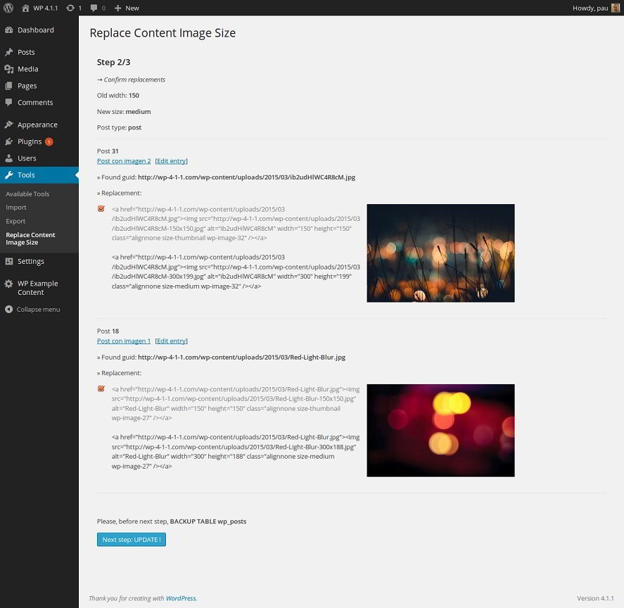

Sometimes, you may not like your current WordPress theme, and you may think of replacing it with some other template.

Themes allow you to export settings. But the settings you back up will be compatible only with the theme i.e. You can't move settings of a Mythemshop template to TagDiv NewsPaper or Elegant Themes Divi.

When you change your template, you may have to tweak the design for the best experience of the user. You may also have to change image sizes so that the blog posts don't look horrible or broken.

Changing design is an easy task in an advanced or premium theme. If you want to change the code, you can get help from the theme developer. You can manually modify the code by editing the respective PHP file with the CPanel, Linux Terminal or Windows Putty.

Changing image size is an easy task if your WordPress blog has 10 to 20 posts. For a large site with over 100 posts, this is a very frustrating and time-consuming task.

You will have to write a filter that modifies the width and height of blog post images. The filter must have a regex expression to match image dimension pattern. The best way to change image size in WordPress post content is by using replace content image size plugin.

RCIS plugin adds an image dimension changer to your WordPress dashboard. You can access this utility under the tools option in the WP dashboard.

Changing the dimension of images in published posts is a 3 step procedure in RCIS. Before you go ahead and run this tool, make sure that you've created a WordPress database backup as the plugin modifies the post DB table.

In the 1st step, you'll be asked to enter the width, new size and post type.

In the 2nd step, the plugin will process the input data, and it will display a list of the posts along with their HTML image code and pictures. It will also display a toggle box to select a picture/post and an update button.

To change image size, the user must click on the update button. Once the plugin has processed the DB, it will display a success message.

WordPress 4.4 automatically makes images in blog posts responsive. You can check the result by opening the blog posts in different browsers.

**My Verdict**:  Though the plugin is new and it doesn't have too many ratings, the RCIS plugin works great. I've used it on a WordPress blog with 1100 posts and 4000 images. You can get the plugin from the WordPress.org repository.
