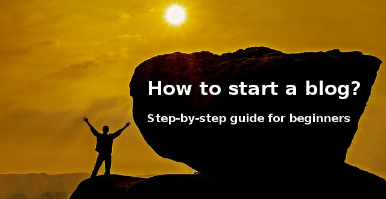
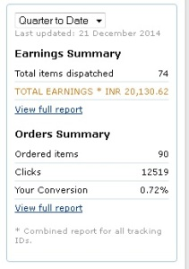

If you want to start a blog, through the below points as we have shared a detailed guide for creating a new blog.

## Step-by-step guide for starting a blog

### 1) Choose a Niche

Niche is nothing but a topic on which you'll blog on. Spend few hours in writing 2 or 3 some niche ideas on a paper and think hard on your favorite topic. Some topics that you can shortlist for your new blog is technology, food, tourism, marketing, etc. No matter what blogging topic you select, make sure you have good knowledge of it.

For example, if want to start a blog to share tips on making money online, make sure that you have good marketing skills. Readers will not like your content if they don't get knowledge from it.

### 2) Choose your blogging platform

Well, I have already shared the differences and similarities between WordPress and blogger. Blogger platform comes with several limitations. The major problem with it is that you don't have the control of blogger platform. My first blog was powered by blogger.

While I was using blogger, my site suffered from several SEO issues. I had to move from Blogger to WordPress to provide users a good experience.

I and many other bloggers use the self-hosted WordPress content management system. WP is a versatile platform. You can easily create any type of website with it.

Choose WordPress if you're building a blog for a long run and if you want to make money online.

WordPress is the best blogging tool for beginners. Once you set up WordPress, you have to log into the dashboard and start posting quality articles.

Before you can access the dashboard, you must install WordPress. To do so, complete the next step.

### 3) Register a domain name and get web hosting

This is the most important step because you won't be able to start a blog unless you get a hosting account and your domain name. Most bloggers fail to make money online and get traffic to their site because they choose a bad hosting provider.

As you are starting a blog with an intention to make money, you should consider setting up your site with a high-quality hosting provider. Bluehost is the world's best and cheapest top-rated hosting service provider.

Bluehost is an excellent choice because you'll get a free domain name along with high-quality hosting for cheap. The hosting provider is recommended by the developers of WordPress content management system itself.

## Step-by-step guide: how to create a blog on Bluehost?

**Step 1**: Visit Bluehost.com and click on the select option below basic plan. If you plan to launch more blogs, chose plus or prime plan.

**Step 2**: Enter the domain name of your choice and click on the next button.

**Step 3**: Fill the account information form, scroll down and uncheck domain privacy protection, site backup pro, and site lock security options. These features are unnecessary.

**Step 4**: Scroll down and complete the payment. Great job! Now, your first blog will go live in 2 minutes.

Bluehost will send an email with login details. Login into your Bluehost account because we'll now install the world's most popular blogging software i.e. WordPress.

## How to install WordPress on Bluehost?

Find the website builder tool in the Bluehost dashboard and select the Install WordPress CMS option from the plethora of software displayed on the screen.

Enter your blog name, desired username, password to access the WP dashboard and click the OK button.

Once the 1-click installer installs WordPress on your server, it will send you an email. Mark the email as important as it has the login credentials and the login URL.

### 4) Theme installation after starting a blog

If you'll search for free themes, you will be confused. There are 10000 of free themes in WordPress directory. You don't to try each template. Just go through the theme rating and user reviews. Once you've selected a template for your blog, download it to your computer.

The theme you have downloaded must now be installed on your site. Login to your WordPress admin console and go to the themes section. Select install a new theme and go to the upload method. Now select the stored theme. Zip file by clicking on the file browser tool. Now click on the install button. Done!

The other method of downloading the theme is as follows:

Log into the dashboard.

Over your mouse cursor on the appearance option and click on Themes option.

Now, the theme interface will show several themes on your screen. Install a theme you like and install it.

After the WP CMS installs the template, move your mouse cursor once again on the Appearance option and select customize.

You can now begin to customize your new blog as per your requirements.

Customization involves adding a menu bar, logo, widgets to the sidebar, etc.

## What should you do after starting a blog?

### 1) Verify your site with Google and bing webmaster tool

These 2 search engines must index your website. To do so, you must verify your site with the two search engines.  Verification is an easy task and it hardly takes 3 minutes. Once you're done with the verification process, you will be able to track your website performance in search engines. The webmaster tools account will also make you aware of the HTML, mobile, server, DNS errors.

### How to verify your new blog with Google or Bing?

Install Yoast WordPress SEO plugin. To do so, open the plugins page from the WP dashboard. Enter Yoast in the search box you see on the page and click enter key.

Once Yoast plugin installation option appears on the screen, click Install button. Now, activate the plugin and navigate to the Yoast settings main dashboard.

Select the webmaster tools tab and click on the following two links:

- Bing webmaster tools.
- Google Webmaster tools.

Once you enter the verification page of the two webmaster tools, follow these two guides to get the verification code.

Verify ownership with Google.

Verify website ownership with Microsoft Bing.

Copy the verification code and paste it in the text-boxes you see in the webmaster tools page of Yoast plugin.

Click Save Changes button.

### 2) Install the best WordPress Plugins

Install these best WordPress plugins to make your blog more productive and powerful.

### 3) Signup for Affiliate program and a choose a product

If you've chosen technology niche then Amazon associate is the best affiliate program for you. Commissions are good. If you've chosen Blogging niche then you should promote website hosting plans. Don't spend your time in getting your blog approved for AdSense ads. Unless your site receives high-quality search engine traffic, you won't get accepted in AdSense program. For inspiration, have a look at the below screenshot for my Amazon affiliates earnings proof:

### 4) Write High-quality content and publish it on your blog

This is the most important point in this article start a blog and make money online in 10 easy steps. Google is constantly lowering the ranks websites with thin and low-quality content. Content is king. If you write high-quality content then you can expect you blog to do well in search results else you should consider some other method to earn money online. Once you have successfully executed the above steps, write quality 500+ word blog post on a product you want to promote (by including low competition high traffic keywords) and publish it.

### 5) Promote your Blog

Join social networking groups and promote your blog posts.

You can promote your blog through the following mediums:

- Social networks such as Facebook, Google Plus, Twitter, Pinterest.
- WhatsApp groups.

Although making money online is not an easy task, if you follow the below steps correctly, then you can easily become a successful blogger and make a good amount of money from the blog.

Image credits: Pixabay
