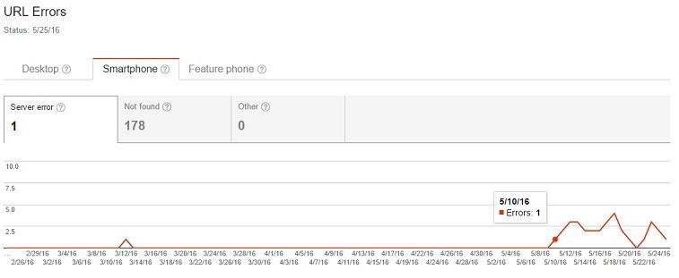
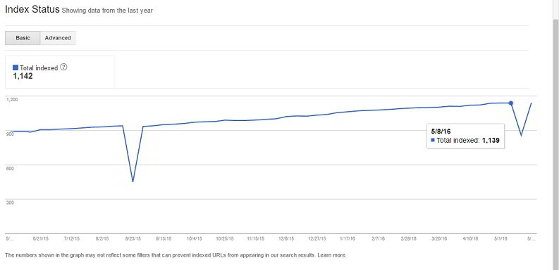
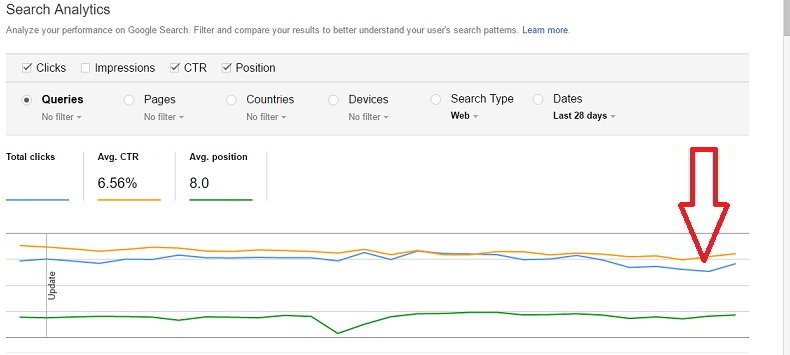

If you're a regular reader of this blog, you may have noticed that this site was throwing error establishing database connection or internal server errors last week.

The issue which was caused by the Linux out of memory manager has now been fixed, and the site is now live 24 x 7. I'm using this server to host some other WordPress websites as well.

Fixing the error was a very confusing task for me. To be honest, I didn't know about OOM process killer in Linux. If I knew how this module worked, the error would have been fixed on the day the error message appeared the system log file.

The downtime affected my affiliate and Google Adsense earnings a bit.

Initially, Google didn't drop rankings of my site. But as the error started to appear once again, Google reduced the crawl rate and dropped some pages from its index.

The error was first reported on 10th May 2016, and it continued to appear till 24th of May.

As the problem was not fixed, Google was not able to crawl my site. The search engine assumed that the pages are no longer available, and it dropped the pages from the search index.

 The website's traffic had dropped 10 percent. Google Analytics showed increased bounce rate as well.

Once HTTP 500 internal server errors were fixed, Google bot recrawled the entire website. The pages which were dropped were now indexed. The SE started to restore the traffic.

Google has been designed to offer the best UX to its users. If the website is down for a few hours, the site's ranking will not suffer. If the website is repeatedly throwing errors, Google may drop pages that are returning 500 internal server error status codes instead of HTTP 200 code response. It will reduce the crawling rate of your website.

**Conclusion**: HTTP 404 errors don't impact a websites search engine ranking, but 500 internal server error does. Make sure that you keep an eye on the crawl errors report in the Google search console. Fix the errors as soon as you find them.
