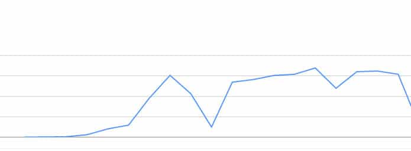

According to Google, HTTPS is a ranking signal. If you make your website secure by configuring the web server to deliver HTTPS pages, your site may rank higher than an HTTP only portal.

More importantly, web browsers have begun to warn their users of non-secure web pages. The Google Chrome browser (version 56) marks non-https website pages as insecure when they have an HTML field for entering passwords, credit or debit card details, etc.

Chrome is a widely used browser. You wouldn't want Chrome (or any other browser) to scare the visitors by displaying a warning message.

As of today, GC is the only browser to display the warning. In the coming days, other popular browsers may follow the suite.

Enabling SSL certificate on a website deployed on a shared hosting server is easy. Most shared hosting providers offer a one-click option in the CPanel to activate the SSL certificate. If you're using VPS hosting, migration is not easy unless you follow in-depth tutorials. If your site is small, the migration should take up to 2 weeks. But if your website is large, the HTTP to HTTPS migration may take up to a month.

Once your web server starts serving HTTPS pages, Google will begin indexing the HTTPS pages. During migration, your site may disappear from the SERPS.

This is temporary. Your site may disappear from search results once or twice in a week. After 15 to 20 hours, Google will restore the website's ranking.

When your https site is ranking in the SERPS, Google will show up the HTTP version of your portal in the search results.

One important thing you should note is that the keyword rankings will not change

I've enabled HTTPS on two sites. Google hasn't dropped the rankings of my site. The CTR, impressions, position and no of clicks of the HTTPS version of my site are same as the HTTP version.

### Will the traffic decline after migration?

No, Google will not punish your site for switching to HTTPS. If your site is serving HTTPS pages and is not ranking for your top keywords, you should fix the HTTPS errors and redirection issues.

If the redirects are set up correctly, your site's traffic statistics may have fallen because of an algorithmic update.

**Conclusion**: Everyday, 100s of websites are being switched from HTTP to HTTPS. During the migration process, your site may disappear from the Google search result pages. After few hours, the rankings will be restored.
