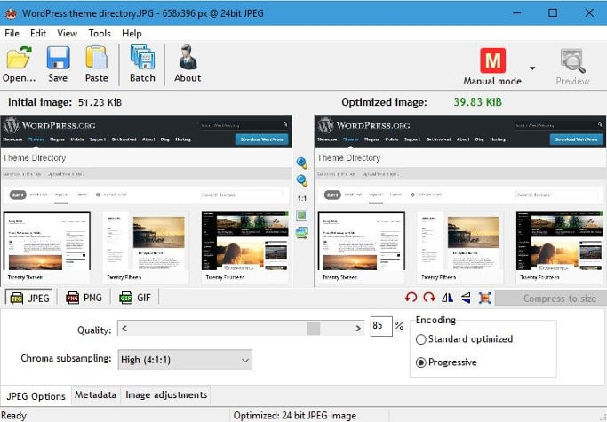

Do you know? Images can bring tons of high-quality organic traffic to your blog or website. A website without pictures looks strange. Visitors may not find such sites attractive. If the blog post doesn't have related pictures, visitors may not read the full content.

Today, we've shared 7 useful tips for image optimization. If your site has many pictures, but if it doesn't get a good amount of traffic from Google image search, follow the below tips.

## Best tips for Image SEO

**Don't copy images**: Avoid downloading pictures from premium photo sharing site like ShuttferStock, Getty, etc. If the picture has a watermark, don't use it in your blog post.

**Define alt tags**: Content management systems allow users to set alt tags. These tags help search engines understand images. If you specify this tag, search engines will link it to the picture. The image will appear in Google pages each time the visitor enters the keywords mentioned in the alt tag.

**Don't create image pages**: Creating separate pages for pictures is not a good idea. They waste page rank and make your site look like a spammy MFA site.

**Avoid clickable images**: Don't make pictures in the blog posts clickable because they're also responsible page rank loss.

5 steps to make a photo in WordPress blog post unclickable:

1. Hover mouse on the picture.
2. Click on the edit option.
3. Select none option in the front of link to the label.
4. Click OK button.

**Remove EXIF data**: Image file store metadata information. The information is of no use for the regular visitor. Hence, you should consider removing it. I use the radical image optimization tool for the same.

**Scale large images**: Although modern websites will automatically make an image responsive, we must upload images having the same/smaller width than the main content DIV width.

Larger pictures will take more time to open than smaller images. If the file is huge, it will take some time for the pic to reach to the client's browser.

**Expiry time**: Setting expiry time for static resources improves the server's performance and decreases the page speed dramatically. If use WordPress, use the best caching plugins like WP Super cache, W3TC to make the browser on the client machine save static resources such as images, CSS, JS, flash files for a longer duration.

**Conclusion**: Making blog pictures search engine friendly is not a difficult task. SEO optimized pictures will help in increasing the visitors to your site. If you've ignored image optimization, implement the tips I've shared above.
