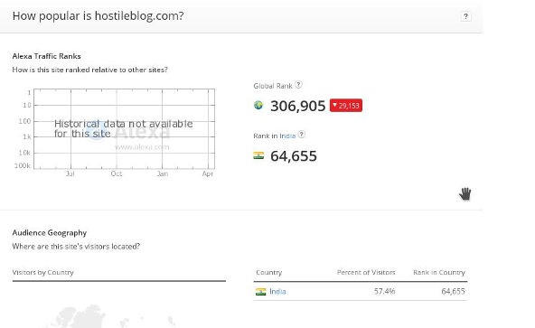
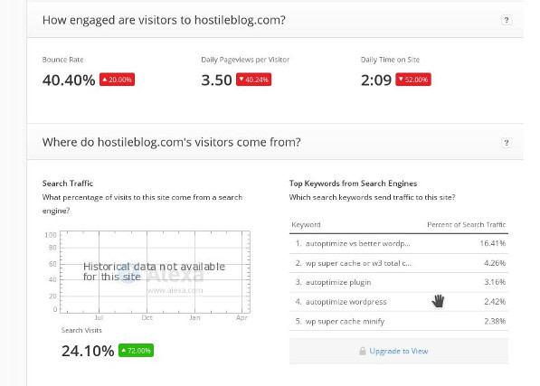

Google PR is dead, and it will never be updated in the future. Advertisers have started using Moz rank and domain authority to know whether a website is ranking high in search engines or not. One more important factor they consider for checking the popularity of a website is the Alexa rank.

Domain authority and MR is generated by inbound link data of a website. Thus, a site with a good number of backlinks will have a good DA/MR. In one of our articles, we have mentioned that you shouldn't create inbound links manually. Make sure that you go through the article to know what happens when backlinks are created artificially.

Alexa rank is not related with any of the Google products. It has nothing to do with the website's performance in the search results. To be honest, no one excluding the people who work at Alexa knows what factors are considered to rank a site, but we do know a method to improve the AR.

There's a simple hack for improving the Alexa rank. Just install the Alexa toolbar on the browsers you use. The rank will keep reducing until it reaches up to 100000 or 150000.

The toolbar works great. You can install with on Google Chrome or Mozilla Firefox web-browsers. When you open any website, it will make you aware of its Alexa Internet rank on the fly.

To check additional details of a website i.e. country-wise rank, bounce rate, daily page-views per visitor, daily time on the site, top keywords, upstream sites, loading time, contact details and the number of backlinks.

 

Alexa is an internet company which is now owned by e-commerce giant Amazon. It has developed some useful tools for webmasters. The tools are as follows:

- Keyword difficulty tool.
- SEO audit tool, etc.

The above two tools are not free, but you can try them out by signing up for the seven days free trial. In my perspective, the Google search console is the best and only SEO auditing tool a webmaster should use.

The keyword planner from Google gives you free access to a huge database of keywords. It also makes a webmaster aware of the keywords that a website is ranking for.

**Conclusion**: Although the Alexa rank doesn't have much significance in the SEO world, it is still referred by 100s of advertisers. A good AR might have a positive impact on the revenue of your website. A bad rank will not harm your site's search engine rankings. Use the method we've shared in the article to increase your site or blog's Alexa rank.
