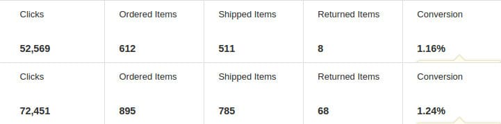

Amazon Associates affiliate program is one of the most important sources of revenue for many bloggers. If you're struggling to earn money from Amazon, follow the below tips.

## Effective tips to increase Amazon affiliate sales

### Send more traffic:

Amazon is counted among the most trusted brands in the world. It has listings of more than a million products. The products include household items, accessories for mobile devices, cameras, etc. They have a competitive price tag due to which people don't hesitate in buying expensive or inexpensive stuff from Amazon. Hence, the more traffic you send to Amazon, the higher will be the conversions. I can say this from my personal experiences.

I embedded plenty of Amazon associates affiliate links in articles of my technology website as compared to last year. My earnings for 2016 increased. Here's the proof of the same.

### Link to relevant products instead of archive pages

Amazon has lightning deals, top offers pages where products are sold for high discounts. These pages offer value for money products to the customer. I tried to generate affiliate sales from these pages by inserting their URLs in posts that receive maximum traffic. But for some reason, I failed.

I replaced the links with links to product pages, people started buying the products. What I want to explain is if your blog post is a review on fashion item such as sunglass, gown, innerwear and similar item, open Amazon fashion page and use site stripe tool to generate affiliate link to that page. Embed this link in your post.

### Varying anchor texts and buttons

Testing is one of the most important activities of an affiliate marketer. To increase Amazon affiliate sales, try different anchor text for the hyperlinks. If people are not clicking the links, insert the buy now button in the blog posts.

### Use native ads

Amazon has introduced Amazon native ads that generate responsive ad units which flaunt products relevant to the page. Create native ad units and place the ad code at these right positions. The ads have the product name, price, image and they are easy to implement. If you're using WP, use the best Adsense plugins to insert them.

**Conclusion**: Amazon associates affiliate program is one of the top ways to earn money online. If you already have an AA account and want to increase affiliate sales, follow the tips I've shared above.
