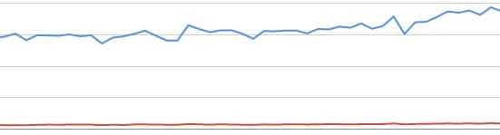

A Blog's income directly depends on the number of visitors your site gets from search engines. In AdSense terms and conditions, it is clearly stated that a user should avoid all fake methods of generating traffic. Affiliate marketing doesn't have strict terms and conditions. My blog's traffic was down several times but I never gave up.

When I started with blogging, for the first 6 to 7 months, there were just 500 to 600 visitors/month to my site. When it was affected by a penalty, the traffic dropped to 100 or 200 visitors. These stats were not enough to generate a decent income nor was I eligible for AdSense program. Now the traffic has increased more than 10 times, 50 percent of my online income is from Adsense and the rest comes from four affiliate programs. Before the year 2016 ends, I expect my blog traffic to increase over 10000 UV/day. Here are the techniques I used to improve traffic to my blog.

**Remove all low-quality posts:** Many low-quality websites are dead after every Google penguin and panda algorithm refresh. If your site is affected by penguin, use online backlink checker tools to identify and remove all dofollow links that you've built. In the case of the panda algorithm, you'll have to shed each post that features grammatical mistakes and low-quality content. If the content is not bad, increase its length by adding few more lines. One of my sites was affected several times with these 2 updates. The last major panda algorithm refresh (just before Diwali 2014) had cut the organic traffic to my blog by 30 to 40%. I used the above two recovery techniques to improve Google traffic and recover my earnings. Bing doesn't penalize blogs and websites as much as google does. Thus, traffic from bing will remain unchanged.

**Make sure that your content length is over 300 words:** Writing long articles will make users spend more time on your time which in turn increases user engagement and bounce rate. If there are a lot of articles on your site whose length in around 200 words, spend some time and add few hundred more words to it. The search engines like Google and bing love high-quality content. Thus, it will rank long posts higher than articles with just 100 or 200 words.

**Facebook and Twitter:** Increase twitter, Google plus, and Facebook followers, share your posts with them and your blog traffic will increase for sure. Adsense program will not pay you well if most of the traffic to your site is from social networks. But if you're using an affiliate program to monetize your blog, this strategy will surely pay off. Don't use Facebook liker as your FB page will get banned. Using tools to improve followers on other social networks is prohibited. You can add social media buttons for the same.

**Use Search engine optimized theme:** Many free themes su\*\* and they're the main reason why many bloggers fail to establish themselves or earn money online. These themes are not responsive and they are not SEO friendly. To get better results, you should buy a high-quality SEO friendly theme like ThemeForest NewsPaper, X Theme, MTS Schema or ElegantThemes Divi. Before purchasing any theme, go through its reviews. Many top blogs powered by the WordPress content management system use paid templates. After switching from free to paid theme, the traffic of my site increased and its bounce rate decreased by 5%.
