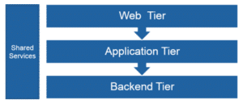
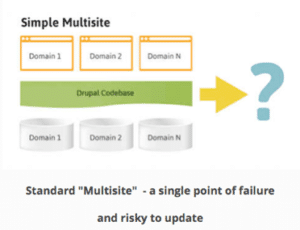
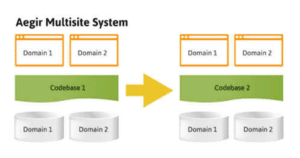

A project I was recently working on had in place a cloud-based infrastructure that was designed to support a single installation of the Drupal CMS running in Amazon Web Services (AWS). This infrastructure included an auto-scaling setup with load balancers hosting a 'cache' layer and an 'application' layer that hosted the Drupal CMS. On the backend tier, an AWS Relational Database Service (RDS) provided the MySQL database needed for the application. There were other components of the infrastructure such as our shared services for continuous integration, monitoring and development tools.

At a high level, the following tiers provided a basic organization of the infrastructure broken down into its respective layers.

 Driving the continuous integration and continuous delivery pipeline (CI/CD) was a library of bash scripts, which were created initially to support Drupal 7 AWS projects. The limitation of these scripts was that they were built to only support one instance of Drupal. Their main function was to deploy Drupal in the Application tier serving the cached tier backed by one RDS database instance. In order to scale the scripts, much work would have been involved in re-architecting the CI/CD processes that would ultimately impact the infrastructure. As such, multi-site options were researched. This document outlines four approaches we considered in order to scale to multiple sites, leveraging the existing infrastructure, that would not impact the current website or architecture. Each of the approaches includes a brief description, links to resources where applicable, and a scorecard and set of assumptions. While every Drupal project is different, it is my hope that some may benefit from this overview.

## Method 1: Multi-site Drupal

Multi-site Drupal (https://www.drupal.org/docs/7/multisite-drupal/multi-site-sharing-the-same-code-base) has been around for a while. It allows you to share a single Drupal installation (including core code, contributed modules, and themes) among several sites. Each site will however need its own database or new prefixed tables within the existing Drupal database (Not recommended due to size).

 Figure 2: Sourced from OS Training

Multisite carries a certain level of risk depending on the complexity and traffic to the new sites that would be added to the infrastructure. Since only one codebase is used, one single point of failure exists and is now shared with the main Drupal website and any that are shared. Ideally, in this and any of the scenarios given, a proper risk assessment would be created supported by analytics data and any other information available on the proposed migration sites prior to implementation.

Another option for multi-site implementation comes from the Aegir multisite system (http://www.aegirproject.org/) that helps reduce risk for a larger number of sites by providing a way to split Drupal into separate codebases for multi-site implementation.

 Figure 3: Sourced from OS Training

This is a much more complex system to setup, however it may provide the scalability needed to support a high number of sites. Keep in mind every new site still needs its own set of RDS databases or prefixed tables which could add to long-term maintainability issues.

Regardless of multi-site implementation, both options here allow for shared module use as well as siloed site-specific module and theme code. This can be both a benefit and drawback depending on how complex each site will be adding to Drupal core overhead.

**Scorecard**

- Complexity to Setup: Medium
- Maintenance: Medium
- Risk: Medium
- Cost: Low
- Scalability: Medium

**Assumptions**

- Additional sites would be in Drupal 7 (As per shared core)
- Same code base will be shared but different database instance will be required
- Cost is low due to sharing of same infrastructure
- Setup may be complex in some areas such as SSO where separate SAML libraries may be required

## Method 2: Tacking on to Drupal Core

The quickest (and cheapest) method in terms of fast development time and least complexity is a process that ‘tacks’ on to the existing Drupal site using a range of modules such as Themekey and Domain Access. In this approach, no changes would be needed on the AWS infrastructure to support an additional site. A new theme would be installed and configured to serve the new site.

Permissions would be modified to allow access to specified site-specific content and content types. Third party libraries such as SAML could be re-used with no configuration and development labor costs to implement separately. This approach differs from multi-site because a ‘tacked’ on site would essentially use the same database and codebase as the existing Drupal instance. It essentially is the same application but separated with permissions and contributed modules. As with multi-site, the risk is medium because one core is used and one single point of failure for all sites. Traffic and resource usage would need to be analyzed carefully. This approach would be best suited for adding small / low resource usage sites and therefore would not be scalable for a higher number of sites or larger / more demanding sites.

**Scorecard**

- Complexity to Setup: Low
- Maintenance: Low
- Risk: Medium
- Cost: Low
- Scalability: Low

**Assumptions**

- Micro-site would be in Drupal 7 (As per shared core)
- Same code base will be shared and same database (essentially the same site with a sub-directory or aliased domain)
- Cost is low due to sharing of the same infrastructure
- Setup is straightforward and fast development due to reusing same Drupal 7 instance

## Method 3: Separate instances (cost per instance)

As mentioned above, the Drupal Platform was designed to host one instance of Drupal along with a caching layer and services. In an ideal world, if we wanted a second Drupal site we would simply create a new infrastructure to support this re-using the Drupal Platform as needed. In this scenario, two new load balancers would be needed to support two sets of separate servers for the application and web tiers. A new RDS instance would also be required.

While we could leverage the same shared services for CICD and development, the cost and complexity of this approach would be much higher than the others. The risk, however would be lower as it would involve an isolated environment (Regardless of what happens to the new site, the existing Drupal site would remain unaffected). The complexity involved in setting up an entirely new infrastructure for each additional site (including third party SAML integration) and potential ATO documentation for changes is high.

**Scorecard**

- Complexity to Setup: High
- Maintenance: Medium-Low (Leverage existing Drupal Platform)
- Risk: Low
- Cost: High
- Scalability: High (At a cost)

**Assumptions**

- Additional sites can be built on any technology (Drupal 8, Static Site Generators, etc.)
- New code base depending development options and choices
- Cost is high due to standing up brand new infrastructure
- Higher labor costs in terms of development (from the ground up) but highly scalable

## Method 4: Separate instance grouping

Taking Method 3 one step further and applying method 1 or 2 to support multiple Drupal sites per infrastructure is another approach we could entertain. The biggest advantage with this approach would be that of scalability while reigning in costs. This is still an expensive option and involves a similar level of complexity as option 3, but it may be necessary if talking about several hundred Drupal instances.

**Scorecard**

- Complexity to Setup: High
- Maintenance: Medium
- Risk: Low
- Cost: Medium
- Scalability: High

**Assumptions**

- Additional sites can be built on any technology (Drupal 8, Static Site Generators, etc.), or if using method 1 or 2 will be tied to parent site technology (Drupal 7)
- Different codebase per shared infrastructure but shared within groupings
- Cost is medium due to standing up a brand new infrastructure for each grouping
- Higher labor costs in terms of development (standing up new groups) but is scalable
