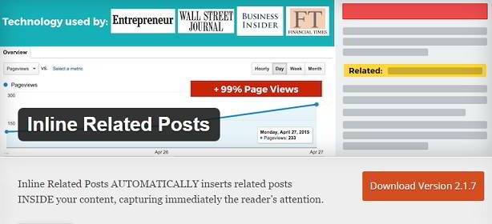
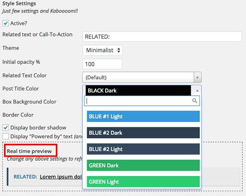

On many established blogs, you'll find related or recommended articles in post content.

The posts are embedded in a stylized , 
 or 
 and they attract visitor's attention. They're known as inline related posts (IRP). IRPs, when placed at the right position can reduce the bounce rate of a blog. They can also increase the page-views.

Established websites have enough revenue to hire a WordPress developer who can write the code to insert content hyperlinks inline of the post automatically after the post has been published.

Most WordPress users don't know coding, and they rely on the free plugins available in the WordPress.org directory. Yarpp is the best-related post plugin for WordPress, but it inserts related links at the bottom of the post content. If you know PHP, you can use Yarpp shortcode to place the RP at any position of the article (i.e., middle, after 2nd or the last paragraph, etc).

Fortunately, there's a free plugin that lets you add inline related posts quickly.

The IRP plugin from IntellyWP is enabled when the user check's the active box. When it is active, you'll find several customization options.

IRP allows you to set a personalized text message that should appear beside the related post. The text will be aligned to the left of the hyperlink. There's no option to move it to the top or right.

The Free version of the Inline related post plugin includes just two themes, minimalistic and shocking. The theme drop box will display five options, but you're allowed to use only 2.

The Inline RP lets you specific the initial opacity of the box in percentage. When the user hover's the mouse cursor on the block, the opacity will be restored to normal. The plugin allows WordPress users to specify a top or bottom margin. You're authorized to set one of the predefined related text, post title background colors. Only the premium users are allowed to choose the hover text color.

The WordPress inline related posts plugin is powerful because it can process already established posts. If your blog has 1000s of articles, the plugin can easily and automatically insert related articles. The plugin won't break the pages or posts where you've inserted tables or other complex HTML objects. It will not cut images (hyperlinks), nor it will affect the layout of existing paragraphs.

The Inline related posts plugin has an option to specify the number of posts that should be inserted in an article. This feature has been added to limit the number of related articles on a give page or post. You can specify the number of words or characters after which the related articles should be inserted.

Download the plugin

The plugin features an option to configure search related posts by categories, tags (or both) to make sure that there's a positive impact on your website. If you want, you can make the internal links nofollow by checking the link "rel" attribute box. The plugin can open the inserted internal links in a new tab or the same window.
