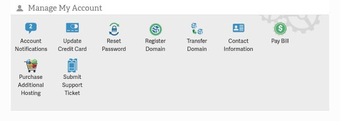
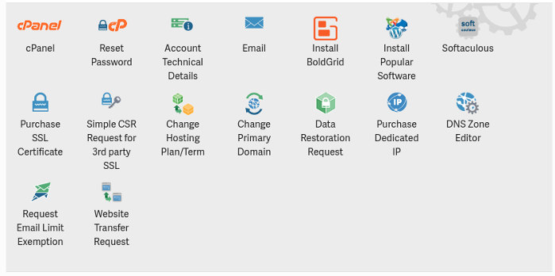
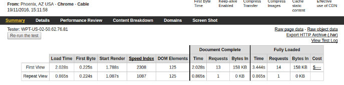

InMotion is one of the top-rated hosting providers in the world. It is an independent company and not a subsidiary of EIG. IM has cheap and feature packed web hosting plans suitable for all types of users.

InMotion supports over 399 web applications and uses the high-speed SSDs aka sold state drives in their servers. It has excellent ratings on various review websites. Genuine users like you have published their honest reviews.

In case you're planning to buy shared hosting from InMotion and want to learn about various features the hosting provider offers, go through the following paragraphs.

### InMotion hosting review 2016

### Plans

People buy hosting only after going through the plans. InMotion offers the following three shared hosting plans:

1. Launch.
2. Power.
3. Pro

The below table shows the differences between the Launch, Pro, and Power InMotion hosting plans.

| Feature | Launch | Power | Pro |
| --- | --- | --- | --- |
| PostgreSQL/MySQL databases | 2 | 50 | Unlimited |
| Websites on account | 2 | 6 | UL |
| Support type | Basic | Basic | Pro level |
| eCommerce support | No | Yes | Yes |
| Parked domains | 6 | 26 | UL |
| Maximum Subdomains | 25 | 100 | Unlimited |

Each shared hosting plan offered by InMotion provides:

- Unlimited storage memory and bandwidth.
- Free web-transfer with no downtime.
- Free domain name worth 14 to 15 USD.
- 24 x 7 support.
- Advertising credits worth $250.
- Option to choose datacenter.
- PHP 5.6 to 7.0 installer.
- Python, Ruby, Perl support.
- Remote login option with SSH.
- WP-CLI.

InMotion shared hosting plans price starts at $7.99. The power plan costs $9.99 and it offers double resources as compared to the Launch plan. The Shared Business plan costs $15.99.

**Signup for InMotion here and get $2 off (discount) on the above plans.**

Once you sign up for InMotion hosting, the hosting provider will dispatch two emails to your registered email address. The 1st mail confirms the payment and the 2nd email has details on how to get started with InMotion hosting.

The second email provides you with a link to set a password for your hosting account. Click on the link and follow the instructions displayed on the password set up page.

Once you set the password, log in to your InMotion hosting account.

### InMotion hosting CPanel and AMP

InMotion hosting provides Account Management Panel aka AMP. The panel is divided into three sections.

1. Manage my account.
2. Manage web hosting.
3. Billing snapshot.

The 1st section has the options to:

**Transfer or register a new domain**: If you want to add a new domain to your account, click on this option.

**Update credit card or contact details**: InMotion hosting accepts payments with credit cards provided by all major banks. Changing contact information is easy because of the AMP's simple UI.

**Change password**: Once you log into the AMP, you can access InMotion hosting CPanel without entering the password. Hence you must set a strong password for the management panel.

**Pay due bills**: The 3rd section i.e. Billing snapshot shows the next payable amount, due date, product name, and term. If the plan is about to expire, you can easily renew it with this option.

**Raise support ticket**: In case you're not able to access your website or a tool provided in the AMP, simply create a support ticket.

**Purchase addition hosting**: If your planning to launch a new website on a new server, click this option.

See full details here on InMotion website.

### Web hosting section

InMotion hosting makes it easy for newbies to launch a website quickly by providing an intuitive interface for:

**Opening CPanel**: Control Panel is the most important module of a shared hosting plan. As most users using shared hosting are non-technical, the CPanel makes it easier for the users to create database/DB backups, view resource usage, view bandwidth usage, etc. InMotion hosting offers a beautiful CPanel with over 50 options.

**Account technical details:** Here you'll find quick links to your webmail account, temp URL/webmail, secure shared server, etc. You'll also find the nameservers and their IP addresses, CPanel username, etc.

**Install software:** InMotion hosting allows users to install popular software such as WordPress, Drupal, Joomla with a single click of a button. The hosting provider offers the Softaculous tool which makes set up of widely used software an easy task.

**Purchase SSL certificate**: Many webmasters are enabling HTTPS encryption for their websites ever since Google announced that HTTPS encryption is ranking signal. You must buy an SSL certificate from a trusted company to enable HTTPS. If you use InMotion hosting, you can easily buy SSL certificate from the AMP.

**Change hosting plan**: InMotion allows users to change their hosting plan through their dashboard.

**Website Transfer Request**: If you are a non-technical person, this option will help you move your website from old hosting provider to InMotion without a headache.

**Buy dedicated IP**: InMotion Hosting may change the IP address of a website during a maintenance activity. In case you don't want them to assign a different IP address to your website, buy a dedicated IP address.

Signup for InMotion hosting and get $2 discount here.

### WordPress installation

I used Softaculous to install WordPress on my shared hosting account. During installation, Softaculous prompted me to:

- Select website protocol.
- Specify primary domain.
- Enter the directory where you want Softaculous to save.
- Enter site name, site description, admin username, password and a branded email address.

It also displayed advanced options to set database name, password, DB username, option to send installation details to a specific email address, and checkboxes to enable WordPress multisite mode and install a plugin to limit login attempts.

After the installation of CMS completes, simply update the name servers at your domain registrar. Your blog or WP portal will now be live.

### Speedtest

Check the TTFB value in the above screenshot. The screenshot proves that InMotion hosting has a solid infrastructure and powerful servers. New site load time (without any optimization) is 2 seconds.

### InMotion hosting Pros and cons

**Pros**

- Fast servers.
- Well designed dashboard.
- Excellent support.
- Great pricing.

**Cons**

- None.

**Conclusion**: IM shared hosting provides affordable plans and blazing fast servers. The CPanel software opens quickly in all browsers and the website setup takes hardly 20 to 30 seconds. In case you need support, you can easily create a support ticket or get in touch with support staff via Skype.

Click here to signup for InMotion hosting and get 25% discount.
