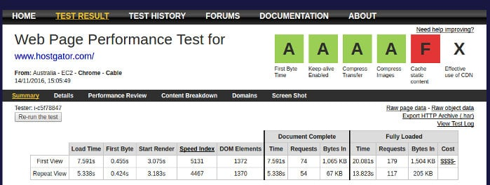
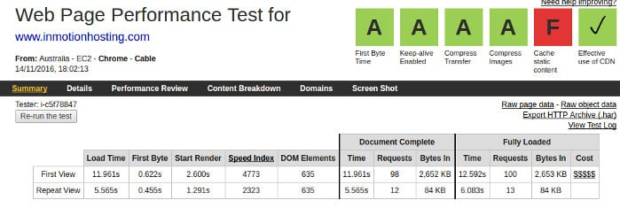

Several hosting companies challenge Hostgator by providing competitive plans with mouth-watering features. But the big question always haunts the minds of money spenders. Are the plans worth the money or is the company reliable?

As an answer to the above two big questions, we've shared comparisons and reviews of various hosting services. We've decided to share more comparisons so that you can buy get the best hosting for your site. Today, we've compared InMotion and Hostgator plans and features.

### Hostgator vs InMotion Plans

Hostgator and InMotion provide a variety of plans suitable for beginners and advanced users.

InMotion offers three shared hosting plans - Launch, Power, and Pro. Users will get a free domain name (.com, .net, etc). The cheapest plan costs $2.95 per month. With this plan, the provider allows you to host maximum 2 websites. InMotion lets its users create up to 2 PostgreSQL or MySQL DBs and doesn't have restrictions on bandwidth. The other plans i.e. Power and Pro cost $4.5 and $7.5.

Signup for InMotion here.

Economy Hatchling is the name of Hostgator's cheapest web hosting plan. It costs $5.5/month. Unlike InMotion, you won't get a domain name for free when you sign up with Hostgator. HG supports plenty of popular application which includes WordPress, Joomla, Drupal, Magento, etc. HG Economy Hatchling plan provides 100GB storage memory and enables hosting for a single domain.

You must signup for the Baby plan that costs $7.96 every month to host multiple websites. The Baby HG plan offers unlimited bandwidth and disk space

Signup for Hostgator here (Use coupon code HostileBlog to get 25% off)

### InMotion vs Hostgator Performance

A website performance depends on the following important factors.

- Network infrastructure.
- Server specifications.

A hosting provider that offers latest servers, software and having a robust network setup will outperform its competitors. Hostgator and InMotion have deployed their account registration and login websites on their own servers. Below are the web page test performance results for the same.

The above two screenshots prove that Hostgator and InMotion hosting have fast and powerful servers along with an excellent network infrastructure.

### Features

**Uptime**: Hostgator offers 99.9% uptime to its customers. I've used its shared hosting in the past and I can confirm that the uptime promised is correct. My site was never down when I used Hostgator.

I haven't used InMotion, but its honest reviews published by genuine users are good. People are happy with the InMotion uptime.

**Freebies**: Hostgator users enjoy $200 AdWords and Bing ads credit. They have access to free website builder tool called Weebly. They provide free website transfer service and offer over 50 scripts which you can install on one-click.

InMotion users enjoy freebies worth $250. The free stuff includes 200 USD advertisement credits worth $100 (each), free domain, etc.

**Applications Languages**: InMotion and Hostgator support the following languages and frameworks:

- WP, Joomla, drupal.
- phpBB, GBook, SMF, Gallery2, Zenphoto, etc.
- CGI, Fast CGI, Python
- Ruby on Rails, SSL.
- PHP 5, Perl.

It supports MySQL databases.

Other highlighting features of InMotion hosting:

- SSD.
- Secure email with IMAP.
- Option to select data center.

#### Conclusion:

Hostgator has excellent infrastructure. Click here to signup for its baby or hatching plan if you're a beginner or a website owner searching for a reliable hosting company. InMotion isn't a bad option, it has competitive plans and good reputation. Signup for InMotion web hosting.
