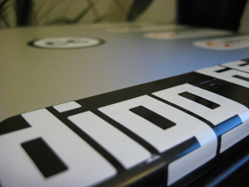
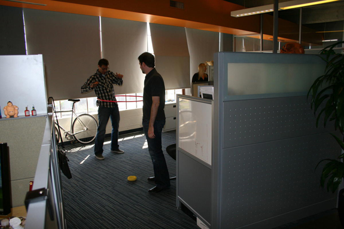

As a web designer myself, I have found that other web designers I talk to always have favorite websites they go to for inspiration. Not saying they want to copy a specific website, but there are just some site's that "stick" and really inspire you to create web designs.<!--more--> For me, this was Digg.com when I first found the site in 2007. It has gone through many design changes since then, but it's still one of the most successful startups for websites in the CA area, and it's fame is very impressive.

I got an interview with one of the software engineers at Digg, Kurt Wilms. A Computer Science major from The University of Minnesota, Kurt is a very intelligent software engineer and provides some insight into the Digg lifestyle. What it's like on a day to day basis, what it's like to design applications for Digg, and a whole lot more. Any other fans of Digg will know exactly what I'm talking about when I say I'm very excited to have this interview, and I hope you all enjoy it as well.

#### How did you first get into software engineering and design?

I studied Computer Science at the University of Minnesota, and I have been working on interesting projects since I graduated.

#### What type of work do you do at Digg and could you give us an example of a project within Digg you've created or helped develop?

I joined Digg right around the end of 2006 as a Senior Software Engineer. I believe I was employee number 18 or 19, and now we are around 80 employees. I've worked directly and indirectly on many of the core features the users of Digg interact with everyday. Now we have many more engineers compared to the early days. This is nice because it allows our engineers to work on pieces of the software that interest them. Lately, I've been working on the development of various new products that organize Digg's existing information in new and interesting ways.

#### Could you go over a typical day at Digg for you?

 I typically bicycle to work from Nob Hill which is where I live in San Francisco. The engineers at Digg have a pretty cool large open space where we work in Potrero Hill. It's really nice; bike friendly, dog friendly, etc. I'll spend most of my day writing code for the site, planning for new features, or analyzing data to help improve existing features or understand user behavior. Meetings can spontaneously occur throughout the day to address issues with the site.

Everyone has a desk in our office, but a few people spend a good amount of time sitting on the various sofas we have writing code or meeting in small groups. I tend to work at my desk for most of the day. Usually everyone leaves in the early evening. Most nights, I end up going climbing, getting dinner, or hanging out with some of the guys I work with once we leave.

#### Aside from developing software for Digg do you have any other side-projects you work on in your spare time?

We have something at Digg we call "Digg Ideas". Every couple of months we get together and employees can show off ideas they've been working on outside of their day to day responsibilities. Probably one or two features on the site came to be because of "Digg Ideas" side projects I've worked on.

Outside of Digg, I've contributed to a few open source projects, and I've released a number of small pieces of software.

#### What is the atmosphere like working at Digg or even just as a software developer in Silicon Valley?

Digg gives their engineers a lot of freedom over both the work and the work environment which is probably pretty typical for an Internet company. There is a lot of flexibility with my day-to-day schedule as well as projects and deadlines. There are exceptions; tasks others ask you to do for them, external deadlines or dependencies, but these goals are set cooperatively with coworkers, taking into account your interests and abilities.

I have total control over my choice of development tools. I write most of my code using emacs on a linux notebook. Others use vim on Macintosh notebooks, etc. As far as San Francisco goes, the number of technology related companies makes the Bay Area a great place for engineers. It seems like every night of the week there is some sort of meet-up, industry party, or tech talk. You'll meet the people who worked on the software and hardware you use everyday. You'll meet people who are starting new companies. There is probably no better place to live if you are a technology geek.

#### What are your thoughts on the social networking / web 2.0 movement that is sweeping the internet today?

Online communities can be powerful and open up new ways to communicate and share information. Of course, there is also the concerns about privacy and misuse. A lot of these "web 2.0" sites can be fun, but can also be a waste of time. I guess it's what you make of it.

#### Aside from surfing Digg what are your other favorite sites to visit?

We have a company IRC where lots of interesting links get shared. So, I see a lot of content during the day. A couple blogs I've been into lately: bikesnobnyc.blogspot.com, a hilarious blog dedicated to cycling faux pas and davidlebovitz.com, an interesting blog written by an American baker living as an expatriate in Paris.

#### Are there any upcoming developments in the works at Digg that you could share with us?

A lot of our focus at the moment is on reworking a lot of the core components of Digg. Right now I am working on a pretty interesting new feature that has been in the works for quite some time. I can't say much more, but it should be pretty interesting when we release it :)

#### If you had any advice for up and coming programmers and engineers what would it be?

I would say don't focus on specific languages or technologies. These things change, and they change constantly. The most important skills are the skills that are transferable. Once you have a deep understanding of general computer science concepts you will know where to look for the details later when you need them. Most of the really sharp computer scientists I know are incredible thinkers who really understand underlying concepts and theories.
