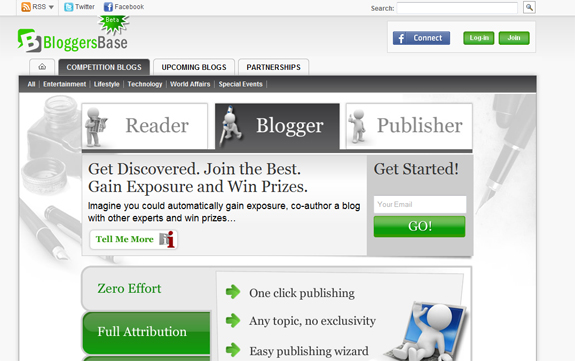

The term "blogging" is thrown around so much these days. There are millions of blogs, bloggers, blog posts, and people blogging every day. In fact, this post you're reading is on a blog! It's no wonder this area has exploded over the past couple of years, and there are many social networking sites connecting both bloggers and readers together.<!--more-->

BloggersBase is one of these such social networking sites. It's a site for bloggers and readers to join together and discover new content and readership. Members can search by keywords for popular blogs or users, and can also discover new blogs to follow! I got an interview with BloggersBase creator Dan Barak, and he had quite a few interesting things to say about this wonderful little blogging app.

#### What is the idea behind BloggersBase, and how did you come up with it?

BloggersBase set out to deliver premium user generated content, while allowing talented bloggers to get discovered. Instead of personal blogs, each blog on BloggersBase focuses on a single topic and is multi-authored by top bloggers in that field. Bloggers compete for the privilege to co-author the blog they are passionate about. This competition gives each blogger the chance to get discovered, while also making sure the casual reader is only exposed to the highest quality content.

Our discovery platform is bloggers powered and readers driven: if they so choose, readers can become very influential and really make a difference in determining the content of the blogs.

The idea came up during a brain-storming session among the BloggersBase founders, when we all realized how hard it is to find the content that interests us on the Web, which is overflowing with user generated content. We also realized how difficult it was for talented bloggers to get discovered and even make a living out of blogging.

#### How many active bloggers are on the site currently?

We have close to a thousand bloggers that have contributed content to BloggersBase, a large part of them are active on a regular basis, the others are taking advantage of a great benefits of BloggersBase.

The competition is also a cooperation. More bloggers and better content means everybody gets much more exposure. The blog is very frequently updated and attracts a lot of traffic. Not only that, but the burden is never on one blogger alone. Each blogger can take some time off, knowing that the blog will not lose its standing in the eyes of readers, nor lose search engine ranking. It's a luxury to know that you don't have to blog frantically, even when you are busy or on vacation – someone's got your back. When bloggers decide to write again, which often happens, they have to contend again for the right to co-author the blog and it can be as if they never left.

#### Can you share your favorite blog on BloggersBase, or a favorite post?

Wow, that's a difficult question to ask – almost like asking a father to choose his favorite child. I have to say that I read all the blogs on BloggersBase as much as time permits. It's fascinating to see how rich each of them is and how different they are in style as well as content.

It's often the case that during staff meetings we share with each other all the new things we've learned on BloggersBase. I really recommend people visit the main page from time to time, or simply have a look outside the blog they are involved in – it's a wonderful rich world out there.

#### How can bloggers promote and market their posts on the site?

Immediately after publishing a post on BloggersBase, each blogger is encouraged to promote it using the social networks they are members of, with just one click. For example, you can publish the title, image and excerpt of your post on your Facebook account, you can Tweet about it, submit it to Digg, Stumble it, etc.

This process can become automatic by associating your BloggersBase account with your Twitter and Facebook. Not only does this promote your posts automatically to both platforms, but it also gives you more benefits when other people with associations comment on your post. For example, if a user with Twitter association comments on your post, his or her Tweet will be a reply to you on Twitter.

BloggersBase users have friends on our platform, readers they respect (other readers that leave meaningful comments and recommend good posts) and favorite bloggers. Each time they publish a post, they can also notify their entire social network on BloggersBase about it, alerting them about it.

Bloggers can also grab their own personalized syndication widget from their profile pages and put in on their own blog or website. This enables them both to refer other users and win prizes, and also helps their fellow bloggers get discovered on yet more venues. As more and more bloggers use this widget, they will help and promote each other.

Inviting friends to join BloggersBase is very easy to do – we have several invitation forms and import contacts options. This increases your network on BloggersBase, so you get more people reading your content and voting for it and it also has the potential to increase traffic and exposure exponentially.

#### Can you explain a bit about how the rankings system works, both for readers and bloggers?

I would love to and I will start by saying that the system works best when users behave "normally", as if the system wasn't there. The system rewards most users that are not trying to manipulate it.

Bloggers are rated mainly according to the quality of their posts, i.e. how the readers rated them. Being prolific and consistent is also important as well as generating a conversation between other users on your posts. So the general guidelines are to focus on creating high quality posts, producing several is definitely helpful, but don't be tempted to prefer quantity over quality.

Readers are automatically rated by our system when casting their votes on other people's posts. After the post is published, there is a period during which its overall score is hidden, so readers can cast their votes in an unbiased manner. If the score you gave the post is close to the score it was given by the rest of the users, it implies that your expertise as a reader in that blog will rise – you recognize the crowd's opinion and its taste. But it's not just any crowd, as most people reading a specific blog are interested in its topic, know quite a lot about it and are even experts in the field.

This explanation is of course very simplistic and the algorithm for calculating user influence is much more complex, taking into account many more factors and variables. In the near future, BloggersBase will deploy its personalization engine, which will give each user his or her own view of the content, according to their preferences, social connections, etc. This will also affect the way influence is calculated.

#### How can bloggers make money off of BloggersBase?

BloggersBase awards its top bloggers prizes – each winner of the blogs gets $40 a week, while the runner up settles for $10, for a total of $50 per blog per week. There are currently 10 blogs that award such prizes, with plans to be joined by the best of the upcoming blogs.

Moreover, every BloggersBase user can refer friends and if those new users submit winning posts, the user who referred them will be awarded the same amount. This applies to users that have registered by following one of our syndication widgets, or banners, or simply direct invitations from the site.

We are about to launch a content marketplace, which will enable publishers and customers in general to order and buy content from our bloggers community. For those bloggers that are interested in providing such services, this can become a very substantial stream of income.

In my opinion, the most important way that BloggersBase helps bloggers make money is by getting them discovered. Not only does their content (and name) get a lot of exposure, but as BloggersBase gains recognition as a place for premium content, blogger rating on BloggersBase starts being another proof of their expertise and their skills.

#### Where do you see BloggersBase going within the near future?

BloggersBase is currently in the process of launching a few partnerships with newspapers and media companies. We'll be able to talk more about this in a few weeks, when we are ready to launch.

We definitely see such partnerships as the future of BloggersBase – we will provide our discovery platform and services to media companies that want to incorporate UGC into their offerings. We will make it possible for them to deal with the sheer scale of UGC, getting premium content for final review by their editors.

Think about any major magazine or media company you know – any aspiring blogger, writer or journalist would want to publish their content there. The magazine wants quality UGC, but they cannot simply use their editors to review ALL the submitted UGC – there's simply too much of it. So our platform harnesses the crowd and helps surface only the very best content for final review.

BloggersBase continues to develop features to promote our users, help them monetize their talent, as well as offer new ways to access premium content. One of these upcoming features is a content marketplace, which I have previously mentioned in the interview.

#### How many people currently work for the site, and what are the main jobs?

 The R&D department has developed both the platform and the site that is built on it. This department is in charge of constantly developing new features and making sure the existing ones work properly.

Our algorithms expert is the one in charge of the ranking system, as well as the discovery formulas that ensure the best and most recent content is the most visible. BloggersBase has a couple of content managers, that have the very important job of monitoring the posts, responding to abuse reports if there are any, answering user questions, checking copyright issues, etc.

The graphics design and visual branding team are the ones to thank for how the site looks like, including its layout, icons, etc. We've made a complete makeover of visual elements of the site recently and they are the ones to thank for it. Business development is also going into hyper-drive these days, approaching more and more bloggers to join BloggersBase, recruiting partners, sponsors, and so forth.

#### How were you able to trim down the categories into what you’ve got now on the site?

We have actually started with only the ten basic topics, but after receiving multiple requests from our users, we have introduced the upcoming blogs. It literally means that every blogger can suggest any blog topic. Each request is carefully considered and often approved, creating a new multi-authored blog.

#### What is your favorite web 2.0 application and why?

Hmm, I'm guessing we're counting BloggersBase out, right?!

I feel it's impossible to name just one – many of them have become part of my professional and personal life: LinkedIn, Facebook, Twitter, Flickr, YouTube… It would be like saying I favor my car over my laptop or cell phone.

#### If you had one piece of advice for someone creating their own web 2.0 application, what would it be?

I believe that the single most important thing you can do is listen to your users. Even before they are your users – figure out who are the potential ones and approach them. Tell them your idea, hear them out, be open, ask questions and don't forget to thank them for their time.

It can be a bit scary at first, as most startups begin in stealth mode, afraid that someone will steal their idea. But the idea is only a fraction of it all and the benefits of being able to create something that you know people actually need is priceless.

We approached bloggers even before we had a prototype ready and their inputs were invaluable. Many of today's hot features, such as RSS auto submission, were implemented thanks to user's feedback. When our private alpha was out, we invited a group of bloggers, from different domains and at different levels of experience, sat down with them and just listened. It helped us refine the product, lose things that we didn't need and add the stuff everybody thought was necessary.

Even today, we have a dedicated blog to suggestions and feedback from our users. The site has evolved beyond recognition in the six months since it was launched and our users were the ones that helped shape it.
