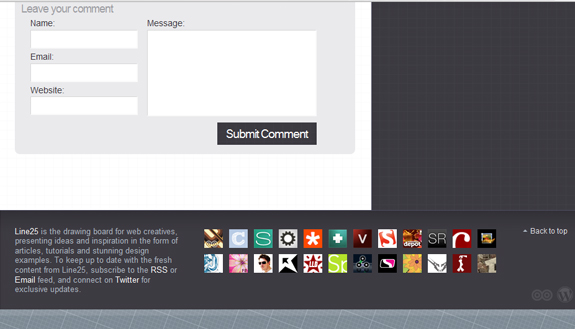

Let's face it: web design is hot. With the internet's popularity skyrocketing, younger and younger kids are getting into design and web projects, even freelancing! Not to say this is bad at all, it's actually started a large spread of web design and development tips and inspiration, mostly posted onto blogs<!--more-->

I've gotten ahold of Chris Spooner, a very talented and popular freelance designer who blogs at his personal blog, blog.spoongraphics, and more recently http://line25.com/. Line25 is a great web design blog, offering free tips, tutorials, and even icons and graphics for use in your websites! Any web design fans will have to check out this interview, and Chris offers some great inspiration for upcoming freelancers and designers interested in the trade, blogging, or anything on the internet!

Can you go over what the idea behind Line25 is and what type of content you have on there?

Line25 is a blog focusing on the topic of Web Design. The site hosts inspirational articles, tutorials and a sites of the week series to help designers keep their ideas flowing and to hopefully learn some new tips and tricks. Topics include CSS and HTML, Wordpress, the actual design process in Photoshop and a little jQuery.

##### What are some of the main reasons you find visitors coming back to Line25 for design resources?

I try to develop Line25 as a source of information both for newcomer web designers and design veterans. The beauty of the web design industry is that it's always growing and evolving so there's always new things to learn. Keeping the site active with potentially handy snippets of information makes it enticing for users to stick around or subscribe.

##### I noticed that you also run another popular web design blog SpoonGraphics Blog. Is it difficult to manage and update posts on 2 design blogs?

Some weeks it's a breeze, but others it can be a little tricky, especially when I have a lot of other jobs on my plate. As a self employed designer I luckily have the ability to schedule my days how I wish, so sometimes I'll set aside an entire day to write up topics for the upcoming month.

My posting schedule is one primary post per week, which go live on Mondays, and a smaller 'sites of the week' or 'weekly faves' appearing each Friday. This is much lower than some other blogs that publish maybe 5-10 articles a week, but I've found it's a slow but sure way to grow my blog with good content all the way.

##### How do you market Line25 and your posts? Do you usually find a lot of traffic coming from any particular social networking sites like Digg or Delicious?

StumbleUpon is always the backbone of my social traffic, but I also take the time to submit my posts to a range of smaller niche networks and news feeds. This then creates a large influx of traffic when each individual source is combined. Some of these sites include CSSGlobe, Script and Style, DesignBump, Noupe news feed and the DesignM.ag news feed.

##### Where did you get the idea for the design of Line25? I assume it’s built on Wordpress, did it take a lot of work to create the custom theme?

While brainstorming ideas for the site I wanted to base it on a kind of drawing board, with grids and graph paper being brought into the website design. It is indeed built on Wordpress, and the theme is put together from scratch. Once you get the hang of the workings of Wordpress, it's pretty simple to put together a theme. However I'm always finding new snippets and learning new tricks, so I'm forever rebuilding my sites and themes. The Line25 theme is actually due a refresh and is currently listed as a job somewhere on my to-do list.

The main design will remain, but the site will be rebuilt from the ground up with new CSS, HTML and PHP Wordpress snippets. Each iteration usually brings some new design tweaks, and higher attention to detail in areas I might not have spent too much time on in the previous version.

##### Do you have any great monetization schemes for Line25, or do you make enough now to support the blog?

Line25 brings in a little revenue, but it's not at the stage where it supports the blog yet. I have gained a lot of experience managing my Blog.SpoonGraphics site, so many of these tips have been put into practice on Line25. I always try to avoid oversaturing my blogs with ads, so I currently have a selection of 125px ads in the sidebar and large ads above the content on older posts. It can sometimes be too easy to make money from ads when the option is there, but it's important to take a step back and consider the user experience before slapping ads all over the place.

##### What do you think of the web design blog niche? A lot of designers say it’s overcrowded, but many say there’s still room for new blogs and tutorial sites.

I remember starting my SpoonGraphics blog about 6 months after Smashing Magazine appeared, since then the niche has definitely grown! There's loads of these newer blogs that provide useful content, while there's others that scrape posts from RSS feeds or copy and paste other people's content. No matter how over-crowded any industry, there will always be people who shine through, these are the ones who are putting out the most sought after content. If you have a passion for sharing your knowledge and helping others out there's no reason why you shouldn't start your own blog.

Most of the sites that aren't up to scratch will probably fizzle out when the owners lose interest, so after a couple of years a few of the same old names will still be around, while others will have been long forgotten. It takes a lot of work, but if you enjoy what you're doing it's all worth it!

##### Did you perform any special marketing or link building to gain your site to the stats it has now (PR5, 26,000 Alexa, etc)?

Nothing special at all. There's all kinds of link building schemes but I try and stay away from it all. I'm forever receiving link exchange requests and often feel like responding and saying if they put all their effort into writing good content rather than emailing people requesting a link they'd be on a much faster track to success.

Your blog stats will grow naturally if you're pumping out content that people want to see, content people find useful or content that's not widely available elsewhere. People share things they enjoy, so your PR will naturally grow when the number of backlinks to your articles increases, and your Alexa rank will decrease as traffic levels get higher and higher.

With that said, having a rough idea of how to market things can help out. It's useful to give your posts a helping hand every now and again with tools like Twitter, and the range of news feeds you can submit your articles to. Unfortunately many people misunderstand the idea of marketing and often cross the line into the realm of blatant spamming.

##### Do you have any goals for Line25 for 2010 that you could share with us?

Basically to continue growing it into a mature and respected design blog. It's still under a year old so there's room for plenty of growth yet! One of my overall aims in 2010 is to move more into the blogging industry to give myself more quality time to write blog content.

I'm also considering opening up Line25 to more guest writers, both to relieve some of my work and to give anyone wanting to make a name for themselves a platform to get their name next to their content on a blog that gets a few eyeballs.

##### Aside from your blogs, what are some of your favorite websites to hang around at when you’re online?

I have a huge collection of design blog feeds, but some of the sites I'm forever finding new content on are those that aggregate links from various other sources. A few that spring to mind are DesignBump, DesignM.ag and CSSGlobe. These sites are often the reason I stumble across new blogs and subsequently increase my feed collection with fresh content.

##### If you had any advice for someone looking into creating their own web design or graphic design blog, what would it be?

Make sure you're doing it out of passion, rather than a shortcut to fame and/or fortune. It takes a lot of work consistently churning out content before you see any real results, so it's crucial that you enjoy every moment. Otherwise it's inevitable that you'll lose interest at some point down the line.
