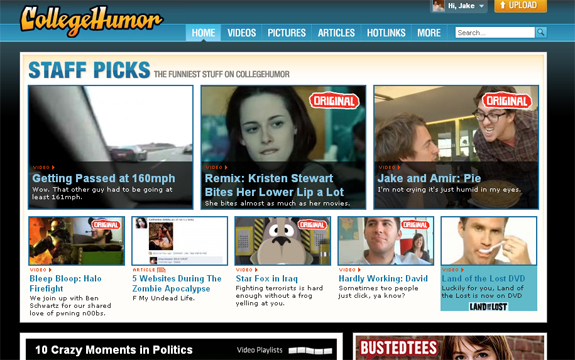

I've gotten my fair share of laughs from all of the hilarious content on the internet today. Photoshopped photos and amazing/retarded videos are spread like wildfire through forums and social networking sites. However, one of the best sites I've ever run across for generally hilarious content has to be Collegehumor. <!--more-->Not only does the site provide hilarious and amusing videos and content, it also has a very large community involvement in the site and a great looking web 2.0 design.

 Anna Hiort is one of the main designers for CollegeHumor, designing things from banner artwork to site revisions and user interface designs. I managed to get an interview with her to discuss what things were like working for Collegehumor, what her inspirations are, where she sees Collegehumor going in the near future and so much more. Definitely check out this inspiring interview with CollegeHumor's main graphic/web designer.

#### How long have you been working for CollegeHumor, and how did you land a job as one of the Designers?

I have been working here since April 2008, so about a year and a half. A friend of mine referred me to the job listing online, interviewed with the guys, and here I am!

#### What is it like working at CollegeHumor? Is the atmosphere as fun and energetic as the videos make it seem?

Obviously the videos are a little over the top, but the energy is definitely at the same level. Everyone hangs out together, gets drinks after work together, so we're a close-knit group, which, I think, lends itself to the relaxed feeling we all have working here.

#### Can you take us through a typical day in the office for you?

I get in the office 9:30/10ish, go through my emails while eating my Corn Pops (I always sprinkle a LOT of powdered sugar on top. Definitely gets me through the day). Working until maybe 1 or so when I grab my group and we go to Chipotle or Taco Bell to fill ourselves with unhealthy food. Work all afternoon. Everyone gets a little antsy around 5 or so (the same as elementary kids do when they know school is almost out) so this is generally when the random dance parties and Nerf ball fights happen). Most of us are out of the office by 6:30.

#### What is it that you work on most of the time, be it website design, graphic design, logos, icons...?

Majority of my time (maybe 80%) is spent on advertisers campaigns. Most of all our ad sales work is made custom; the skins on our site are each custom-made by myself or the other designer and sometimes they have custom micro-sites and such that are fun to work on as well. Besides that we're constantly improving the usability of the actual interface of the site. Other fun things include fake logos and product labels for use on the CH Original videos.

#### Where do you get your inspiration for your design?

I read a TON of blogs. I guess most of my inspiration comes from just seeing what things other people in my same field are doing. Inspiration can come in all kinds of forms. Photography, graphic design, fashion design, architecture. Just walking up and down the streets of NYC can be enough.

#### Aside from CollegeHumor, what are some of your favorite websites?

I'm a huge fan of Tumblr. I spend too much time on Facebook. I shop online more than I should. My favorite design blog would probably be Web Designers Wall (http://www.webdesignerwall.com/) or DesignM.ag (http://designm.ag/).

#### I’m sure designing is a huge passion of yours, but can you share any other interests or hobbies you have?

I'm a huge shopper. I might have to go to shoppers rehab, haha! Other than that, I'm pretty laid back, I just love nice afternoons laying around in the park with friends. I appreciate a good cocktail and good conversation.

#### What is one fact about you that nobody could guess just by looking at you?

I was raised in Dallas but I didn't get my first pair on cowboy boots until I moved to NYC when I was 20!

#### If you had any words of wisdom for aspiring designers out there, what would they be?

 One of the things I had as a hurdle against me was my age. I'm quite young and I don't think a lot of people really understood that I had potential as such a young age. I basically had to bang down doors and bombard people with emails until they would even take a look at my portfolio after they saw what year I graduated high school. My advice would be to be persistent, don't let people doubt you, and always do your best and try your very hardest because people can see when you don't.

#### I want to thank you again for having this great interview. Do you have any closing thoughts or comments for our readers?

Thank you! I guess my closing comment would be to never give up on your dreams! (Cheesy and cliche, I know, but its totally true; that's how I got to where I am at such a young age!)

I want to thank Anna for such a great and informative interview, and I'm excited I got to get an inside peek into her design world. As one last treat for our readers, I found a really... neat video of Anna on her Vimeo account. Since I enjoyed it so much, I figured I would share with all of our readers. Enjoy!
