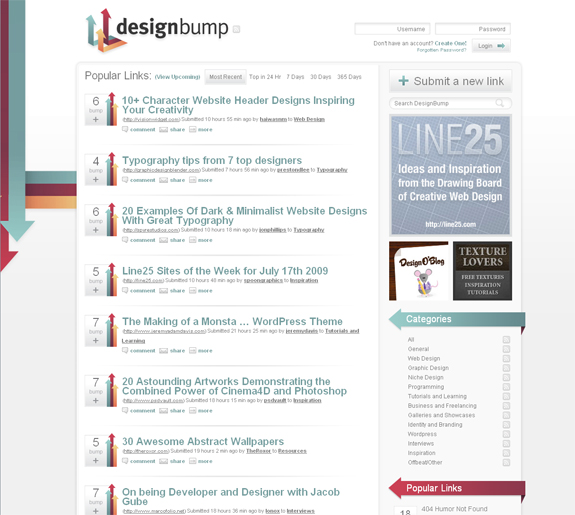

Digg was the first social news site to really skyrocket into popularity, gaining millions of pageviews a day to the site. No doubt, there would be similar sites in separate niches on the web. The first of these niche sites in the web design category was Design Float, which has had many issues with databases and keeping the site up and running properly. Therefore, a new competitor has stepped up to the plate: DesignBump.<!--more-->

DesignBump promotes the most popular articles about web, graphic, and print design from all across the internet. Members of the Design Bump community vote up the best articles, and the most popular ones will hit the front page. I got an interview with the site's creator John Campbell to get the inside scoop on this hot new social media/news clone for designers.

#### How did you get the idea for DesignBump, and what was it like when first starting to create the site?

I am much more of a web developer than I am a designer. Create sites - yes, make them pretty - not so much. I am still constantly looking for resources to help learn how to make myself into a better designer. So originally I was looking to create a place for myself where I could find and share the kind of resources and articles needed to help advance my skills.

When I first created the site I got a lot of positive feedback from the design community. I built the site using the open source software Drupal which has allowed me to be incredibly flexible in the functioning of the site and offer changes and features the community asks for as the needs arise.

#### Your newest re-design for the site has been posted on quite a few blogs. Have you noticed any increase in traffic or user registration?

As DesignBump grew I knew I needed a much prettier and more user friendly design. One that was beyond my skills to create. I reached out to, and hired, Chris Spooner (http://www.blog.spoongraphics.co.uk/) to help recreate the site's image. Working with Chris was a pleasure. I couldn't be happier with the result and all the feedback so far has been amazing. Traffic and User registration have both increased dramatically, although I'm sure at least some of that can be attributed to the recent problems at DesginFloat.

#### What do you think of DesignFloat’s current situation, and the comparison between Pligg and Drigg?

DesignFloat has steadily gone down hill since the original creator (Andrew Egenes) sold his site to its current owners. Up time for the site has been shoddy at best. The new owners severely neglect the site and let the site be overridden with spam. Spam is a huge problem with a lot of Pligg sites. I have used Pligg in the past and found it less expandable than I thought I would need. Drigg is a expansion of Drupal which is, in my opinion, the best CMS out hands down.

#### Can you share with us about how many visitors daily/monthly DesignBump receives? Along with that, do you have an estimate about how many active members there are on the site?

Currently DesignBump gets about 400,000 monthly visitors. The site is constantly trending upwards and, if I can continue to improve the site, I would expect much higher numbers in the near future. As for active members, approx 1500 people have logged in within the last 8 weeks but the average front page story only receives about 7 or 8 votes.

#### Where did the design inspiration come from for the new arrows design and logo?

Chris originally presented me with two different designs for DesignBump. He choose to stay with the arrows I had in the original design and spruce them up a bit as well as create a more brand-able identity for the site.

#### How easy is it when using Drigg to combat against spam posts, link submissions, and spam comments?

Drupal has some great options for combating spam but the best tool I have found has been to manually ban websites that abuse the system. I am on the site everyday so I try to delete any outrageously irrelevant content before it reaches the average visitor.

#### Are you looking on taking on any help, such as hiring another web designer or developer to help with the site?

 I am more than happy with the current design and I haven't had too many problems tackling the developing end myself as of yet. I am looking to increase the site's blog presence so I will probably be looking for guest authors in the near future. And I am ALWAYS looking for constructive criticism or ideas on how to make the site better.

#### Does DesignBump make any money currently? Are you planning on adding different types of monetization onto the site?

The site was making money before the redesign but I took down almost all sources of revenue before I recoded the new look. In the future I will probably add some side banners to help cover cost but right now I am more concerned with making the site as good as possible for the end user.

#### What is your favorite web 2.0 application and why?

That can be a pretty broad range of things. Aside from my obsession with Drupal and social media in general, I love Pandora and the Music Genome Project. I have found countless new artist and hours of entertainment while working through Pandora.

#### If you had any advice for someone creating their own Drigg-based web 2.0 application, what would it be?

Have a genuine interest in the topic you are covering and a vested interest in the community you are building. If you don't honestly enjoy what you are doing you won't be willing to work as hard as you need to in order to make a site worth visiting.

### Visit the Site!
