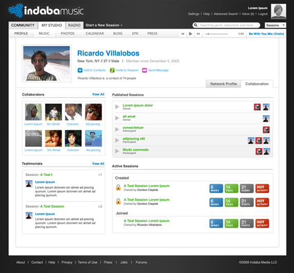
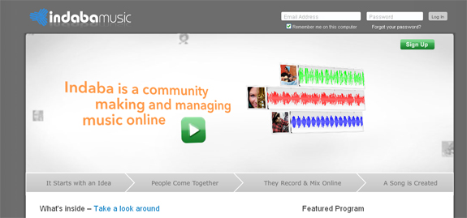

Are you a musician looking to find others to jam with, write music with, or just talk to? Or maybe you have a band, but want to find others who are writing the same kind of stuff? Yeah, listen to their tunes, kick back, maybe even share some wisdom with each other. Well look no further, as Indaba Music can cure all your problems.<!--more-->

A social networking site at heart, Indaba Music is an online community of musicians, recorders, sound/audio producers, and anyone with a love for sound. You can connect with people of similar careers, genres, likes/dislikes... really anything! But that's not all: Indaba Music also has it's own web based digital audio workstation, or DAW. With this, musicians can write music with other musicians ONLINE: truly a revolutionary feat. I got an interview with the site's creator Kate Pokorny, just to get the inside scoop on all your questions!

#### What is the idea behind Indaba Music?

Indaba Music (www.indabamusic.com) is an international community of musicians exploring the creative possibilities of making music online with people in different places.

#### How many members are there currently on the site?

Currently we have more than 200,000 members in over 185 countries.

#### What benefits does the site allow to musicians that makes it easy to network, share music, and other things?

Indaba Music enables members to interact with the premiere social network for musicians as well as create original music in new and exciting ways. Members create profiles where they can share information about themselves with other musicians. Musicians upload samples of their music, find new opportunities and collaborators, blog, and get feedback on their work from the community.

With hundreds of thousands of members in more than 185 countries, Indaba makes it easy to find people to work with. With our advanced digital audio workstation (DAW), the Session Console 2.0 coming soon, Indaba Music continues to change the way music is made.

#### Explain how the competitions work on the site, and what kinds of prizes are given away?

Contests and artist programs offer every member of the Indaba Music community the opportunity to explore exciting content, engage in creative challenges, and interact with major artists like Mariah Carey, John Legend, Yo-Yo Ma, and even brands like PBS. Members compete for prizes, unique access to artists and content, and broad exposure.

Past prizes have included, among others, the chance to record with Yo-Yo Ma, royalties and inclusion on physical and digital releases, an invitation to play on-stage with Third Eye Blind, cash prizes, and Berklee College of Music online classes.

#### How was the idea of Indaba Music originally created, and where did the name come from?

Indaba Music came out of our experience working with artists in a digital world that’s rapidly evolving. With recording hardware and software now available on almost any budget, it's easier than ever for artists of all levels and backgrounds to record and produce professional quality music. We saw this as a big deal for the future of music, and we built Indaba to be an environment for artists to harness online trends and create music in new ways.

The name Indaba is a Zulu word that invokes the spirit of collaboration and community. It refers to a gathering or a forum for sharing ideas, and it embodies concepts that are central to the mission of Indaba Music.

#### How many people currently work for Indaba Music?

We’re up to 21 plus a few awesome interns who we love as fellow Indabans.

#### Could you share with us how the backend of the site works, and what CMS/Script (if not a custom script) the site is running on?

At its core, Indaba is a Ruby on Rails application. We utilize a series of custom written server-side tools written in Java and C for audio ingest and processing. All of our VoIP services use Asterisk and Adhearsion.

#### What features need to be fine-tuned before rolling Indaba Music out of the Beta stage?

We’ve been gathering feedback, insights, and data on the ways people use Indaba Music since we launched back in February of 2007, and while we continue to do so everyday we're feeling pretty good about the site and what it delivers to our users. We came out of Beta on July 9, 2009.

#### Are there any new features in the works behind-the-scenes that you can share with us?

Well actually, there are quite a few exciting things that we are about to launch including a partial site redesign and most importantly, our powerful new DAW, the Session Console 2.0.

#### What are some of your favorite web 2.0 websites and social networks?

Indaba Music (obviously), Facebook, GetSatisfaction, Drop.io, Flickr

#### If you had any advice for someone starting their own web 2.0 site, what would it be?

Find a problem that **you** care about solving… and **solve it**. Also, Use your own site every day and it will be obvious to you what needs to be done to continually improve and grow it.
