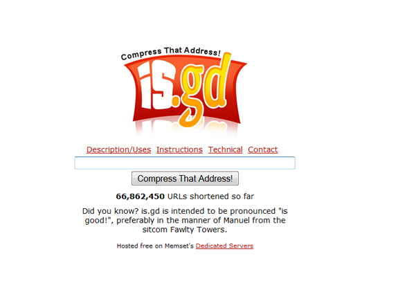

New URL Shortening services hit the web every week it seems. I can remember not too long ago when TinyURL was just starting up, and that hit with a huge bang. Ever since then, there have been countless creations of URL shorteners (where some even provided stats). However, only a select few have really succeeded to hit mainstream popularity and be of any use.<!--more-->

I got an interview with the creator of is.gd, another very popular URL shortening service with many key features. Allowing you to track visitors and create your own custom URL's, is.gd is really the next step in web 2.0 URL shortening. I got the inside scoop on the site from is.gd's founder Richard West, and he has some very interesting things to say about the site.

#### Where did you get the idea to create is.gd? How did the name come about?

The inspiration to create is.gd came because I used to work as a researcher for an SMS service where customers could ask any question and we'd text back the answer. Sometimes these required links to websites and shortening these as much as possible helped save space for other information due to the limited character count allowed in SMS messages.

The name mostly came about just because I was looking for a URL as short as possible. I noticed domains at the Grenada (.gd) TLD were available to register and there were a lot of short ones that hadn't been taken, so considered various possibilities to find something as memorable as possible. I thought is.gd was a good choice for this purpose since it's easy to remember as "is good".

#### Can you go over how is.gd went from idea and development stages into what it is today? More like a history story of the site, if you will.

I started is.gd in October 2007. After I'd come up with the initial concept for the site I wrote some basic code to map original URLs into short ones (storing the originals in a database) and to retrieve them. I focused on making this as efficient as possible, and it only took a couple of days to get most of the core code for the site in place (much of it is still being used). I then designed the site including some basic instructions and put it online, although the design wasn't particularly clean at first. It was several months after it first went live that I removed most of the text from the homepage and cleaned it up to look something like the current one.

I've made various tweaks to the site and added features over time including a simple API and tracking a few basic statistics such as the number of times each shortened link is accessed. I'm also grateful to other developers who have written code to harness is.gd in more flexible ways including as a Firefox plugin and as a cross-platform Java utility.

#### Competing against many other URL shortening services such as TinyURL and Bit.ly, how did you market is.gd to reach the audience that is has?

I'll be honest and admit that I've done little or no marketing of is.gd! I posted links to the site on a couple of forums I visit when I first put it online, but that's about it. Is.gd basically markets itself since people tend to see links shortened with the site being used and then visit it to check it out.

I also feel many of the sites competing with is.gd have problems such as being overly complex, slow, featuring intrusive advertising on their pages or just not generating particularly short URLs. One of my main goals with is.gd is to keep it as fast and simple for users as possible which is why it doesn't have any advertising (except for a brief mention of my host) and doesn't require users to register.

#### Does is.gd get any money or revenue from investors or other sources?

Not currently. I ran the site out of my own pocket on a shoestring budget for the first year or so as a hobby, but now have a deal in place with my host (Memset) who supply the resources I need so that the site doesn't cost me anything to run. I'm looking at working more closely with them in the future.

#### What were some of the challenges you’ve run in to when developing and marketing the site?

 The most challenging area of developing and running the site is combating spam usage. I've automated this as much as is practical and rely heavily on blacklisting (using my own blacklist as well as 3rd party data such as SURBL). Sadly this will never be perfect and I take any usage of the site by spammers very seriously, so I devote a good amount of time to manually investigating all spam reports I get and tweaking the measures I have in place.

Apart from preventing spam, the other big challenge with the site is its back end database. Performance in this area is critical since is.gd has tens of millions of URLs stored and does over 100 million redirects per month when shortened URLs are visited. As such I have to carefully consider the impact of any changes on database performance. I'm also looking at the possibility of tracking more detailed usage stats for shortened URLs which will likely require growing the database into even more of a behemoth. I expect the site to continue to expand and to be dealing with over 1 billion rows of data before long, so the database model remains a concern and something I'll no doubt have to tweak further in future.

#### The design on the home page is very simple and easy to navigate, which works very well with the site. How did you come up with the home page design?

It was originally not at all clean and had most of the homepage dedicated to instructions on how the site worked and what it was for. Over the first few months the site was running I got several suggestions that I should get rid of most of this and make it cleaner. As such one day I decided to remove all this and see how clean/minimalist I could make the design, so I just went with the site logo, a box to type the URL in and a button to submit it, all centered on a white page. I liked this so much I replaced the old homepage with this design and just incorporated a few extra links to the various documentation needed.

#### Where do you see is.gd going within the upcoming months? How about a year or two?

 I intend to implement a couple of major new features into is.gd when time allows. One of these will be allowing users to select custom shortened URLs - this should be a great feature if you want to use a shortened URL in print or need to give it verbally (since is.gd's current mixed case shortened URLs can be confusing for non-electronic usage). The other will be much more detailed tracking of statistics on shortened links and how they are used. I will be migrating the database to some powerful new hardware (Dell R900) over the next few weeks which should give me plenty of spare capacity to allow for this. I'm confident I'll find a good way to integrate these changes into the site without compromising its simplicity.

My long term goal over the next couple of years is to make is.gd the most popular URL shortening/redirection site. I intend to do this by improving the feature set (as outlined above) whilst keeping the site very fast and not annoying my users with advertising etc.

#### Why did you choose to develop is.gd in PHP as opposed to other backend languages?

I chose to develop in PHP because it's relatively mature and widely used. As such most serious bugs are ironed out quickly, and there are very few gaps in its feature set, with the provided libraries and documentation being excellent. It integrates very well with other software I'm using such as MySQL. I find the syntax easy to understand and quick to work with compared to other scripting languages. It also performs pretty well especially when used with opcode caching accelerators (of which there is a good choice).

#### If you had any advice for someone creating their own web 2.0 service or application, what would it be?

The best advice I can give is to seek the relevant training/knowledge first. I have a formal computer science background and although this isn't necessary at least a basic knowledge of programming is a requirement for anyone serious about creating web applications in my opinion. The more work you can do yourself the better since other than initial development, most web applications are fairly cheap to get running these days. As long as you've got the required skills and the will and vision to get your project completed, my advice is get it made and get it online as soon as possible.

Another important piece of advice is to care about your users. Maybe that awesome 2 minute mandatory Flash intro you were going to use won't be quite as stunning the 5th time someone visits! Always consider whether the site you're making something that you'd want to use yourself and would be happy visiting.
