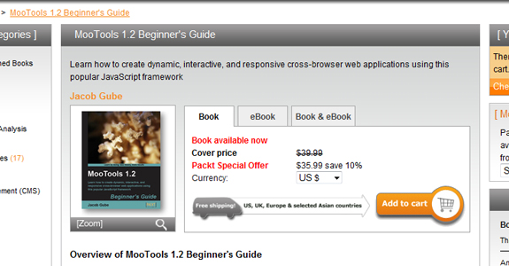
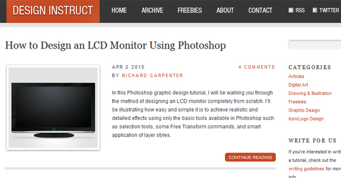

I've been in the freelance and web design/development community for years now, starting back when I was attending high school. I always keep up with the latest blogs, tutorials, tips, and design tricks from the community, and no blog has shown greater content with a higher rate of growth than Six Revisions. Jacob Gube is the founder and main writer at the blog, and I'm lucky enough to share with you some great Q&A's between us.

<!--more-->

Jacob's also co-founded a new Web Magazine titled Design Instruct, which has really hit it off over the past couple of weeks. Along with blogging, he's also recently published a book on the JavaScript library MooTools: MooTools 1.2 Beginner's Guide. Clearly Jacob's an active member in the design community, and his words of wisdom shine through in our short interview.

Can you give us a little background info about you, what you do for work, and your extremely successful design blog Six Revisions?

I'm Jacob Gube and I'm a web developer and web designer. I founded Six Revisions, a multi-author website that publishes useful information for web developers and web designers. I also co-founded Design Instruct, a web magazine for designers and digital artists focused on publishing professional-level design and digital art tutorials. I'm also an author of a book on MooTools.

### How did the idea for Six Revisions come about? Can you take us through how the site came to be what it is today?

The idea of Six Revisions came about as a need for me to catalog what I learned about web development and web design. It started out as a personal blog, but it took off in a direction that I couldn't have dreamed of.

Eventually, it grew in such a way that other web designers and web developers began contributing articles to the site. Today, Six Revisions is a multi-author website and its authors are as much a part of it as I am, if not more!

### I'm a huge fan of Six Revisions, and I keep up with each day's new post. What's your secret to keeping yourself from getting writer's block so you can update each and every day?

The best way to avoid writer's block is to cover a topic about something you're passionate about, and something that you do on a daily basis. For me, it's web development/design - for a chef, the topic they might pick is cooking.

Of course, there are days when I just don't feel like writing; everyone has those days. The best way to remedy that is to take a break and do something else.

But if it's more than "a few days", you might have to consider if the subject you're covering is something that you're truly passionate about.

### Six Revisions has grown into one beastly design blog, with almost 50,000 RSS Subscribers! Where can you see the blog going within the next couple of months?

In the next couple of months? That's too far ahead for me to think about. I tend to plan things by the week. The main ingredient of Six Revisions is that it's flexible and malleable; we're not bound to a predefined course of action. That way, the content remains fresh, interesting, and relevant.

I do have two general goals though: a shift towards even more high-quality content and a re-design (which I've been promising for probably a year now). I doubt I'll be able to get through both of those in two months though!

### So you’ve just finished writing MooTools 1.2 Beginners' Guide with Garrick Cheung. What was it like to be part of such a great project? Anything you learned or understand better having written a web development manual?

Writing a book is a massive task to undertake. It takes a lot of effort and time.

I wrote the MooTools 1.2 Beginners' Guide because I'm passionate about web development and the MooTools project. I felt that MooTools was this little secret (it's popular, but not as popular as it should be, given its capabilities) that I just wanted everyone to discover and try. That was the motivation behind writing the book.

After writing the book, I learned that I've barely scratched the surface of what MooTools is truly capable of. It's a great framework developed by some of the best and brightest JavaScript programmers in the world.

### What are some of the most memorable moments from when you were writing this book? Any nuggets of wisdom to share with other developers?

The most memorable moment was the weekend of the final stretch. We were way past the book's production timeline. So I locked myself in my work area with a case of Red Bull and finished the rest of the book.

A suggestion for would-be authors: take the time you think it would take you to write the book, and multiply that time by two or three. That's the actual time it will take you. Do the same when you're spec'ing web development project timelines.

### The page design for Design Instruct is beautiful – easy to navigate, and works well with the site. Was this designed by you or someone else? Any specific sites show as inspiration for Design Instruct?

I designed the site design for Design Instruct. I also created the custom WordPress theme for it. But I worked with my brother to perfect the design.

Being a web developer and web designer, I tend to do my own design and development. Wouldn't it would be ironic to run a website about web development and web design and have someone else do the design and development work of your site for you? It's all about credibility.

I also built our web servers (they all run on Linux/Apache) since I've never gotten a server set up the way I want it. It always had junk that I didn't need that only took up server resources. I've optimized our servers specifically for WordPress and for serving content-heavy web pages. I still have a lot of work to do though, especially for Design Instruct. I also have a lot of front-end performance tuning to do on both sites.

### What are your future plans for growing Design Instruct? Where do you think it will pick up that Six Revisions has left off?

We have plenty of plans for Design Instruct, we're just getting started, even though most people that have seen the content already published might think: "How are they going to make this even better?" All I can say is this: Stay tuned.

Design Instruct doesn't necessarily pick up where Six Revisions left off. Six Revisions is for web designers and web developers; people who make websites. Design Instruct, on the other hand, is for designers and digital artists--illustrators, graphic designers, print designers, and also web designers.

You can look at them as two separate sites that have different objectives. The subject is related, but distinct enough to merit two separate sites.

### If you had any advice for someone interested in starting up their own design blog, what would it be?

Ask yourself how you'll differentiate yourself from the hundreds of other design blogs. Figure out the answer to that question, and then do that.
