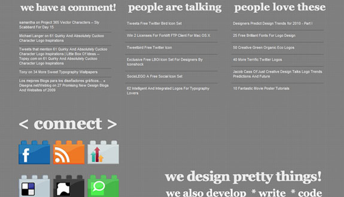

Much alike many designers out there, I'm constantly craving new graphic design inspiration, web design galleries, and everything the life of a designer should be filled to the brim with. This leads me on my quest of finding the best design blogs out on the internetz, and my interview today is no shortage. Little Box of Ideas is a great design and creativity blog, focusing on great topics such as graphics tutorials and typography.<!--more-->

I got a fantastic interview with LBoI's designer and main blogger, Sneh. Also sporting a fantastic portfolio of illustrations and Photoshop designs, Little Box of Ideas boasts a great blog with tons of resources for the design community. To anyone interested in getting the inside scoop on this fantastic design inspiration blog, check out Sneh's answers to my questions below! She runs a tight blog, and I am very intrigued and excited to present such an interesting interview.

What is the main topic of Little Box of Ideas, and how did you come up with the unique name?

Creative Ideas and Design are the basis on which Little Box Of Ideas was built. Nick and I were knocking around names a few years ago. We wanted something personal and quirky. "Jump Start Ideas" and "Little Box Of Ideas" were the main contenders after whittling down a list of 40 odd names with the word "Ideas" in them. LBOI won because it was quirkier and totally defines us!

##### Where did you get the inspiration for LBOI? Did any other popular blogs or websites help inspire your posts or design?

LBOI just happened! I took a break of 6 months to evaluate what I wanted to do with myself and my work in 2008. I was already food blogging (http://www.gelskitchen.com) for 3 years at that time, but I never imagined I would start blogging about design.

Shout out time! Grant Freidman(http://colorburned.com) was the 2nd person I followed on twitter. His blog was a treasure trove of freebies and right then I was inspired to start my own and give away the countless designs I was already creating on a regular basis. Andrew Houle's blog(http://myinkblog.com) introduced me to what blogging was all about. Jacob Cass's(http://justcreativedesign.com) cheery online presence and his amazing attitude brought things into perspective for me.

##### How popular has LBOI grown over the past couple of months? Have you seen a spike in any stats like daily visitors, Twitter followers, RSS subscribers, etc?

When LBOI started out in Feb 2009, it showed a steady growth of 1500% on Alexa for a few months. Then it started slowing and evening out. In 10 months, Alexa ranking has gone from 850,000 to 42,000. The rest has increased at a steady pace, slowly and surely, no big dramas there.

But I am happy with the response of my readers. My blog is more personal and close-knit community based as opposed to impersonal and purely commercial. I have over 4,000 twitter followers and although I don't know all of them, I try to interact and reply to everyone who writes to me.

##### Do you make a decent amount of money from your blog? Could you share any success you’ve had with certain revenue sources?

For the first couple of months, there was no revenue at all. I was giving away my ad spots for free to friends and acquaintances who had websites. Then I got accepted into BuySellAds.com and made my first $10, woohoo! Advertising is tough to come by for smaller blogs like mine and I have a long way to go before I start making serious revenue from advertising. I spend almost $300 every month on my dedicated servers and firewalls (I run a big celebrity/movie database which is relaunching on its 10th anniversary soon).

My income is generated from projects I score via the blog. Since starting the blog 10 months ago, I have had the pleasure of working with some amazing clients and have done close to 15 very satisfying web design and branding projects. And I am happy with this scenario where my blog stays personal and relevant to certain core areas of design, whereas the revenue that fuels it comes from project work.

##### Where can you see Little Box of Ideas going within the next couple of months?

LBOI is my baby. I eat, live, breathe and sleep LBOI. In the next couple of months, I am going to be dedicating a lot of time to create exciting and interesting content that makes people stop and take notice. Loads of high quality freebies, detailed tutorials and a splash into the technical side of design (that is where Nick is stepping in) with articles and tutorials on CSS, XHTML, AJAX and JQuery are in store. So watch out for quirky stuff that makes you think "Woah, that is absolutely nuts!"

##### What are some of the most popular topics on LBOI? Do you have any personal favorite posts?

- Designers Predict Design Trends For 2010 is one of the most popular topics on the blog
- A post about Creepy Photo Manipulations to Scare Your Pants Off has been a big hit too!

**Some of My Personal Favorites are:**

- 62 Intelligent And Integrated Typographic Logos
- Clean Up Your Digital Mess You Gadget Hungry, Font Hoarder
- And a Guest Post I did for Spyre Studios, The Anatomy Of An Infographic

I love logo inspiration list posts and writing on design related issues from my perspective, from the depths of my heart.

##### What are some of your favorite sites around the web to share your posts on, or just sites you like to visit in general?

I used to visit a lot of blogs before I started blogging full-time. Ever since I am hardly left with any time to read blogs. There are a few websites I do frequent on either a daily basis or whenever I have the time.

- IMDB
- Tastespotting
- Logopond
- Vector Tuts+
- Deviantart

I love DesignBump, DesignMoo, The Web Blend and Delicious for sharing my articles.

##### I see you have a portfolio link as well. Do you plan on offering web design or development services as well on your site?

Nick and I offer complete web design, system design, logo and branding services from our home studio. We have been doing projects for clients since 1998. Our work is our play and we love it!

##### Can you share any new upcoming features for LBOI, or any ideas you have for new additions to the blog?

I recently started an exciting project to create a new vector illustration every single day of the year. I am onto Number 5 now in this Project 365 of mine http://www.littleboxofideas.com/blog/category/365-vector-characters-project. So there is something new to look out for on the blog everyday, because these vector characters are not mere characters, they are mascots of sorts with a unique name and a story revolving around each of them.

##### If you had any advice for someone looking to start their own web design blog, what would it be?

Put on your thinking cap, get set, ready, GO! And then keep running, don't stop! I have been writing on my food blog for 5 years but the dedication and passion I have for design is what makes my LBOI the very essence of my being and not the food blog.

Your blog can be about anything, but as long as it is what drives you, you will never give it up. And because you will never give it up, you will feel on top of the world and that will give your life purpose. Despite that, it will get hard, very hard! There will be times when you will have nothing to write or say or just blogging every 2 days will become an absolute chore! Don't give up! Get out, sit on a cold park bench somewhere, have an ice cream and then come back fresh. If you survive the first 6 months, you will be fine, my friend!
