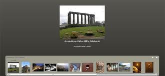

Mark Anders is a senior principal scientist at Adobe Systems, and one of his core responsibilities is to make Flash the platform for building the next generation of rich internet applications. Prior to Adobe's acquisition of Macromedia, Anders started and led the Flex Builder Team, but he is probably best known for his work at Microsoft, where during a decade-long career he led the creation of ASP.NET.

<!--more-->

Anders recently addressed the "Flash on the beach" conference for Flash designers and developers, where he discussed the future of Flash applications through Adobe, and also building Rich Internet Applications through Adobe's Flex. I got an interview with Mark, discussing the exciting future of Flash and what it means for designers and consumers.

#### What are you working on at the moment?

What I'm really focused on is all of the stuff around building rich internet applications (RIAs). I work across lots of product teams, including the Flash Player and Flash authoring teams, as well as the Flex framework and Flex building teams.

#### What is Flex, and what relationship does it have with Flash?

Flex is now at version 2, and it's a rich internet application authoring environment.

Flash started as an animation tool and became an interactive media product, but it's really geared towards designers. The problem is, the tooling and all the pre-build pieces of code (such as the component library) is still based on an animation paradigm.

Flex provides another way of doing Flash content, but one that's optimized for applications. So, for example, you have components that can pull in data from the net and display it in a really rich way, such as interactive charting and tabular displays of data. It has lots of pre-built components that people can use to structure their applications.

People aren't trying to create the most beautiful things with Flex, but rather things that have rich interaction. They're not really concerned with branding. Most Flex apps have a common look and feel, because they just use our components and don't bother with custom skins. Flex is more about interaction, whereas Flash is all about movement, but there is an area inbetween - a lot of people do stuff in Flash and then import these assets into an application. There are areas like this where Flash and Flex meet, and one of the things we're working on is helping to bridge that gap.

#### Why does Flash continue to have such appeal for web designers?

One of the things I think people realised about Flash is that it's a metaphor that makes sense, and is one over which they have great control.

For example, if you check out restaurants on the web, you'll find a bunch of incredibly presented sites, so amazing that you can almost taste the food just by looking at it. Such sites are frequently done in Flash. The question is why? A lot of the time it's probably stuff you could do in HTML. I think it's because it's immediate, it gives you precise control, and it will render the same on all browsers and operating systems. That means you can be comfortable your vision is going directly to whomever you want to reach out to.

The web is about hooking people together, wherever they are in the world or whatever they're doing, and that's an attribute that's always been really important with Flash - it's on 90% of all machines hooked up to the internet. The other thing that's so popular about Flash is that you can brand it in a unique and very customized way - you can overlay it with graphics, say, and really integrate it into an overall experience.

#### Is there a danger that Flash will become overloaded with eye candy features?

People have been able to create great content in Flash for a long time. From a developer standpoint, a lot of what I think drives this is productivity. Look at some of the filters in Flash 8. Is it that nobody could do a drop shadow before? They could, and most certainly did, but it was a lot of work. Being able to take advantage of such filters affords people more freedom, so they spend less time fooling around with drop shadows and more time crafting their applications and getting them out quicker.

#### What part has Flash got to play in the convergence of the web and mobile channels?

One of the things that's held us back is creating compelling user experiences on mobiles. People have a lot of fun with texting, but for other content you need to format it differently - it has to be crafted in such a way as to take advantage of the limited real estate on mobiles.

There's a lot of games and fun content for mobiles and other devices, and this is something Flash is really good at because it's a compact format and is extremely flexible. One of the things that Adobe has always been good at is striking a balance between requiring a lot of horsepower on the computer and having a great expressive experience. Flash runs on such a wide array of devices, and it's not like the latest game where you're constantly overclocking your machine. Flash is really good at reaching down to all devices.

#### What features are Flash users asking for?

Whether you're a designer or developer, part of what you naturally do is push the boundaries of what anybody thought possible. We put out a version of Flash, and people do things with it that blow your mind. When you ask them what's lacking, they'll tell you the wackiest things because it's only the boundaries they can't push through that they'll tell you about. At the same time, you can come up with an innovation like Flex that takes the paradigm in a completely new direction and people say "Wow! This is amazing!".

#### Where do you see the future of interactivity being in 10-15 years?

Some people look at the web and say "It's all about HTML and a browser". The other way to look at it is as a means of reaching out to people with compelling experiences, no matter what type of machine they're running or where they are. Originally the web was about documents, then interactivity increased and now we have immersive 3D worlds, and it's replacing the TV for watching video. I think all this kind of stuff is going to continue as bandwidth improves.
