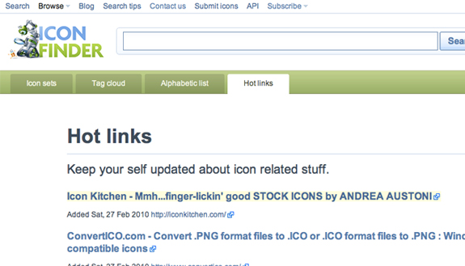
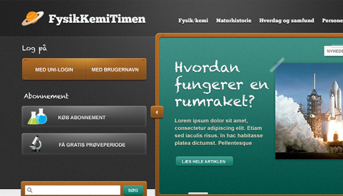

So many design blogs and showcases today are giving away icons for free. Even in large sets, social media icons and small graphics are making their way into the big time. I'm a huge fan of collecting icons, and all of these free sites are extremely useful and always in my bookmarks.

<!--more-->

IconFinder is a simple site with a simple premise: provide an easy-to-use icon search engine. Simply typing in keywords like "twitter" or "RSS feed" will bring up pages of icons, all free an available to download! I got a terrific interview with the site's creator Martin Leblanc Eigtved, discussing the inner workings of Icon Finder.

Where did you get the idea for Icon Finder? Was it inspired by any other sites or ideas?

The idea for IconFinder came from a personal need to solve my own problem. Back in '04-05 I worked as a front end developer and designer at a company that sold large CMS solutions. Most of the coders and myself were using Linux when coding (I had a Windows computer for Photoshop, though).

For Linux you could download these large packs of icons for the OS released under an open source license. Since the license allowed the icons to be used in web design, I started using these icons in the web design too, using the file system to find icons. Using the OS file system to find these icons was of course not very efficientm so I started to work on a database where all the icons could be nicely organized with tags and indexes.

In 2006 I put a simple HTML interface on top of the database and found it to be very useful, so I bought the domain and worked on it for 6 months more and released to the public in 2007.

The biggest inspiration has always been Google. I have always wanted to keep the user interface as clean as possible and make the site fast and easy to use. Back when we first launched, the only other big icon site was IconArchive.com and there were no icon search engines on the market. So I had to figure out the interface from scratch.

#### How do you collect so many icons for the site? User submitted, or perhaps just a huge stash you've had for a while?

I spend a lot of time looking for great icon designers on design blogs or on sites like Deviant Art. Lately a lot of designers have started submitting the icons themselves, which is great. I also look at my competitors sites for new icon releases.

Last month I launched a page on IconFinder which finds news about icon related stuff. This helps when I need some updates about new releases.

#### Did you do any of the programming and/or web design for the site? Do you remember what the process was like when you were first trying to launch Icon Finder?

I have done the programming and design myself, but I'm not particularly good at any of these things - my strength is probably in my ability to focus on making the site better month after month.

The process of launching the first version was all about getting a basic version up and running. I didn't spend time on large frameworks - I believe in keeping things as simple as possible, because you have to be able to adjust the site to feedback from the users. If you spend too much time on frameworks and having a large code base you can not iterate as often... if you're not embarrassed by the first version you launched too late.

#### Aside from working on the site, what other work do you do? Could you take us through a casual day in the life of Martin Leblanc Eigtved?

I study computer science and business administration at Copenhagen business school (the same education as David Heinemeier Hansson from 37signals) which I will finish this summer. Besides the education I work at a consultancy called Glassbox which I co-founded in 2008.

We help clients with optimizing sales for their e-commerce solutions. My responsibility is mainly usability and design stuff, but I also work on more technical things for web tracking solutions such as Google Analytics.

This is the latest design I have made for a client at Glassbox. The site is an education portal for students in elementary school.

When I'm not studying or working in Glassbox, I work on IconFinder or spend time with my lovely wife. I don't watch television, and I'm basically working on something from when I get up in the morning until about 9 in the evening.

#### Roughly how much traffic are you getting to the site daily/monthly? Have you seen this increase heavily over the past couple of months?

Right now 350,000 unique monthly users are visiting the site, generating more than 10 million page views. I hope to reach 1 million unique monthly users in 2010. The traffic continue to increase every month and it's the fastest growing site of it's kind.

#### What type, if any at all, of marketing have you done for Icon Finder? Submitted to any social media sites, built backlinks, etc?

I spend a lot of time on Twitter and thinking about how to make people tweet about the site and write blog posts. One example is the page: http://www.iconfinder.net/free\_icons which is primarily made as link bait. I posted links on sites like Digg and Reddit when it launched, but I leave that to the users now and focus on the site it self.

#### Do you have any other sites you’d recommend checking out if Icon Finder just doesn’t have an icon to match what you need?

Yes, there are many interesting sites. Iconspedia.com and Iconarchive.com are the two largest, but sites like 365icon.com and weloveicons.com always have some interesting stuff.

#### Where can you see Icon Finder going within the next couple of months? Do you have any plans for new sections or modules to the site?

The next step for IconFinder is to work on the server setup so it can handle the increase in users. I'm working on a load balancing setup for the database because that is often the slowest part of the site.

I'm also planning to launch some new personalized features which will make the site more useful. I wont tell more about these features before I'm closer to releasing them.

I will release a new icon set which has been designed especially for the IconFinder users. It will be released in the beginning of March 2010, so keep an eye on http://www.iconfinder.net/blog.

#### Aside from Icon Finder, do you have any other projects you're either currently working on or plan on launching sometime in the near future?

Yes, In Glassbox we're working on a survey tool that will be released in a beta version next month. It's called Mindset and is a combination of a survey and a web analytics tool. The great designers at Softfacade (http://www.softfacade.com) have designed beautiful app icon for the project.
