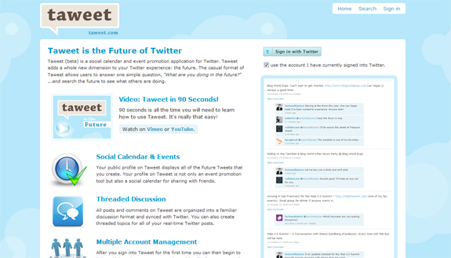

As Twitter has blown through other social media sites, it's become one of the most trafficked websites of the present day. Everybody and their grandma is using Twitter, and there's no shortage of helpful applications and Twitter resources for them all! Ranging from Twitter wallpaper creators to free icons or avatars, the internet hosts them all.

<!--more-->

I recently ran into such an app at http://taweet.com/. It's a beautiful application, and it lets you share and store dates of future events through Twitter, like a Tweet Calendar! I got an awesome interview with the application's creator and developer William Moynihan, and he's got some great things to say about seeing all of Twitter's future through Taweet.

##### What is the idea behind Taweet and what does it allow Twitter users to do?

Taweet allows users to create 140 character posts related to what's happening in the future. Your Taweet profile is in essence a social calendar displaying all of your future events. If you visit my Twitter profile you can see what I'm doing right now, and if you visit my Taweet profile you can see what I'm doing in the future. You can share new events to Twitter when you create them and we also allow people to add comments.

##### How did you come up with the idea for such a useful Twitter application?

Looking at the popularity of Twitter and real-time information we saw an opportunity to capture future information in a similar format. People frequently post future events on Twitter but these posts get lost in the constant flow of real-time. Taweet allows people to organize future events and share them to the real-time stream.

##### I can see the design of the site even compliments Twitter. Was this your work as well or have someone else do the design?

We designed Taweet in-house. The reason we gave it a similar feel as Twitter was to make creating content more intuitive. As we develop the platform further and add new features we anticipate that Taweet will take on a new look and feel.

##### How many visitors and users do you have currently visiting Taweet every day/week?

Almost 1500 Twitter accounts have registered with Taweet and we receive several thousand unique visitors per week. We are still a small application and anticipate our user base growing as we build out the platform.

##### What do you think of how quickly Twitter and all social networking sites are picking up as the hottest trends?

Social networks are bringing people together from across town to across the globe and people are discovering the more they share, the more meaningful connections they make. We are inherently social beings and the Internet and social networking applications allow people to connect in ways never before possible.

##### How long did it take to create the application from start to finish? Any major hitches along the way?

 We started developing Taweet in the late summer of 2009. We launched the first version within 6 weeks and continue to add features along the way. As long as Taweet is online it will never be a finished product. As the needs of users change, so will Taweet.

There are always growing pains with any startup. I think we've avoided any major pitfalls thus far by sticking with the "launch early and often" philosophy. As we develop new features we make them available to our users very early on to see if they stick. This allows us to invest our time and energy into the features that users are interested in.

##### Do you have any ideas or ways you think Twitter could be updated or made easier to use? And what is your take on all of the 3rd party apps being built to integrate with it?

I think the unique benefit of Twitter is it's simplicity. Twitter has added several new features in 2009 but it's still the core micro-messaging platform that makes Twitter what it is. I don't think Twitter would be at the level it is today without it's API and third party applications. These applications have allowed Twitter's real-time stream to penetrate many areas it could have not done so on it's own.

##### Are you currently making any money with Taweet, or are you planning on that in the future?

Taweet is currently pre-revenue however we have several ideas on how to monetize the platform. One opportunity we see is to allow companies to promote their future events to those searching for specific criteria.

##### What are some of your favorite websites to visit online? Have any personal favorite blogs or apps you use aside from Taweet?

Honestly I'm usually all over the place on the Internet, there is so much great information out there. One site I do visit pretty often is TechCrunch to keep up on the latest startup news. Anything Google I've been a fan of thus far. I also use Facebook regularly to keep up with friends.

##### Do you have any advice for anyone trying to create their own Web 2.0 app?

The "launch early and often" philosophy mentioned earlier I think is a great way for startup applications to get their hands dirty and interact with users. Trying to keep something stealth-mode for too long could end up hurting development more than helping. Get your product out there and let people give you feedback to make sure you're doing things right.
