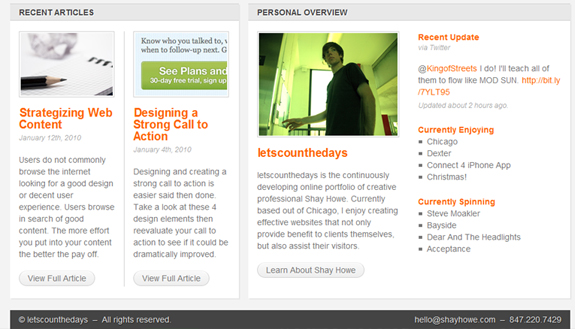
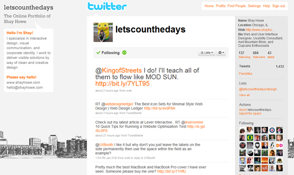

One of the fastest growing professions is website design and web developers, especially with the attraction of working freelance. Many people hate the 9-5 grind induced through corporate America, and having the option to work from home on your own time seems like a much more viable and interesting option to many. Although in the end it may require a bit more work on your end, the ultimate freedom of your time seems to pay for itself.

<!--more-->

I've talked with one of the many talented freelance web designers on the web Shay Howe. I got a great interview with Shay, discussing the ups and downs of living the freelancing life, some great tips for those interested in becoming a freelance designer, plus a whole lot more! Avid readers of FreelanceSwitch will recognize where Shay is coming from, and anyone interested in the freelancing or work-from-home profession should absolutely give this interview a read!

How did you get into web and graphic design and how long have you been doing it?

I have always been a fairly artistic individual whether it is through art, music, writing, or what have you. My interest in web and graphic design peaked in high school after working with a few local bands designing websites and t-shirts. It didn’t long before I was spending more time Photoshop than I was on my homework. When the time came to go to college I chose to do what I loved the most and majored in digital multimedia with a focus in web design.

In all, I have been designing websites for around six years. Out of the past six years I have been professionally working as a web and graphic designer for only three or four years. I was fortunate enough to get started and work with a few clients at a pretty young age however I’m not too sure you could quality those as professional jobs.

### What are some of your biggest design influences in your work?

One of the biggest design influences for me is the element of simplicity. Websites and interfaces need to be intuitive first and foremost. Anything that prohibits or weakens a website from being operational needs to be rethought.

My other influences include other great designers and developers as well as the clients themselves. There is a lot to learn from those around us and studying some of the best designers and developers out there has certainly helped me. At the end of the day, there is no reason to reinvent the wheel. I believe it is also important to tap into a clients "know how" for each project as well. Reason being, they know their customers better than anyone else. I know works from a design and development standpoint online. Putting my knowledge together with that of the client typically creates the best of both worlds.

### What is a typical day like as a freelance web designer?

Typically I am off and running at my desk by 8:30 every morning. The first 30 minutes of my day are usually spent checking RSS feeds, reading a few blogs, and seeing what the Twitterverse is up to. Once I get this out of my system I like to handle the business side of my job. This includes doing some simple accounting, sending out invoices, writing a proposal or two, answering emails, and making a few calls if need be.

By this time I have normally consumed my first cup of coffee and then the real work begins. I'll fire up Photoshop and the text editor of choice for the day and get to work. As long as I don't have any meetings or conferences to attended I will be hard at work until the late afternoon. During this time I will also step out to grab some lunch and the ever so often-occasional game of ping-pong.

In the evenings I enjoy relaxing and spending time with my family and friends. If there isn't too much going on I will be back on the computer reading or writing blogs, working on pet projects, or even playing around with a few tutorials.

### Your portfolio site's design is very clean and easy to navigate. What was the design process like for creating your site?

The design process for my website was actually pretty difficult. I am very critical of my work and even more so when it came to my personal website. I completely scratched my progress and started over a few different times before really finding what I was looking for.

To start the process I began gathering websites I liked over time. After a while I have a strong base of notes to work from and started sketching out the wire frame with pencil and paper. Once I had the wire frame ready I designed the initial layout and design in Photoshop.

After finishing the design I moved into developing and coding the website, getting all of the functionality working. At this time I did some user testing. This gave me great input that lead to some beneficial changes in making the website more user friendly.

My initial goal was to create a very intuitive website and I feel like I have accomplished this so far. I continue to make regular updates to the website in effort to always improve it.

### Is there a backend section to your site? How long did it take to completely develop the site from start to finish?

My website is currently built using WordPress. The functionality behind WordPress is fantastic. I am using it as a CMS as well as a publishing platform for my blog.

Aside from designing the website, the development took me a little under a week. This is mostly in part due to the help of a few excellent plug-ins.

### What are a few of your favorite pieces of work from your portfolio and why?

It is hard to say what a few of my favorite pieces of work are as I have enjoyed working on all of my projects. If I had to pick one though, I would probably have to go with Café Wa s.

Café Wa s is different from the e-commerce or service driven websites I most commonly work on. This combined with a very energetic owner and amazing photography led for a very fun and entertaining project. I cannot say enough kind things about everyone over at Café Wa s. They also have sensational food!

### What has your site's blog, or "Notebook", added to user interactivity and impressions of the site?

The "Notebook" started as a place where I could make note of my thoughts and learning's so that I could reference them later on. Over time it has gained a little popularity and is now the main source of traffic for my website.

As far as user interactivity, the blog has allowed me to connect with other web designers and developers. I have received some great comments, really adding to the content of the articles, from which I have been able to learn from. I also provide users the ability share the articles with their friends via social media. From this my top referring websites have quickly become Twitter and Delicious.

### What are some typical things you blog about? Do you follow any other popular design blogs for inspiration?

I most commonly blog about web design and development, as those are my strongest skill sets. I do occasionally throw in an article or two on SEO, usability, or being a designer in general. Most recently I wrote an article on how to stay motivated which can really be applied to anyone no matter what your job is.

A few of my favorite blogs I follow include Smashing Magazine, CSS-Tricks, A List Apart, and Web Designer Wall to name a few. To be completely honest there are a ton of great design blogs that I really enjoy and visit on a daily basis. To name them all would take a while.

### Are there any projects you're working on now you could share with us?

Unfortunately I am not at liberty to give out any specific details on any of my current projects. I can however let you know that I am currently working on a web-based application with a team of guys that will hopefully be out late 2009/early 2010. I came up with the idea for the application out of something I am continuously doing as I write articles and I think that others may be able to benefit from it as well.

I am also looking forward to begin working on an iPhone application later this year. It will be the first iPhone app I have worked on, so I am pretty excited to get my hands on a new platform.

### You have skills ranging from PHP to ActionScript to Adobe Illustrator, how long did it take you to really fine-tune all of these skills for professional work?

Really fine-tuning all of these skills has taken quite a bit of time and is continually a work in progress. My skill set really grew in college where I would sit in on classes' in-between my assigned classes trying to absorb all the information I could.

Further more, whenever I am working on a team I try to work with every single person on the team rather than just doing my part and calling it a day. Moving from the design side of a project over to the programming side and working with the developers I am able to learn from dedicated professionals on a daily basis.

### Would you recommend any specific books or tutorials for learning web and graphic design?

Yes, I have found books to be one of the greatest resources available for learning web and graphic design. A few of my favorite books include "Don't Make Me Think" by Steve Krug, "CSS Mastery, Advanced Web Standards Solutions" by Andy Budy, and "Web Design for ROI" by Lance Loveday and Sandra Niehaus.

I also just received "Designing with Web Standards, Third Edition" by Jeffrey Zeldman in the mail a few days ago. I have high expectations for this book as Zeldman is a very influential person in the community.

### If you had any advice for aspiring freelance web designers out there, what would it be?

Have fun! Being a freelance web designer can be extremely challenging and stressful at times, however it can also be extremely pleasing and rewarding as well. Enjoy the opportunity at hand.
