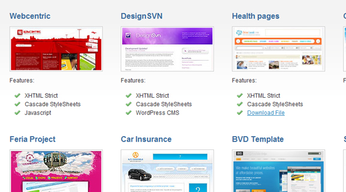
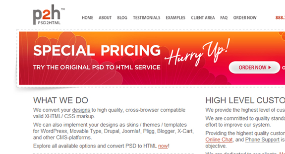

PSD Conversion is a very high-paying business. Many amazing designers know how to work through Photoshop but just don't have the time or haven't learned how to code their designs into XHTML and CSS code. This is where many popular companies come in to help, the most popular being psd2html.

<!--more-->

I got an interview with the founder and creator of Slicejack Toni Trivkovic. He has some really inspirational words for those who are looking to get into the slicing business. It's a very high-paying market if you have clients, and understanding how to code PSD's into XHTML/CSS code is knowledge useful for every web designer and developer.

How did you come up with the idea for Slicejack?

The very idea for Slicejack wasn't something I came up with over the night. I spent a few years developing my skills while working for other web development companies until the idea of starting my own business grew complete. Slicejack has been active for over two years now and I can say that I've gained huge entrepreneurial experience. There are four of us employees at Slicejack right now, and we are all located in the same city.

### How many clients have you worked with so far? Any sites you think stand out in your portfolio?

Well, I can't give you the precise number of clients we've worked with, but I can tell you that we have coded over 300 web pages during past year. Most of our clients are from USA and Europe.

There are many references we are proud of, and some of them are these:

- Reference 1: Homepage | Interior page
- Reference 2: Homepage | Interior page
- Reference 3: Homepage

You can view more references on our website under portfolio section.

### Can you go through a typical day for you working on slicing templates?

We've all worked from our homes until recently. That worked really well for us, but things have been working even better since we started working at the office. We meet at 8AM in a cafe near the office, and we do the schedule for the day. At 8:30AM we start working and spend 7 hours working in average.

We are a good team, well coordinated, and we complete our tasks quickly.

### The design of the site is very easy to navigate. Can you go through the design process for creating Slicejack's website design and logo?

I did the Slicejack design myself, and I'm constantly working on improving it. When I first started Slicejack, design looked like this.

Last version is online at slicejack.com. I hope you can easily spot the improvement. I already have some new ideas that I should implement in the current design.

Starting a webpage is like a little kid, you need to keep on investing in it constantly so it can grow with quality. We pay a lot of attention to Google Analytics and depending on the information we adjust the page to our potential clients.

Logo was created by my colleague Logoholik.com. "J" represents slash / in HTML. KISS principle.

### What does Slicejack offer that can compete with similar services such as PSD2HTML?

PSD2HTML was the first slicing service, number one on the market. They have employees all over the world and are focused on mass production. Our philosophy is totally diverse. We want to stay small and agile, a service that adjusts to the needs of each client individually. There are four of us working at the Slicejack and we are all located in the same city (Split, Croatia/Europe).

We have special offer right now - each buyer gets one interior page for free. We decided to offer this because 80% of our clients have ordered more than one page.

### What are some of your favorite design and coding blogs? Do you frequently read tutorials or blog posts about design and coding?

We build our knowledge through work experience everyday. Constantly we are facing new techniques so that it is not that necessary to read various blogs frequently.

Personally I use Twitter (@toni\_trivkovic) and I often run into interesting information. Some of the webpages I visit frequently are boagworld, WebAppers, and Smashing Magazine.

### Do you have any plans for the future to expand Slicejack?

We have planned on personalizing our webpage to certain markets. We've already done that for Croatian market, and soon we'll be expanding our service on other European markets. We will also expand our CMS support. We are aware of the importance of social media, so we'll pay more attention to that too.

I've created a Facebook page for Slicejack so that we can communicate with the fans. We'll have various offers frequently so visit us on Facebook, too!

### What advice would you give to someone interested in starting their own XHTML/CSS slicing company?

Well, I can advise you to focus on the non-mainstream services, such as Design to Newsletter, Design to various less popular CMS systems...

Specialize in one of those fields, do it with quality and I am sure you will find a market big enough!
