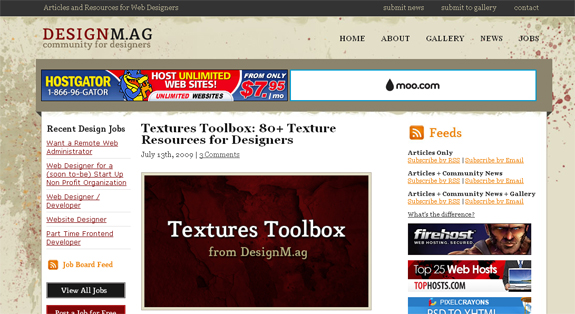

Website Design has become one of the most popular career paths, especially with many teenagers taking entry-level classes in high school, and with so many available resources to learn from. There are tons of web design blogs, galleries, news sites, and much more. However, there are only a select few that actually post up quality content, update frequently, and are run my professional web designers who can teach us all a thing or two.<!--more-->

I approached Steven Snell, the creator of two very popular blogs (Vandelay Design blog and DesignM.ag) and asked for an interview to get the inside scoop about DesignMa.g. So here it is, my interview with the blogger and web designer at DesignM.ag.

#### When did you get the idea to create Design Mag, and what gave you the idea?

My first blog was the Vandelay Design blog (http://vandelaydesign.com/blog/). After about a year of running that blog I decided that I wanted to start something new in the design niche. The blog at Vandelay Design has done much better than I ever anticipated, but because it is connected to my own design services I feel that I'm a bit limited to what I can do there. I wanted to have a site that was more community focused rather than being attached to the services of a particular designer. Some of the things that I waned to do I felt would be more appropriate if I just started a second site (things like the community news, design job board, and the design gallery). Plus, I would like DesignM.ag to become a multi-author blog. I have had a few posts be other writers, but not very many at this point.

#### How did you manage to come up with a clever domain URL by using the designm.ag instead of designmag.com?

 My preference would have been to get a .com, but I didn't want anything long or with hyphens. I did a lot of brainstorming and wrote down possibilities. I think it was a result of URLs like del.icio.us that led me to browse through the possibilities and I came up with DesignM.ag. I was hesitant because of SEO concerns so I bought a few other domains at the same time in case I changed my mind before the site launched.

Ultimately, I liked the fact that it was short, and I felt that it had some potential for branding.

#### What were the early days of Design Mag like? Can you share any noticeable growth over time?

The site benefited because I already had a site with a fairly well established audience at the same time. I think I had about 8,000 subscribers at Vandelay Design at the time, so I announced the launch and that really helped. It still took time to build subscribers though. I was able to get respectable amounts of traffic from the start because I already had a strong network of other bloggers that wound up linking to me, and I already knew how to use social media from my experience with Vandelay Design.

#### About how many visitors daily does the site receive?

It averages about 8,000 per day.

#### There is a lot of competition in the web design niche. How does Design Mag stand out from the crowd?

It's true that there is a lot of "competition", but I see that more of an opportunity than a hindrance. In a crowded niche like ours it's much easier to get links than it is if you're writing about a less popular topic, plus there are plenty of potential readers and advertisers.

For me the only frustrating part of being in a crowded niche is that it's pretty common to have a post idea that I'm working on, and before I can publish it I see a very similar idea on another blog. Being original is a real challenge in my opinion.

#### How well does each area of the site do (blog, job board, gallery, etc)?

The blog posts are by far the most popular. The news section also does pretty well, although more so in terms of RSS than on-site visits. Most subscribers go directly to the source articles from the news submissions rather than coming to the site first, which is fine, that's how it makes the most sense. The gallery and job board draw relatively small amounts of traffic. I'd like to ramp up the activity on the job board, it's just a challenge to find the time to promote it.

#### Where do you get your inspiration for all of your blog posts?

I have a notebook where I write down all of my ideas, and I keep that with me so I don't forget to write anything down. Most of my ideas come from brainstorming.

#### What are some of your favorite web design blogs? Are there any specific that have influenced Design Mag?

My favorite blogs are those run by my friends. I've found that my interest in blogs is very much influenced by the people behind them. So some of my favorites are Smashing Magazine, Six Revisions and Noupe.

#### What are some of your favorite web 2.0 sites and why?

I don't really know exactly what is classified as web 2.0 and what's not, but I would say Delicious is probably my favorite. It really helps me to keep important pages organized and I find myself going back to particular bookmarks pretty often.

#### What is one random fact about yourself you’d like to share with our readers?

I don't really like to read, which is kind of odd for someone who writes at many different blogs. I've actually never liked to read and only ever finished a few books in my life.

### Visit the Site!
