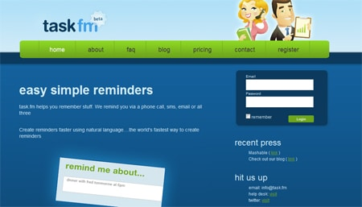

I have recently been scoping out some cool web 2.0 sites to add to my blog for my first interview, and I found my answer lying in the new startup task.fm. This app has only been online for about a week so far, but already has a booming userbase of 1000 regular users and growing daily. Task.fm allows its users to have reminders sent through e-mail, phone, and SMS. The reminders can be entered by the user, and typed in regular speech, too! Below is my interview with the site's creator Anthony Feint.<!--more-->

#### How does Task.fm work, and what can you help users with?

Task.fm is a really simple tool for creating reminders. Unlike all the other reminder apps, Task.fm uses natural language recognition, so users don't have to worry about entering dates or times. Instead enter "meeting with bob next Tuesday noon" and Task.fm will extract all the vital info to create a reminder automatically. Task.fm can send out sms, email and phone reminders.

#### How was the idea created and designed into the site it is today?

By nature, im not the most organized person. I needed a really simple tool that made creating reminders even easier than writing it down on paper. So I decided to build this app, with a real focus on simplicity.

#### What were some inspirational influences for designing Task.fm

From a design perspective I was inspired by Twitter - it has a great, clean interface which I love. From a development perspective, there has been some recent advances in semantic technology (natural language recognition) which gave me the idea to integrate this tech into a reminder app.

#### Does the website make a decent amount of money through the services provided? Are you planning on adding any other type of monetization to the site in the future?

Although the site has only been live for a week or so, we are taking orders and yes, it's a "decent" amount. I won't go into any details on the future plans but we are currently developing a feature set for business users.  

#### How was the site’s design created to look so web 2.0-like?

The current site design was done by myself. I'm not a full-time designer so it probably took a lot more work than it actually should have. My goals were to create a really clean interface. One of my biggest pet complaints of other reminder apps is poor UI. I made good use of JavaScript and Ajax to give the user a "desktop" like experience and used big and bold elements with plenty of white space. The design is far from perfect and its constantly in development. In fact, some major design changes should be live fairly soon.

#### How many people currently use Task.fm, roughly?

After just a week the site has over 1000 active users.

#### What are your plans for growth in the near future?

I'm a strong believer in rapid development. So we'll be launching new features every week. Our main focus at the moment is to make creating reminders even easier. You'll soon be able to create reminders via email and SMS, and work has begun on integrating with Twitter.

#### What is your favorite social networking / bookmarking service and why?

FriendFeed. FriendFeed is simply amazing for keeping on top of all the news happening in our industry. Its also a vital tool for tracking what people are saying about Task.fm, and responding to questions about our product. Plus it doesn't seem to have all the spam that's happening on Twitter and many of the other social sites.

#### If you had any piece of advice to give to someone trying to startup their own web 2.0 site, what would it be?

Well now is the best time to launch a startup. Developing sites like Task.fm have become so much cheaper and running costs have also dropped. So my advice is to just get out there and do it. If you fail, get up and try again.

### Check out the site!
