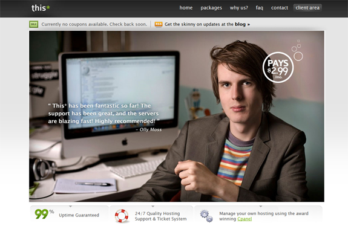

Finding a decent web hosting company today is difficult. So many companies overprice, can't keep uptime promises, have horrible support, or offer you barely any space to store your site's files and content. The few that have shown promise in the past are some of my favorites: Hostgator, Dreamhost, Bluehost, etc. However as I was browsing the web one night (like always) I ran into a great looking hosting company, This\*.<!--more-->

This\* Web Hosting is very affordable, provides an awesome interface to work with as a client, and the site's design is very nice and easy to navigate. Along with that, the founders of the site keep a blog called This & That, where coupons and discounts are posted, along with important news and updates. I got a great interview with the company's brains David and Jules, and they've got some great information about their very successful and upcoming web hosting company.

#### What is the history behind This\* and how was the company created?

**David**: The hosting industry has always been something that has appealed to me. I've always enjoyed working with people and providing them with services they enjoy, and Jules and I thought there could be big improvements in the world of hosting. Ever since the decision to join the market, it's been a rewarding and enjoyable experience.

**Jules**: I've been involved in the hosting industry for around 11 years now, so it's something that's almost second nature to me. I'd known David for some time and I think we both saw and recognized that many people were unhappy with their hosting providers, and for reasons they shouldn't be. I'd see the negative reviews on various hosts and think "Hey, if I were their provider, that wouldn't be a problem." so we decided to put up.

#### What does This\* offer that other web hosting services such as GoDaddy and HostGator don't?

GoDaddy and HostGator are great companies in their own right, and their success and huge client base really shows that. But honestly, we think we target slightly different markets and have a different work/business ethos.

 We believe our most prominent difference is that we're very anti-overselling. It's a controversial area that we won't go into here, but we believe it's served us extremely well so far. In almost 2 years of providing public hosting, we've yet to have a single period of unplanned maintenance or downtime - and we're very happy about that. Sure, we've had a few hiccups, but nothing that was beyond our control or lasted very long at all.

We also like to think of ourselves as a "yes host". It's very easy to fall into the trap of declining features or changes to your customers because they involve, say, recompiling services or installing additional software - but the fact is that web development is constantly evolving, and people want to test new technologies out. You have to be very flexible and move with the times, and I think we certainly do that.

#### How many people currently work for This\*, and do you see the numbers increasing in the future?

 Unfortunately we can't tell you how many people work for us, as that's commercially sensitive information, but we definitely see the number improving in the future. Right now we're very hands on and are involved with much of the work ourselves. We think it's better to do that so you can maintain some idea of how your company is running, and what improvements need to be made.

We're always on the lookout for sales staff, though, so if anyone's interested - please let us know! ;)

#### How many customers currently does This\* have hosted?

Again, that's commercially sensitive information we're afraid. What we can tell you, though, is that we currently have 3 live shared hosting servers, so we host a reasonable number of clients.

#### Do you have any future plans that you could reveal to us?

Absolutely! We're currently in the process of developing our new website which looks amazing, and we can't wait to see it live. Alongside the launch of the new site we're going to be rolling out a few new products, such as dedicated server hosting and some other great stuff which people should find positive.

Perhaps the biggest future plan is the launch of one of our own custom products, which we can't say much about, but it serves to solve one of the biggest problems both client and provider have when it comes to providing shared hosting. Stay tuned!

#### If you had any advice for someone looking to start up their own web hosting company, what would it be?

Investment is the key to becoming a solid hosting provider. Don't skimp on hardware and try to run your business on cheap VPS's for example. Be prepared to lose money in your first year! The hosting market is incredibly saturated, and it's very difficult to get your name out there and obtain some brand recognition. If you cannot afford at least a semi-expensive dedicated server every month, this isn't the business for you.

### Visit the Site!
