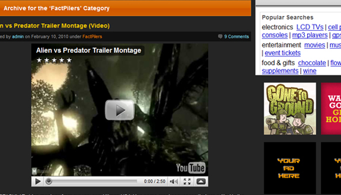
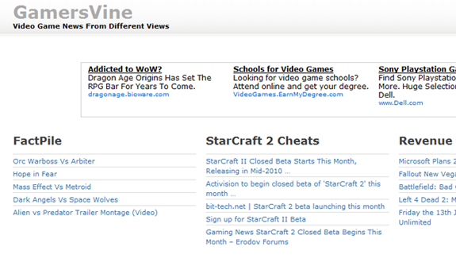

There are so many great online gaming communities. Video games have taken a huge rise in popularity over the years, and what a better way to celebrate your favorite games than hanging out with like-minded people on a fun and active community? FactPile does just that, collecting all gamers and tech-lovers from around the globe to interact and enjoy the community.

<!--more-->

You can share battle stories, hold virtual fights and tournaments, discuss the latest gaming articles or even write your own! The community is extremely vast in what it holds, and you can do virtually anything you want! I got a deeper look inside the site with FactPile's founder and creator Paul Bliss. Here's what he had to say about FactPile's recent and ever-increasing success.

How did you come up with the idea for FactPile?

I've seen other sites on the web that have battles with fictional characters facing each other, but typically, they are set up in a forum, which has some limitations. I always wanted to have a place on the web where the readers could visit at any time they choose and could participate without having to 'join' or become a member to participate. I've always felt that if I could create matches that were interesting to people, they would feel compelled to comment and defend their side.

### What are some of the best features on the site to attract members?

The communication. Most sites are run by people who don't (or can't) interact with their audience. I make it a point to read all the comments posted within each battle. To me, that's the best way to get a pulse of the site and to anticipate what the readers want to see next.

Many times the readers will ask a question directly to me to help settle a question about the debate. I also make sure that every month has a balance of site favorites, new characters and some random items that I know the readers want.

We have a section named "FactPilers" in which all the content found in that section is entirely created from the readers of the site. Most of the content are stories written by the readers, but we also have some other creative people who have created animated .gifs and some storytelling with pictures.

### The design of the site is very impressive, very web 2.0. Did you create the design, and could you go over the process of how the site’s design was created?

The current look of the site is the fourth design since the site was launched in 2006. The first and second designs were very basic Wordpress themes as more attention was given to getting the site into a working form that it is today.

Version three was the first design to take into account all the sections that needed to be shown on the site. While it was nice, I knew it could be improved. The current version took about three months to determine and tweak to get the right feel and functionality that the readers wanted. The web 2.0 element is just a natural process since social media is a driving force on the web and to ignore it would be foolish.

### Where did the name FactPile come from? Any particular back story behind it?

It started off meaning nothing. But the readers of the site have used the name as a sort of battle cry to validate the points in a match. If someone enters the site and claims victory without providing evidence on how one character could beat another, they're almost instantly labeled a 'fanboy' and not given much credibility. The readers have embraced the notion that in certain fictional situations, characters can beat other powerful entities.

While this adds a few layers of complexity, it makes for a more compelling experience since winners are determined with facts from the creators of these franchises, and not people yelling at the top of their lungs.

I obtained the domain name for trading an e-book that I used to sell. The previous owner of the domain was going to make a site full of facts.

### Have you done any marketing for the site to bring in new visitors and members?

Only recently have I begun to seriously go after traffic. There are many strategies that I use to bring in traffic. One of my favorites is to acquire domains that have built in traffic.

For example, I own the domain Herculesfans.com that re-directs to all the matches that are tagged with "Hercules". The domain itself only brings in about ten visits per day, but it sends them to a page on a character they presumably like and hopefully that gets them to either comment or return to FactPile.

I've also been very aggressively going after links from other gaming sites. I've also created a new gaming network named Gamers Vine(gamersvine.com) where I am currently recruiting members to be part of the network. By getting exposure on other quality sites, we can all benefit.

### What type of advertising do you run on FactPile? Have you started to make a profit from the site running ads?

Banner ads, video ads and Google Adsense. We're always looking for new advertisers and partnerships to explore. The profit margin is slowly increasing and I expect 2010 to dramatically increase.

### Where can you see FactPile going within the upcoming months? Have any new features you want to push soon?

As mentioned before, we are being very aggressive in getting found in the search engines for popular phrases that will introduce the site to new readers. We would like to partner up with other like-minded sites to run some contests to reward those who are creative and can.

We will be adding a members section that will provide some goodies for all who sign up. The forum for FactPile (FactpileTopia.com) will be getting some more features to enhance the user experience.

### What are some of your favorite websites or blogs to visit online in your free time?

I'm a huge fan of popurls.com - they essentially list all the "hot" stories and anything important that's going on typically appears there. BoingBoing.net is a quirky site that has some interesting topics.

### Considering how popular the web has become, social media and networking has become a huge facet connecting users. What are your thoughts on the huge popularity of social networking sites over the past decade?

Like all things web, when a new technology arrives, there are many players who jump in and try to make something happen. The consumers determine who the victor is. A tool like Twitter was built with one purpose in mind, but once the users go their hands on it, they created their own uses for it and Twitter has been smart in allowing users to do so. A site like Facebook, you have to wonder how long it will last.

Only a few years ago MySpace was king of the hill. It still has a ton of users and provides value for many, but as BB King says, "The thrill is gone". When blogs first arrived, they were hailed a web site killer. Today they are a category and represent a different experience than you would have at a traditional site.

Social networking sites will continue to evolve while they strip away another layer of human interaction. Since I am in contact with anyone from high school via Facebook, why would we need a class reunion? I already know what they're all doing! While I am all for new technology and the Internet, everyone needs to 'get off the grid' and have some time away from the distractions the web provides us.

### Can you take us through a typical day as a webmaster running FactPile?

It starts with an email check to make sure nothing's wrong with the server. Then a quick check on the comments made on the site. Typically it's more of a scan looking for anything that might need addressed (like a flame war). Unlike many sites, I interact with the readers through the site. A lot of times, in their comment replies, they will ask me a question about the match or site and I'll do my best to answer those questions in a timely manner.

After that part is think about some of the upcoming matches to appear on the site. There are site favorites that need to appear every month. I'm always looking to have new characters that have never appeared before show up in a few matches per month. We also get readers who submit content and links to sites that need to be determined if it makes sense to appear on FactPile.

Once a list of matches and posts are determined, the production begins to find the best images to use for the battle. Sometimes the images are easy to get and other times the characters are so vague that it's hard to find anything we can use. There is a constant thought process of balancing all the content that appears on the site so that we don't have too much of one franchise/character over another.

The next step is to look for sites to link with or partner up with. Sometimes it's waiting for an email to come back to see what their response is. Other times there are other forums to participate in so that links can be dropped into the conversation that point back to FactPile. After all of that is done, it's back to the emails and comments to see what's going on with the site to make sure everything is running smoothly.

### If you had any advice for someone interested in starting up their own social networking and communication site, what would it be?

Be ready to have your users do things you never thought of. To them, your site is a tool. Once you empower people, they can do great things. In the past where one person in the middle of nowhere would never be heard, today can be the voice of a real movement.

Be open to ideas that you are outside your comfort zone. You'll never grow as a person or professional if you always stay where it feels safe. Try new things. Some will fail, that's a given. But when you find something that works, it could really jump-start your site, career or most importantly, your life.
